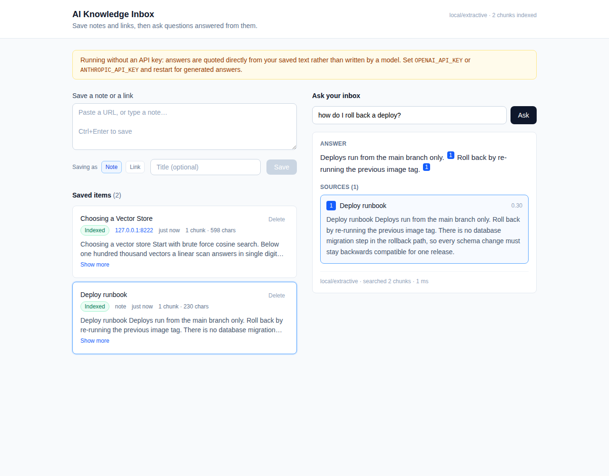

# AI Knowledge Inbox

Save notes and links, then ask questions answered from that content, with citations back to the exact passage each claim came from.

FastAPI + SQLite on the backend, React + Vite on the frontend, and a RAG pipeline that runs end to end with no API key (falling back to local embeddings and extractive answers) or with OpenAI/Anthropic when a key is present.



---

## Quick start

Two terminals, roughly a minute.

```bash
# 1. backend  (http://127.0.0.1:8000, docs at /docs)
cd backend
pip install -r requirements.txt
python3 -m uvicorn app.main:app --reload --port 8000

# 2. frontend (http://127.0.0.1:5173)
cd frontend
npm install
npm run dev
```

Or `make install && make backend` / `make frontend` from the repository root.

**No API key needed.** The app boots into a local provider: hashed lexical embeddings for retrieval, and answers quoted directly from the retrieved passages. Everything works, including the citations; the answers read like quotes rather than prose, and the UI says so in a banner.

**With a key**, set one and restart. Nothing else changes:

```bash
export OPENAI_API_KEY=sk-...        # embeddings + generated answers
# or
export ANTHROPIC_API_KEY=sk-ant-... # generated answers (embeddings stay local unless OPENAI_API_KEY is also set)
```

`GET /health` always reports which providers are actually live. See `backend/.env.example` for every tunable.

> Switching embedding providers after ingesting changes the vector space. Existing vectors are not comparable to new ones, so re-ingest your items; the API returns a clear error rather than silently ranking nonsense.

Run the tests with `make test` (85 tests, about 3 seconds, no network required).

---

## How it works

```
   POST /ingest                                        POST /query
        │                                                   │
        ▼                                                   ▼
  ┌──────────────┐   202 Accepted                  ┌──────────────────┐
  │ create item  │──────────────►  UI polls        │  embed question  │
  │  (pending)   │                 /items          └────────┬─────────┘
  └──────┬───────┘                                          ▼
         │ enqueue                                 ┌──────────────────┐
         ▼                                         │  hybrid search   │
  ┌──────────────┐                                 │ cosine  +  BM25  │
  │ ingest worker│                                 └────────┬─────────┘
  │  fetch URL   │  SSRF guard, size cap                    ▼
  │  HTML → text │                                 ┌──────────────────┐
  │  chunk       │  sentence-aligned, overlapping  │ selection policy │
  │  embed       │  batched                        │ floor + per-item │
  │  store       │  SQLite rows + float32 BLOBs    │ cap + top_k      │
  └──────┬───────┘                                 └────────┬─────────┘
         ▼                                                  ▼
     status: ready ───────► searchable ────────►   ┌──────────────────┐
     status: failed (reason recorded on the item)  │ answer + [n] cites│
                                                   └──────────────────┘
```

### Layout

```
backend/app/
  main.py              app factory, lifespan, exception handlers
  middleware.py        request id + access logging
  config.py            every tunable, read from the environment once
  schemas.py           request/response contract (pydantic)
  errors.py            AppError types that map to HTTP status codes
  db.py                SQLite connections, schema, async bridge
  models.py            domain objects passed between layers
  api/                 routes + dependency wiring
  repositories/        SQL for items and chunks, nothing else
  services/
    ingestion.py       fetch → clean → chunk → embed → store state machine
    url_fetcher.py     server-side fetching with the SSRF guard
    html_text.py       HTML to readable text
    chunking.py        sentence-aligned chunking with overlap
    embeddings.py      OpenAI + local hashing provider
    vector_store.py    brute-force hybrid search over a cached snapshot
    lexical.py         BM25 index
    rag.py             query orchestration and selection policy
    answering.py       OpenAI / Anthropic / extractive answerers
    jobs.py            in-process ingestion queue
```

Dependencies point one way: `api → services → repositories → db`. A service never imports FastAPI, and a repository never makes a decision. `main.py` is the only module that knows about all of them.

---

## API

Base URL `http://127.0.0.1:8000`. Interactive docs at `/docs`.

Every error, without exception, uses this shape:

```json
{ "error": { "code": "not_found", "message": "no item with id 'itm_x'", "details": { "item_id": "itm_x" } } }
```

Every response carries an `X-Request-ID` header (echoed from the request if you send one), and that id appears on every log line produced while serving it, including the background ingestion it triggers.

### `POST /ingest` → `202 Accepted`

Note and URL are separate, explicitly tagged request shapes rather than one guessed field, so a note that happens to start with `http` is never fetched by accident. The UI picks the tag for you and shows its choice before you save.

```bash
curl -X POST localhost:8000/ingest -H 'Content-Type: application/json' \
  -d '{"type":"note","content":"Deploys run from main only. Roll back by re-running the previous image tag."}'

curl -X POST localhost:8000/ingest -H 'Content-Type: application/json' \
  -d '{"type":"url","url":"https://example.com/post","title":"optional override"}'
```

Returns the created item immediately with `status: "pending"`. **202, not 201**: the row exists, but fetching and embedding happen on a worker, so the item is not searchable yet. Poll `GET /items` (the UI does this automatically, and stops once nothing is in flight) until it reaches `ready` or `failed`.

A failed ingestion is recorded on the item with a human-readable `error_message`, not dropped:

```json
{ "id": "itm_a1b2", "status": "failed", "error_message": "that URL resolves to a private or reserved address and will not be fetched" }
```

### `GET /items`

```bash
curl 'localhost:8000/items?limit=20&offset=0&status=ready&source_type=url'
```

```json
{ "items": [ { "id": "itm_a1b2", "source_type": "url", "title": "Choosing a Vector Store",
               "status": "ready", "chunk_count": 4, "char_count": 5981,
               "preview": "Start with brute force cosine search…", "created_at": "2026-09-11T15:30:08.846049Z" } ],
  "total": 1, "limit": 20, "offset": 0 }
```

`GET /items/{id}` adds the full `raw_content`. `DELETE /items/{id}` returns `204` and cascades to the item's chunks.

### `POST /query`

```bash
curl -X POST localhost:8000/query -H 'Content-Type: application/json' \
  -d '{"question":"how do I roll back a deploy?","top_k":5}'
```

```json
{ "question": "how do I roll back a deploy?",
  "answer": "Roll back by re-running the previous image tag [1]. There is no migration step in that path [1].",
  "grounded": true,
  "citations": [ { "marker": 1, "chunk_id": "chk_9f3", "item_id": "itm_c4d5", "title": "Deploy runbook",
                   "source_type": "note", "source_url": null, "snippet": "Deploys run from main only…", "score": 0.32 } ],
  "chunks_searched": 12, "provider": "openai", "model": "gpt-4o-mini", "latency_ms": 842 }
```

`marker` is the `[n]` the answer text points at, so the UI can link each claim to its evidence.

Optional `item_ids` restricts retrieval to chosen items; unknown ids are a `400` rather than silently ignored.

**Nothing relevant is a 200, not an error.** `grounded: false` with an empty `citations` array and a plain "the saved notes do not cover this" is the correct answer to a well-formed question about content that was never saved. Reserving errors for actual failures keeps the client's error path meaningful.

### Status codes

| Code | When |
|---|---|
| `200` | query answered (grounded or not), item read, list returned |
| `202` | ingest accepted and queued |
| `204` | item deleted |
| `400` | semantically invalid input (unknown `item_ids`, non-HTTP URL, private address) |
| `404` | no such item |
| `413` / `415` | fetched page too large / not text |
| `422` | body or query string failed schema validation, with the offending field named |
| `502` | an upstream URL could not be fetched |
| `503` | an embedding or LLM provider is unavailable or misconfigured |

`422` bodies name the field, and thanks to the discriminated union they only report the variant you actually sent:

```json
{ "error": { "code": "validation_error", "message": "the request body or query string is invalid",
             "details": { "fields": [ { "field": "note.content", "message": "String should have at least 1 character",
                                        "type": "string_too_short" } ] } } }
```

---

## Design decisions and tradeoffs

### Chunking: sentence-aligned, ~900 characters, ~150 of overlap

Notes and articles are prose, and a fixed-size window routinely cuts a sentence in half. Half a sentence embeds to a vector that means something subtly different from either neighbour, which is the kind of retrieval failure that never throws an error and is miserable to debug later. So the chunker splits on paragraphs, then sentences (keeping `Dr. Chen` and `e.g.` intact), then packs whole sentences up to the target. A line break also ends a unit, because note headings and bullet items rarely carry terminal punctuation.

Overlap exists because a claim and the qualifier that changes its meaning often straddle a boundary. Roughly 15% overlap makes the join retrievable from either side; the cost is about 15% more vectors, which is nothing at this scale.

900 characters is roughly 200 tokens: large enough to carry an argument, small enough that five of them plus a question fit comfortably in any context window, and small enough that a citation points at something a user can actually read in the UI.

**Invariant:** a chunk's text is exactly `raw_content[char_start:char_end]`. Offsets stay meaningful, so highlighting a citation in the original document needs no fuzzy matching. This is asserted in the tests.

**What I did not do:** semantic chunking (embed sentences, split at similarity troughs) costs an embedding pass per document and, in my experience, wins little on short notes. Recursive splitting on markdown headings would be the first upgrade for longer documents.

### Vector store: SQLite rows plus a brute-force numpy scan

The whole persistence layer is one SQLite file: item and chunk rows, with embeddings as float32 BLOBs (4 bytes per dimension, versus roughly 12 to 20 as JSON, and they load straight into a numpy matrix with no parse step). Search is one matrix-vector product over a cached, pre-normalized snapshot, invalidated on every write.

Why not a real vector database for this: at 10k chunks by 1536 dimensions the index is about 60 MB and a query scans it in single-digit milliseconds, with exact recall and nothing to tune. An approximate index at that size adds a build step, a tuning parameter, a second process to run and a new way to be subtly wrong, in exchange for latency I do not need. Brute force is the honest answer below roughly 100k vectors, and the code says so in one place so it is easy to replace.

### Retrieval: hybrid, 70% dense and 30% BM25

Dense retrieval misses exact tokens that carry all the meaning: an error code, a product name, a person. BM25 catches those and contributes corpus-aware IDF. BM25 scores are unbounded, so they are squashed through `score / (score + 8)` rather than normalized against the current result set, because dividing by the batch maximum would make a single result's score depend on the other results and break a fixed relevance threshold.

Between retrieval and the prompt there is an explicit selection policy rather than a bare `top_k`:

- a **relevance floor** (`RETRIEVAL_MIN_SCORE`), below which the answer is "not covered" instead of a confident answer built from the least-bad passages available;
- a **per-item cap** (3 chunks), because one long document otherwise fills the whole context with near-duplicate neighbours and crowds out the short note that actually answers the question.

### Embeddings: pluggable, with a real offline fallback

`EmbeddingProvider` has two implementations: OpenAI (batched 64 at a time, retried with backoff on 429/5xx), and a local hashing embedder used when no key is set. The local one hashes stemmed tokens into a signed 1024-dimension vector with sublinear term-frequency weighting, so cosine similarity approximates weighted term overlap.

Being straight about it: that is a lexical vector, not a semantic one. It will not match "how do I undo a release" to "roll back a deploy". It exists so the whole pipeline runs, demos and tests deterministically with no key, no network and no cost, and so that provider swaps are a config change rather than a rewrite. `/health` reports it and the UI shows a banner, because a fallback silently masquerading as a model is a debugging trap.

The answerer splits the same way: OpenAI and Anthropic share one prompt and differ only in wire format, and the offline answerer quotes the best-matching sentences from the retrieved passages with real `[n]` markers. Blunt, but always grounded.

### Ingestion is asynchronous

`POST /ingest` returns as soon as the row exists. Fetching a third-party URL plus an embedding round trip is seconds of work that no user should hold a connection open for, and running it inline would block the event loop that serves the item list the UI is polling.

The queue is an `asyncio.Queue` with two worker tasks: the smallest thing that is actually correct for a single-user app. It is in memory, so jobs do not survive a restart; items stuck in `pending` stay visible in the UI rather than disappearing. A failing job never takes the worker down, and its reason is written onto the item.

### Fetching a user-supplied URL is a security boundary

Server-side fetch is a request-forgery primitive: without a guard, `http://169.254.169.254/latest/meta-data/` turns this endpoint into a cloud credential reader. So every hop is resolved and checked against private, loopback, link-local, reserved and multicast ranges; redirects are followed by hand so each hop is re-checked rather than trusted by httpx; the body is streamed with a hard byte cap instead of being read whole; and non-text content types are rejected before parsing. There are tests for each of these, including the metadata address.

Known gap, stated rather than hidden: validation happens at resolution time, so a DNS rebind between the check and the connection is not covered. Closing it needs a transport that dials the already-validated IP with an explicit `Host` header, which is the right next step if this ever becomes multi-tenant.

### Debuggability

Logs are one JSON object per line with a `request_id` that survives the jump onto the ingestion worker, so the `POST /ingest` and the `item ingested` that happens two seconds later on another task join up:

```json
{"ts":"2026-09-11T15:22:15+0000","level":"INFO","logger":"app.services.ingestion","message":"item ingested",
 "request_id":"req_ad6dc54e3a10","item_id":"itm_5e60","source_type":"url","chars":598,"chunks":1,
 "embedding_model":"local-hashing-1024","duration_ms":78.08}
{"ts":"2026-09-11T15:22:17+0000","level":"INFO","logger":"app.services.rag","message":"query answered",
 "request_id":"req_cd2346d77d03","chunks_searched":2,"passages_used":1,"top_score":0.3605,
 "cited_items":["itm_820af"],"provider":"local","model":"extractive","latency_ms":1}
```

Queries log what was searched, what scored how, and what was cited, which is usually enough to tell a retrieval problem from a generation problem without a debugger. Unanswered queries log the top candidate score against the threshold, so "why did it say it does not know" has an answer. `LOG_FORMAT=console` gives readable output while developing.

---

## What breaks at scale

Honest numbers, in the order they would actually hurt:

| Scale | What breaks | Fix |
|---|---|---|
| ~10k chunks | Nothing. ~60 MB resident, single-digit ms queries. | Leave it alone. |
| ~100k chunks | The linear scan reaches tens of ms and the snapshot is ~600 MB of process memory. Every write invalidates the whole cache and the next query rebuilds it. | Move vectors to pgvector or Qdrant with an HNSW index; keep metadata in Postgres. |
| ~1M chunks | The snapshot no longer fits in a normal container, and rebuilding it takes minutes. | The index has to be a service, not an in-process array. |
| Several concurrent writers | SQLite allows one writer. WAL plus a process-level lock holds for one process; a second process will hit `SQLITE_BUSY` under load. | Postgres. |
| Any restart with a full queue | In-memory jobs are lost; items sit in `pending` forever. | A durable queue (Redis/SQS) with separate worker processes, plus a sweeper that re-enqueues stale `pending` items. |
| Large documents | The whole `raw_content` lives in a row and the whole text is embedded in one request. A 5 MB page is a slow transaction and a large batch. | Stream chunks to object storage, embed in bounded batches with checkpointing. |
| Traffic | No rate limiting, so a loop of `POST /ingest` will happily spend your embedding budget. | Per-IP and per-key rate limits at the edge; a cost ceiling per user. |

## What I would change for production

1. **Auth and tenancy.** Single-user by design here. Every query would take a tenant id, and it would have to be enforced in the storage layer, not the handler, so a missing filter cannot leak another tenant's notes.
2. **Postgres + pgvector.** One store for rows and vectors, real concurrency, real backups, and filtered vector search (by tenant, date, source) which the brute-force scan only fakes.
3. **A durable queue and separate workers.** Ingestion should survive a deploy, retry with backoff, and be scalable independently of the API.
4. **A retrieval eval set.** Thirty to fifty question/expected-source pairs in CI, reporting recall@5 and citation precision. Without it, every chunking or prompt change is a guess. This is the single highest-value thing missing, and the honest reason it is not here is the timebox.
5. **Caching.** Embeddings keyed by content hash (re-ingesting the same page should cost nothing), and answers keyed by question plus corpus version.
6. **Better extraction.** Swap the hand-rolled HTML heuristic for trafilatura or readability; add PDF support, which is what people actually want to save.
7. **Cost and quality telemetry.** Tokens and spend per query, plus a thumbs up/down written next to the retrieved chunk ids, which is what makes the eval set grow on its own.
8. **Re-index on model change.** Store the embedding model per chunk (already done) and run a migration job when it changes, instead of returning an error and asking the user to re-ingest.

---

## Tests

```bash
cd backend && python3 -m pytest -q     # 85 tests, ~3s, no network, no API key
```

What they cover, and why those things:

- **Chunking invariants** (exact-slice offsets, full coverage, overlap, abbreviation handling, oversized sentences, blank input). These are properties the rest of the pipeline assumes, so they are asserted rather than eyeballed.
- **Retrieval quality**, including a parametrized test that each of four questions retrieves its own note, and that an unrelated question scores below the floor. The ranking is the product; if it silently regresses, nothing else matters.
- **URL ingestion against a real local HTTP server**, not a mocked transport: private-address blocking (including `169.254.169.254`), non-HTTP schemes, redirects, redirect loops, the streaming size cap, binary content types, and upstream 500s. Mocking httpx here would skip exactly the code most likely to break.
- **The HTTP contract**: status codes, the error envelope, pagination, the full ingest → poll → query → cite → delete flow, and that a deleted item stops appearing in answers.

The frontend was verified end to end in a real browser (Playwright against Chromium): type detection, `pending` → `ready` transitions via polling, a cited answer, the citation marker highlighting its source, the ungrounded case, and delete, with no console errors.

## Deliberately not built

Auth, user accounts, containers, streaming answers, conversation memory, and a rate limiter. The brief asked for none of them and each one would have taken time away from the parts being evaluated: the pipeline, the API contract, and the reasons behind both.
