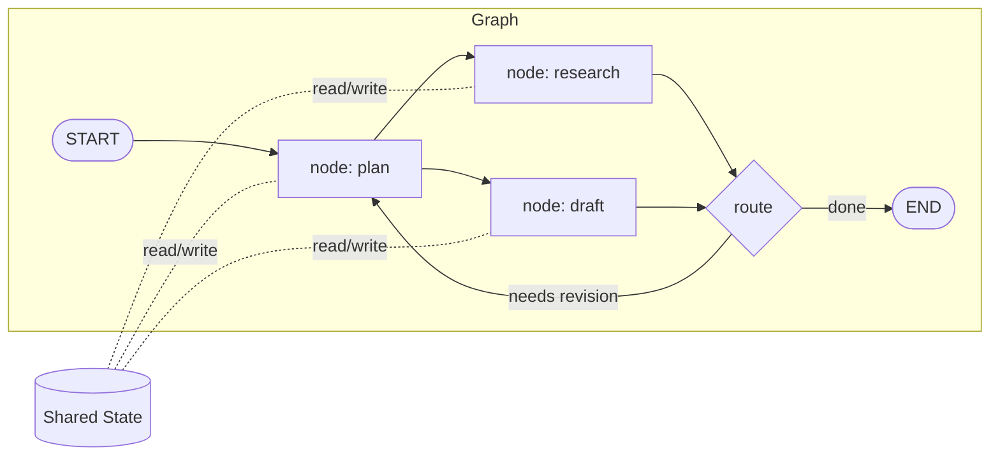
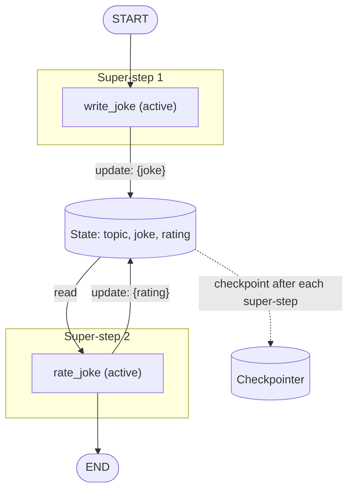

# 1. Core Concepts

This file gives you the mental model behind LangGraph: why it exists, what a graph actually is, how execution works under the hood (the Pregel-inspired super-step model), where LangGraph sits in the wider LangChain ecosystem, and a complete hello-world you can run in under a minute. Everything else in this documentation set builds on the ideas here.

## Why LangGraph?

A single LLM call is stateless and linear: prompt in, text out. That works until your application needs to *do* things — call tools, loop until a condition is met, branch on a model's decision, pause for a human, or recover from a crash halfway through a 40-step run. You can hand-roll this with a `while` loop and a pile of `if` statements, and for tiny scripts you should. But as soon as the control flow gets interesting, hand-rolled loops accumulate problems:

- **Control flow becomes implicit.** "Which step runs after which, and why?" lives in scattered conditionals rather than a single inspectable structure.
- **State becomes ad hoc.** Variables get threaded through function signatures, mutated in place, and lost on crash.
- **Operational features are all-or-nothing rewrites.** Streaming partial results, persisting progress, letting a human approve a step, running branches in parallel — each of these is a significant retrofit to a bespoke loop, but a built-in in LangGraph.

Plain "chains" (fixed pipelines of prompt → model → parser) solve the opposite problem: they are inspectable but *too* rigid — no cycles, no branching on model output, no pausing. LangGraph sits in between: you declare an explicit graph of steps and transitions, and the runtime gives you streaming, checkpointing, human-in-the-loop, retries, and parallelism for free.

## The core abstraction: graphs

Three concepts, and you know 80% of LangGraph:

| Concept | What it is | Analogy |
|---|---|---|
| **State** | A shared, typed data structure (usually a `TypedDict`) representing everything the application knows right now | Shared memory |
| **Nodes** | Python functions that receive the current state and return an update to it | Units of work |
| **Edges** | Rules that decide which node(s) run next, either fixed or conditional on state | Control flow |

Nodes do the work; edges decide what happens next; state is how they communicate. A node never calls another node directly — it returns a state update, and the graph's edges determine what runs after it. This inversion is what makes graphs inspectable, resumable, and parallelizable.



## The execution model: Pregel and super-steps

LangGraph's runtime is inspired by Google's [Pregel](https://research.google/pubs/pub37252/) system for large-scale graph processing, combined with an actor-model flavor. Execution proceeds in discrete rounds called **super-steps**:

1. At the start of a super-step, every node that received new input (via an edge from the previous step, or `START` at the beginning) becomes **active**.
2. All active nodes in the same super-step run **in parallel**. Each one reads the state as it was at the start of the step and returns a partial state update.
3. When all active nodes finish, their updates are applied to the shared state (using **reducers** — see [State management](02-state-management.md)) and messages pass along outgoing edges, activating the next set of nodes.
4. A node that receives no message stays **inactive** (it votes to *halt*, in Pregel terms).
5. The graph **terminates** when a super-step ends with no active nodes and no messages in flight — or when it hits the recursion limit (see [Graph API](03-graph-api.md)).

Practical consequences you will rely on constantly:

- **Parallelism is structural, not manual.** Two nodes fanned out from the same parent run in the same super-step, concurrently. You never spawn threads yourself.
- **Updates within a super-step are merged, not raced.** If two parallel nodes write to the same state key, a reducer decides how the values combine deterministically.
- **Checkpoints happen at super-step boundaries.** This is why LangGraph can pause, resume, and time-travel: state is well-defined between steps.
- **A node sees the state from the *start* of its super-step**, never a half-applied update from a sibling running concurrently.

## Workflows vs. agents: a spectrum

People often present "workflows" and "agents" as rival architectures. In LangGraph they are the same machinery with a dial:

| | Workflow end | Agent end |
|---|---|---|
| Control flow decided by | Your code (fixed edges) | The LLM (conditional edges, tool loops) |
| Predictability | High | Lower |
| Flexibility on novel inputs | Low | High |
| Typical shape | DAG or mostly-linear pipeline | Loop: model → tools → model → ... |
| Example | Extract → classify → summarize | ReAct agent choosing among 12 tools |

Most production systems live in the middle: a mostly-fixed workflow where one or two nodes give the model routing authority. LangGraph is deliberately agnostic — the same `StateGraph` expresses both ends, so you can move along the spectrum without changing frameworks. See [Tools & agents](07-tools-and-agents.md) for the agent end and [Multi-agent systems](08-multi-agent-systems.md) for compositions of agents.

## When to use LangGraph vs. a simple loop

Reach for a plain script or simple loop when:

- The flow is a straight line of 1–3 LLM calls with no branching.
- You do not need to resume after failure, stream intermediate progress, or pause for humans.
- The whole thing fits comfortably in one screen of code.

Reach for LangGraph when any of these are true:

- **Cycles or branching** — the model decides what happens next, or steps repeat until a condition holds.
- **Durability** — a run may take minutes to days, and crashing at step 37 of 40 must not restart from step 1.
- **Human-in-the-loop** — a person approves, edits, or redirects the run mid-flight.
- **Parallel fan-out** — independent subtasks (e.g., research five topics) should run concurrently and merge.
- **Multiple agents** — several LLM-driven components need to hand control to each other.
- **Observability** — you want a picture of the control flow you can render, trace, and reason about.

## Ecosystem map

LangGraph is one piece of a modular stack. You can use it with or without the rest of LangChain.

| Package / product | Role | Required? |
|---|---|---|
| `langgraph` | The orchestration framework: `StateGraph`, runtime, `Send`, `Command`, interrupts | Yes |
| `langchain-core` | Base abstractions LangGraph builds on: messages (`HumanMessage`, `AIMessage`), `Runnable`, tools | Installed automatically with `langgraph` |
| `langchain-anthropic` | Claude chat model integration (`ChatAnthropic`) | For the examples in these docs |
| `langgraph-checkpoint` | Base checkpointer interface + `InMemorySaver` | Bundled |
| `langgraph-checkpoint-sqlite` / `langgraph-checkpoint-postgres` | Durable checkpointers for local dev / production | For [persistence](05-persistence-and-memory.md) |
| `langgraph-prebuilt` | Ready-made components: `create_react_agent`, `ToolNode`, `tools_condition` | Bundled with `langgraph` |
| **LangSmith** | Hosted tracing, evaluation, and observability (works with any LangGraph app via env vars) | Optional |
| **LangGraph Platform / Server** | Managed or self-hosted deployment runtime: API server, task queues, Studio UI | Optional; see [Platform & deployment](12-platform-and-deployment.md) |

> **Version note:** In LangGraph v0.x the prebuilt agents lived directly in `langgraph.prebuilt` as part of the main package; in v1.x they are maintained in `langgraph-prebuilt` (still importable from `langgraph.prebuilt`) and higher-level agent builders also ship in the `langchain` v1 package. The imports used in these docs work in v1.x unchanged.

## Installation

```bash
pip install -U langgraph langchain-anthropic
```

Set your API key:

```bash
export ANTHROPIC_API_KEY="sk-ant-..."
```

Optional but recommended for development — tracing with LangSmith:

```bash
export LANGSMITH_TRACING=true
export LANGSMITH_API_KEY="lsv2_..."
```

## Hello, world: a minimal StateGraph

A complete, runnable two-node graph. The first node calls Claude; the second post-processes the answer. Note the shape: define state → define nodes → wire edges → compile → invoke.

```python
from typing import TypedDict

from langchain_anthropic import ChatAnthropic
from langgraph.graph import StateGraph, START, END

llm = ChatAnthropic(model="claude-opus-4-8")


class State(TypedDict):
    topic: str
    joke: str
    rating: str


def write_joke(state: State) -> dict:
    """Node 1: ask Claude for a joke about the topic."""
    response = llm.invoke(f"Tell me a short joke about {state['topic']}.")
    return {"joke": response.content}          # partial update, not whole state


def rate_joke(state: State) -> dict:
    """Node 2: plain Python — nodes don't have to call an LLM."""
    rating = "groaner" if "why" in state["joke"].lower() else "solid"
    return {"rating": rating}


builder = StateGraph(State)
builder.add_node("write_joke", write_joke)
builder.add_node("rate_joke", rate_joke)
builder.add_edge(START, "write_joke")
builder.add_edge("write_joke", "rate_joke")
builder.add_edge("rate_joke", END)

graph = builder.compile()

result = graph.invoke({"topic": "distributed systems"})
print(result["joke"])
print("Rating:", result["rating"])
```

Things to notice, because they generalize:

- **`State` is a `TypedDict`** declaring every key the graph works with. Nodes are type-checked against it.
- **Nodes return partial updates** (`{"joke": ...}`), never a mutated full state. The runtime merges updates for you.
- **`START` and `END`** are special sentinels marking entry and termination — you never define them as nodes.
- **`compile()`** turns the builder into a runnable graph supporting `invoke`, `stream`, `astream`, and more.
- Execution here is three super-steps: `write_joke` → `rate_joke` → done (no active nodes remain).

## The mental model, in one diagram



Hold onto this picture: *rounds of parallel node execution, separated by deterministic state merges, checkpointable at every boundary.* Streaming ([04](04-streaming.md)) taps into those boundaries, persistence ([05](05-persistence-and-memory.md)) saves them, human-in-the-loop ([06](06-human-in-the-loop.md)) pauses at them.

## Key takeaways

- LangGraph exists for the middle ground between rigid chains and hand-rolled agent loops: explicit control flow plus built-in streaming, persistence, HITL, and parallelism.
- The three primitives are **state** (shared memory), **nodes** (units of work returning partial updates), and **edges** (control flow).
- Execution is Pregel-inspired: discrete **super-steps** in which all active nodes run in parallel, updates merge via reducers, and the graph halts when no nodes are active.
- Workflows and agents are two ends of one spectrum — the same `StateGraph` expresses both.
- The ecosystem is modular: `langgraph` for orchestration, `langchain-anthropic` for Claude, checkpointer packages for durability, LangSmith for tracing, LangGraph Platform for deployment.
- Install with `pip install -U langgraph langchain-anthropic`; a working graph is ~30 lines.

## Next

Continue to [02 — State management](02-state-management.md) to learn how state schemas and reducers actually work.
