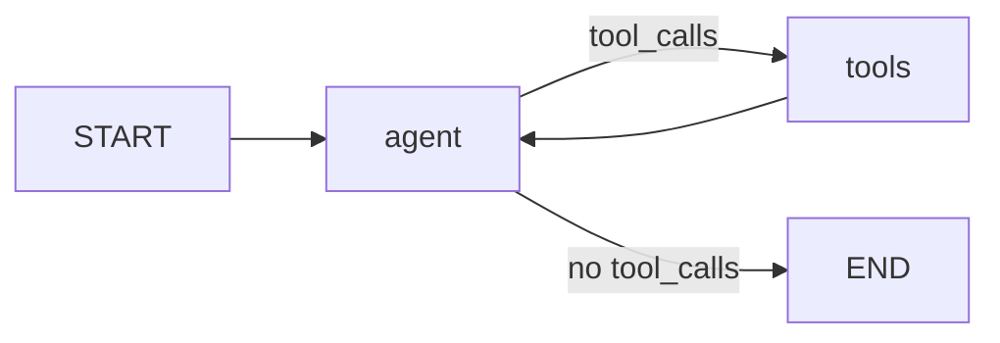

# 7. Tools and Agents

Tools are how you give a language model hands: functions it can request to call, with arguments it fills in from context. LangGraph turns that request/response cycle into a graph — a model node proposes tool calls, a tool node executes them, and the loop continues until the model produces a final answer. In this chapter you build that loop from scratch, then meet the prebuilt agent that packages it, and learn the patterns for tools that read and write graph state.

## Defining tools with `@tool`

The `@tool` decorator from `langchain_core.tools` converts a plain Python function into a tool the model can call. The tool's **schema** — what the model sees — is generated from the function's type hints and docstring, so both matter a great deal:

```python
from langchain_core.tools import tool

@tool
def search_flights(origin: str, destination: str, max_price: int = 500) -> str:
    """Search for available flights between two airports.

    Args:
        origin: IATA code of the departure airport, e.g. "SFO".
        destination: IATA code of the arrival airport, e.g. "JFK".
        max_price: Maximum ticket price in USD.
    """
    return f"Found 3 flights from {origin} to {destination} under ${max_price}."

print(search_flights.name)         # "search_flights"
print(search_flights.description)  # first line(s) of the docstring
print(search_flights.args)         # JSON schema derived from type hints
```

The function name becomes the tool name, the docstring becomes the description, and type hints (including defaults and `Optional`) become the argument schema. You can invoke a tool directly for testing: `search_flights.invoke({"origin": "SFO", "destination": "JFK"})`.

## Binding tools to a model

`bind_tools` attaches tool schemas to a chat model so it can emit tool calls:

```python
from langchain_anthropic import ChatAnthropic

llm = ChatAnthropic(model="claude-opus-4-8")
llm_with_tools = llm.bind_tools([search_flights])

response = llm_with_tools.invoke("Find me a flight from SFO to JFK under $400")
print(response.tool_calls)
# [{"name": "search_flights",
#   "args": {"origin": "SFO", "destination": "JFK", "max_price": 400},
#   "id": "toolu_01ABC...", "type": "tool_call"}]
```

The model does **not** run the function — it returns an `AIMessage` whose `tool_calls` list describes what it wants executed. Your code (or a `ToolNode`) runs each call and reports results back as `ToolMessage`s, matched by `tool_call_id`:

```python
from langchain_core.messages import ToolMessage

tool_call = response.tool_calls[0]
result = search_flights.invoke(tool_call["args"])
tool_msg = ToolMessage(content=result, tool_call_id=tool_call["id"])
```

The conversation then continues with `[human, ai-with-tool-calls, tool_message, ...]` — the model reads the `ToolMessage` and either calls more tools or answers.

## The `ToolNode` prebuilt

`ToolNode` is a ready-made graph node that executes every tool call in the last `AIMessage` — **in parallel** when there are several — and appends one `ToolMessage` per call to state:

```python
from langgraph.prebuilt import ToolNode

tool_node = ToolNode([search_flights])
```

By default, exceptions raised inside a tool are caught and turned into an error-text `ToolMessage`, so the model can see the failure and retry or recover. Tune this with `handle_tool_errors`:

```python
# Default: catch and report the exception text to the model
ToolNode(tools, handle_tool_errors=True)

# Custom static message shown to the model on any error
ToolNode(tools, handle_tool_errors="Tool failed. Check your arguments and try again.")

# Custom function: exception -> message content
ToolNode(tools, handle_tool_errors=lambda e: f"Error: {type(e).__name__}: {e}")

# Propagate: let the exception crash the run (surface it to your own retry logic)
ToolNode(tools, handle_tool_errors=False)
```

## Routing with `tools_condition`

`tools_condition` is a prebuilt conditional-edge function: it returns `"tools"` if the last message contains tool calls, and `END` otherwise. It saves you writing the same two-line router in every agent.

## Building a ReAct agent from scratch

Here is the full loop — an agent node that calls the model, a tool node that executes, and an edge that decides whether to loop or stop:

```python
from langchain_anthropic import ChatAnthropic
from langchain_core.tools import tool
from langgraph.graph import StateGraph, START, END, MessagesState
from langgraph.prebuilt import ToolNode, tools_condition

@tool
def get_weather(city: str) -> str:
    """Get the current weather for a city."""
    return f"It is 72F and sunny in {city}."

@tool
def get_population(city: str) -> str:
    """Get the population of a city."""
    return f"{city} has a population of about 900,000."

tools = [get_weather, get_population]
llm = ChatAnthropic(model="claude-opus-4-8")
llm_with_tools = llm.bind_tools(tools)

def agent(state: MessagesState):
    response = llm_with_tools.invoke(state["messages"])
    return {"messages": [response]}

builder = StateGraph(MessagesState)
builder.add_node("agent", agent)
builder.add_node("tools", ToolNode(tools))

builder.add_edge(START, "agent")
builder.add_conditional_edges("agent", tools_condition)  # -> "tools" or END
builder.add_edge("tools", "agent")                       # loop back

graph = builder.compile()

result = graph.invoke(
    {"messages": [("user", "What's the weather in Austin, and how many people live there?")]}
)
print(result["messages"][-1].content)
```

The shape is universal:



The model may call both tools in one turn; `ToolNode` runs them in parallel, appends two `ToolMessage`s, and the loop returns to `agent`, which now has everything it needs to answer.

## The prebuilt agent: `create_agent`

In LangChain/LangGraph v1 the packaged version of this loop lives in `langchain.agents`:

```python
from langchain.agents import create_agent
from langgraph.checkpoint.memory import InMemorySaver

agent = create_agent(
    model="anthropic:claude-opus-4-8",   # or a ChatAnthropic instance
    tools=[get_weather, get_population],
    system_prompt="You are a concise city information assistant.",
    checkpointer=InMemorySaver(),
)

config = {"configurable": {"thread_id": "user-42"}}
result = agent.invoke({"messages": [("user", "Weather in Austin?")]}, config)
```

> **Version note:** in v0.x this was `from langgraph.prebuilt import create_react_agent`. That import still works in v1 but is deprecated; `create_agent` is the successor and adds middleware-style hooks. Existing `create_react_agent` code continues to run.

Useful options:

| Option | Purpose |
|---|---|
| `system_prompt` | Static system message prepended to every model call |
| `response_format` | Pydantic model / schema for structured final output (returned as `structured_response` in state) |
| `pre_model_hook` | Node that runs before each model call — trim/summarize messages, inject context |
| `post_model_hook` | Node that runs after each model call — validate, guardrail, human review |
| `state_schema` | Custom state class (must include `messages`) to carry extra keys |
| `checkpointer` / `store` | Persistence for threads and cross-thread memory |

Because `create_agent` returns a compiled `StateGraph`, everything from other chapters applies: streaming, interrupts, subgraph embedding, `get_state`.

## Accessing graph state and store inside tools

Tools sometimes need more than model-supplied arguments — the current state, or long-term memory. Annotate parameters so they are **injected at runtime and hidden from the model's schema**:

```python
from typing import Annotated
from langchain_core.tools import tool
from langgraph.prebuilt import InjectedState, InjectedStore
from langgraph.store.base import BaseStore

@tool
def summarize_conversation(state: Annotated[dict, InjectedState]) -> str:
    """Summarize the conversation so far."""
    return f"The conversation has {len(state['messages'])} messages."

@tool
def recall_preference(
    key: str,
    store: Annotated[BaseStore, InjectedStore()],
) -> str:
    """Look up a stored user preference by key."""
    item = store.get(("preferences",), key)
    return item.value["text"] if item else "No preference stored."
```

The model only sees `key` for `recall_preference`; the state and store arrive automatically. Inside any tool (or node) you can also grab the store imperatively with `from langgraph.config import get_store`.

> **Version note:** v1 introduces `ToolRuntime` — add a `runtime: ToolRuntime` parameter (from `langchain.tools`) to receive state, store, config, tool call ID, and stream writer through one object instead of separate `Injected*` annotations. The annotations remain supported.

## Updating graph state from tools

A tool can do more than return text — return a `Command` to update state directly. Include a `ToolMessage` in the update so the tool call is still answered:

```python
from typing import Annotated
from langchain_core.messages import ToolMessage
from langchain_core.tools import tool, InjectedToolCallId
from langgraph.types import Command

@tool
def update_user_name(
    name: str,
    tool_call_id: Annotated[str, InjectedToolCallId],
) -> Command:
    """Record the user's name in the session."""
    return Command(update={
        "user_name": name,
        "messages": [ToolMessage(f"Recorded name: {name}", tool_call_id=tool_call_id)],
    })
```

`ToolNode` recognizes the `Command` and applies the update. Combined with `goto`, this is also how handoff tools move control between agents — see [Multi-agent systems](08-multi-agent-systems.md).

## Structured output strategies

| Strategy | How | Trade-off |
|---|---|---|
| `response_format` on `create_agent` | Pass a Pydantic model; agent makes one extra model call at the end to fill it | Simplest; one extra LLM call |
| Bind a final "respond" tool | Add a `FinalAnswer` tool alongside real tools; route to `END` when it is called | No extra call; more wiring |
| `llm.with_structured_output(...)` in a dedicated node | A separate formatting node after the loop ends | Full control over when/how |

In v1, `response_format` accepts strategy wrappers (e.g. `ToolStrategy` / provider-native output configuration) so you can choose between tool-based and native structured output without changing your schema.

## Tool error-handling strategies

| Strategy | Mechanism | Use when |
|---|---|---|
| Report to model (default) | `handle_tool_errors=True` | Model can fix bad arguments and retry |
| Static guidance | `handle_tool_errors="..."` | You want a consistent recovery hint |
| Custom formatter | `handle_tool_errors=callable` | Different errors need different messages |
| Raise | `handle_tool_errors=False` | Failures are bugs; fail fast in tests |
| Node retry | `RetryPolicy` on the tool node | Transient faults (network, rate limits) |
| Validate inside the tool | Raise `ValueError` with a clear message | Enforce invariants the schema can't express |

## Best practices for tool design

- **Names**: verb-first, unambiguous (`search_flights`, not `flights` or `do_search`). The model routes on names.
- **Descriptions**: say what the tool does, when to use it, and what it returns. Document each argument with an example value.
- **Few, focused tools** beat many overlapping ones — models pick wrongly among near-duplicates. Aim for a handful per agent; if you need dozens, split into multiple agents ([Multi-agent systems](08-multi-agent-systems.md)).
- **Narrow argument types**: prefer `Literal["celsius", "fahrenheit"]` over free-text `str` where the domain is closed.
- **Return concise, model-readable strings** — the output is prompt content. Truncate huge payloads; store bulk data in state or the store and return a summary.
- **Make tools idempotent** where possible; the model may retry after errors.

## Key takeaways

- `@tool` builds a schema from type hints and the docstring; `bind_tools` lets the model emit `tool_calls`, which you answer with `ToolMessage`s.
- `ToolNode` executes calls in parallel and handles errors via `handle_tool_errors`; `tools_condition` routes between the loop and `END`.
- The ReAct agent is just `agent → tools → agent` in a `StateGraph` — you can build it in ~20 lines.
- Use `create_agent` (v1; formerly `create_react_agent`) for a batteries-included agent with system prompt, structured output, hooks, and persistence.
- `InjectedState`, `InjectedStore`, and v1's `ToolRuntime` give tools hidden access to state and memory; returning `Command` lets tools write state.
- Design few, well-named, well-described tools with narrow argument types and concise outputs.

## Next

Continue to [8. Multi-agent systems](08-multi-agent-systems.md).
