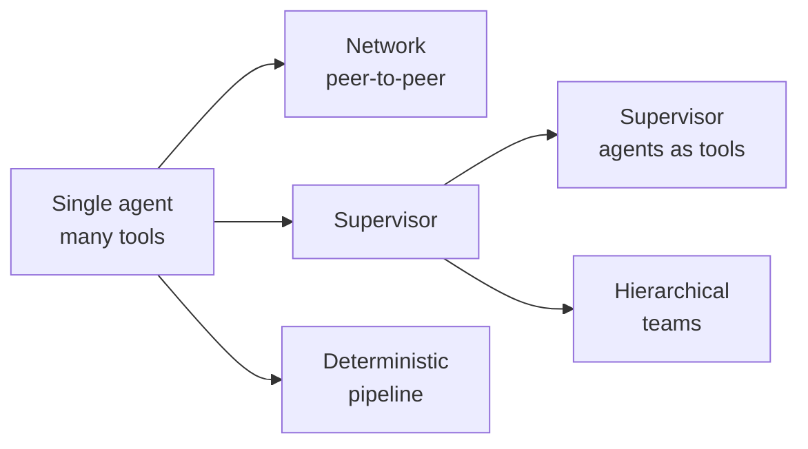
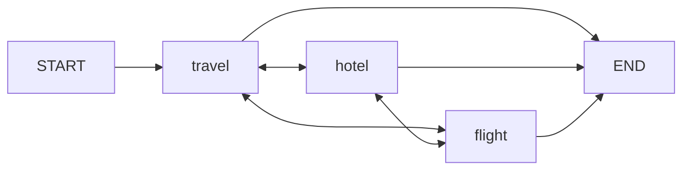
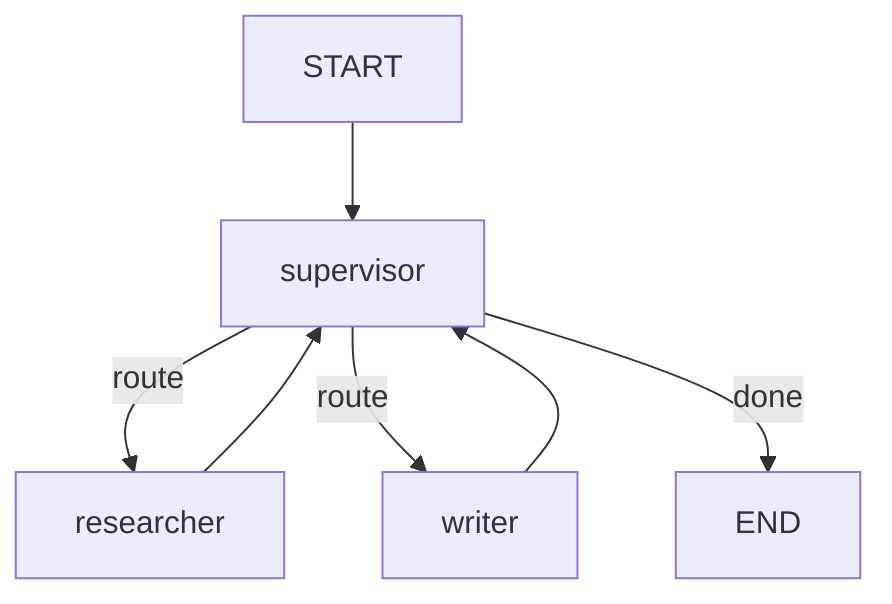
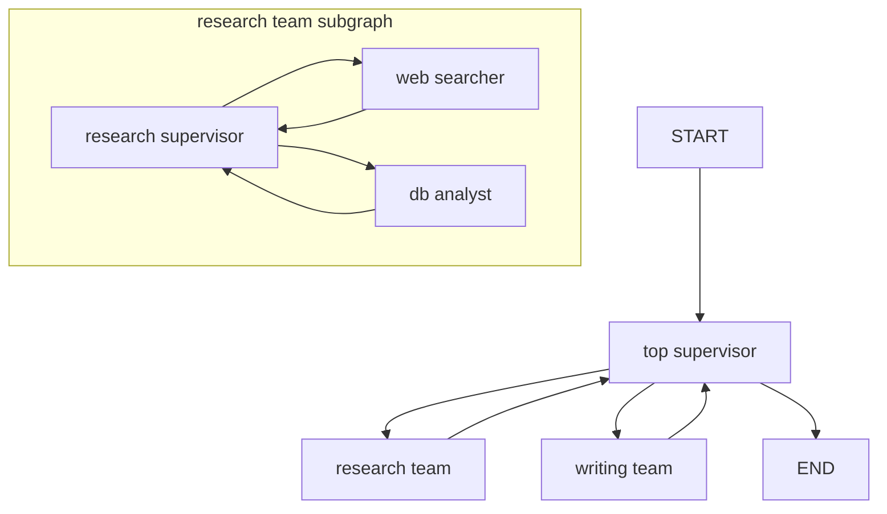
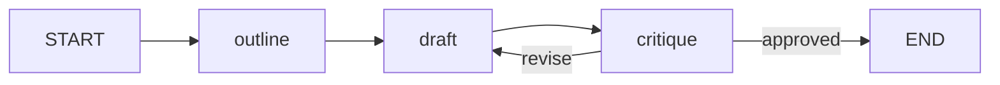

# 8. Multi-Agent Systems

A single agent with a pile of tools works — until the prompt bloats, the tool list confuses the model, and every extra capability degrades every existing one. Multi-agent systems split the work across several focused agents that hand off to each other, run in parallel, or report to a coordinator. In LangGraph, every one of these architectures is just a graph: agents are nodes (or subgraphs), and handoffs are edges or `Command`s. This chapter walks the full architecture spectrum, the mechanics of handoffs and shared state, and ends with a complete runnable supervisor system.

## Why multi-agent?

- **Context bloat**: one agent doing research, coding, and writing carries all three instruction sets and tool schemas in every prompt. Splitting agents keeps each context small and relevant.
- **Specialization**: a focused system prompt plus 3–5 tools outperforms a generalist prompt plus 20 tools. Each agent can even use a different model (cheap model for routing, strong model for synthesis).
- **Parallelism**: independent subtasks (research three topics) can fan out to concurrent workers.
- **Modularity**: agents can be developed, tested, evaluated, and replaced independently — a supervisor doesn't care how the researcher works internally.

The cost is coordination complexity. Start with the simplest architecture that works and move right along the spectrum only when you feel real pain.

## The architecture spectrum



### (a) Single agent with many tools (baseline)

The null hypothesis. One model, one loop, all tools bound:

```python
from langchain.agents import create_agent

agent = create_agent(
    model="anthropic:claude-opus-4-8",
    tools=[search_web, run_sql, write_file, send_email],
    system_prompt="You are a general-purpose assistant.",
)
```

Works well up to roughly 5–10 well-differentiated tools. When tool selection accuracy drops or the system prompt turns into a wall of special cases, split.

### (b) Network (peer-to-peer)

Every agent can hand off to any other agent. Each agent node returns a `Command` naming the next agent (or `END`):



```python
from typing import Literal
from langchain_anthropic import ChatAnthropic
from langgraph.graph import StateGraph, START, MessagesState
from langgraph.types import Command

llm = ChatAnthropic(model="claude-opus-4-8")

def travel_agent(state: MessagesState) -> Command[Literal["hotel_agent", "flight_agent", "__end__"]]:
    # model decides where to go next (e.g. via a routing tool call)
    response = llm.bind_tools([book_trip, transfer_to_hotel, transfer_to_flight]).invoke(state["messages"])
    goto = decide_next_agent(response)   # parse tool call -> "hotel_agent" | "flight_agent" | "__end__"
    return Command(goto=goto, update={"messages": [response]})

builder = StateGraph(MessagesState)
builder.add_node("travel_agent", travel_agent)
builder.add_node("hotel_agent", hotel_agent)
builder.add_node("flight_agent", flight_agent)
builder.add_edge(START, "travel_agent")
network = builder.compile()
```

Flexible but hard to control: with N agents there are N² possible transitions, and loops between chatty agents are a real failure mode. Prefer supervisor unless agents genuinely need direct lateral handoffs (the "swarm" pattern).

### (c) Supervisor

A central router LLM decides which worker runs next; every worker returns to the supervisor when done:



```python
def supervisor(state: MessagesState) -> Command[Literal["researcher", "writer", "__end__"]]:
    decision = router_llm.invoke([SUPERVISOR_PROMPT] + state["messages"])
    return Command(goto=decision.next_agent)   # structured output: "researcher" | "writer" | "__end__"

builder.add_edge("researcher", "supervisor")   # workers always return
builder.add_edge("writer", "supervisor")
```

One decision point, easy to log and debug. The full runnable version is at the end of this chapter.

### (d) Supervisor with agents-as-tools

Wrap each worker agent as a *tool* of a single top-level agent — the "tool-calling supervisor." The supervisor is a plain ReAct loop; calling a worker is just a tool call, and the worker's final answer comes back as a `ToolMessage`:

```python
from langchain.agents import create_agent
from langchain_core.tools import tool

research_agent = create_agent(model="anthropic:claude-opus-4-8", tools=[search_web],
                              system_prompt="You are a researcher. Answer with findings only.")

@tool
def research(query: str) -> str:
    """Delegate a research question to the research agent."""
    result = research_agent.invoke({"messages": [("user", query)]})
    return result["messages"][-1].content

supervisor = create_agent(
    model="anthropic:claude-opus-4-8",
    tools=[research, write_report],   # workers look like ordinary tools
    system_prompt="You coordinate research and writing. Delegate; do not answer directly.",
)
```

Simplest supervisor to build — no custom graph at all. Workers see only the query the supervisor writes for them (a feature: clean contexts) and can even run in parallel when the supervisor emits multiple tool calls. The trade-off is that workers never see the full conversation, and the supervisor must compress context into each tool call.

### (e) Hierarchical (supervisor of supervisors)

When one supervisor has too many workers, group workers into *teams*, each with its own supervisor, compiled as a subgraph. A top-level supervisor routes between teams:



```python
research_team = build_team_graph(["web_searcher", "db_analyst"]).compile()
writing_team = build_team_graph(["drafter", "editor"]).compile()

top = StateGraph(MessagesState)
top.add_node("research_team", research_team)   # compiled subgraphs as nodes
top.add_node("writing_team", writing_team)
top.add_node("top_supervisor", top_supervisor)
```

Each team is independently testable and keeps its internal chatter out of the top-level state — see [Subgraphs](09-subgraphs.md) for schema mapping.

### (f) Custom deterministic workflow with agent nodes

When the order of operations is known, don't ask an LLM to decide it. Wire agents in a fixed pipeline and reserve model judgment for the work inside each node:



```python
builder = StateGraph(MessagesState)
builder.add_node("outline", outline_agent)
builder.add_node("draft", draft_agent)
builder.add_node("critique", critique_agent)
builder.add_edge(START, "outline")
builder.add_edge("outline", "draft")
builder.add_edge("draft", "critique")
builder.add_conditional_edges("critique", lambda s: "draft" if s.get("needs_revision") else END)
```

Cheapest, most predictable, easiest to evaluate. Many "multi-agent" products are really this.

## Handoffs in depth

A **handoff** transfers control (and optionally state) from one agent to another. The idiomatic mechanism is a *handoff tool*: the agent's model calls it like any tool, but instead of returning text it returns a `Command` that jumps to another node — and because worker agents are usually subgraphs, the jump must target the **parent** graph:

```python
from typing import Annotated
from langchain_core.messages import ToolMessage
from langchain_core.tools import tool, InjectedToolCallId
from langgraph.prebuilt import InjectedState
from langgraph.types import Command

def make_handoff_tool(agent_name: str):
    @tool(f"transfer_to_{agent_name}", description=f"Hand the conversation to {agent_name}.")
    def handoff(
        state: Annotated[dict, InjectedState],
        tool_call_id: Annotated[str, InjectedToolCallId],
    ) -> Command:
        tool_msg = ToolMessage(f"Transferred to {agent_name}.", tool_call_id=tool_call_id)
        return Command(
            goto=agent_name,                       # node to run next
            update={"messages": state["messages"] + [tool_msg]},  # what it receives
            graph=Command.PARENT,                  # navigate in the parent graph
        )
    return handoff
```

Key points:

- `goto=agent_name` names a node in the parent graph, so `graph=Command.PARENT` is required when the tool runs inside a worker subgraph.
- Always answer the pending tool call with a `ToolMessage` in the update — otherwise the receiving agent sees a dangling tool call and most providers reject the transcript.
- The `update` decides *what the next agent sees* — full history, or just a task description you compose here.

### Parallel fan-out with `Send`

Handoffs move control to *one* agent. For map-reduce patterns — dispatch N workers concurrently over a list, then aggregate — use `Send`:

```python
import operator
from typing import Annotated, TypedDict
from langgraph.graph import StateGraph, START, END
from langgraph.types import Send

class ResearchState(TypedDict):
    topics: list[str]
    findings: Annotated[list[str], operator.add]   # reducer merges parallel writes

def plan(state: ResearchState):
    return {"topics": ["pricing", "competitors", "regulation"]}

def fan_out(state: ResearchState):
    return [Send("worker", {"topic": t}) for t in state["topics"]]

def worker(state: dict):   # each Send delivers its own private input
    answer = research_agent.invoke({"messages": [("user", f"Research: {state['topic']}")]})
    return {"findings": [answer["messages"][-1].content]}

def reduce(state: ResearchState):
    return {"findings": [summarize(state["findings"])]}

builder = StateGraph(ResearchState)
builder.add_node("plan", plan)
builder.add_node("worker", worker)
builder.add_node("reduce", reduce)
builder.add_edge(START, "plan")
builder.add_conditional_edges("plan", fan_out, ["worker"])
builder.add_edge("worker", "reduce")
builder.add_edge("reduce", END)
```

All `Send`-spawned workers run in the same superstep; the `operator.add` reducer merges their outputs safely.

## Communication and state design

The hardest multi-agent decision is not topology — it is *what each agent sees*.

| Design | How | Pros | Cons |
|---|---|---|---|
| Shared message list | All agents read/write one `MessagesState` | Full context everywhere; simplest | Contexts grow fast; workers see irrelevant chatter |
| Share final results only | Handoff `update` passes a task string; worker returns only its answer | Small, clean contexts | Supervisor must write good task descriptions |
| Separate per-agent histories | Each agent is a subgraph with its own `messages` key and schema; wrapper maps parent ⇄ child state | Full isolation; per-agent memory | Most wiring; see [Subgraphs](09-subgraphs.md) |

A worker with a private history looks like this:

```python
class ResearcherState(TypedDict):
    task: str
    messages: Annotated[list, add_messages]   # private to this subgraph
    result: str

def call_researcher(parent_state: MessagesState):
    task = parent_state["messages"][-1].content            # parent -> child input
    out = researcher_graph.invoke({"task": task, "messages": []})
    return {"messages": [("ai", out["result"])]}           # child -> parent update
```

**Attribute messages to agents.** When several agents share one list, set `name` on the messages an agent produces (`AIMessage(content=..., name="researcher")`) or prepend an identifier, so downstream agents and your traces can tell who said what.

## Prebuilt libraries

Two companion packages implement the common patterns so you don't hand-roll them:

```python
# pip install langgraph-supervisor
from langgraph_supervisor import create_supervisor

app = create_supervisor(
    agents=[research_agent, writer_agent],       # created with create_agent, each with a name
    model=ChatAnthropic(model="claude-opus-4-8"),
    prompt="You manage a researcher and a writer. Assign work; do not do it yourself.",
).compile()
```

```python
# pip install langgraph-swarm
from langgraph_swarm import create_swarm, create_handoff_tool

alice = create_agent(model="anthropic:claude-opus-4-8", name="alice",
                     tools=[math_tool, create_handoff_tool(agent_name="bob")])
bob = create_agent(model="anthropic:claude-opus-4-8", name="bob",
                   tools=[create_handoff_tool(agent_name="alice")])

app = create_swarm([alice, bob], default_active_agent="alice").compile()
```

`langgraph-supervisor` builds architecture (c)/(d); `langgraph-swarm` builds (b) with a remembered "active agent" so the conversation resumes with whoever spoke last.

## Choosing an architecture

| Situation | Choose |
|---|---|
| ≤ ~7 well-separated tools, one domain | (a) Single agent |
| Known, fixed sequence of steps | (f) Deterministic pipeline with agent nodes |
| Dynamic task routing among specialists | (c) Supervisor |
| Specialists never need shared history; fastest to build | (d) Agents-as-tools |
| Users converse with different specialists over time | (b) Network / swarm |
| Many specialists, natural groupings | (e) Hierarchical teams |
| Parallel work over a dynamic list | `Send` fan-out inside any of the above |

## Full example: supervisor + researcher + writer

A complete, runnable supervisor system with custom handoff tools and shared `MessagesState`:

```python
from typing import Annotated, Literal
from langchain_anthropic import ChatAnthropic
from langchain_core.messages import ToolMessage
from langchain_core.tools import tool, InjectedToolCallId
from langgraph.graph import StateGraph, START, END, MessagesState
from langgraph.prebuilt import InjectedState
from langgraph.types import Command
from langchain.agents import create_agent

llm = ChatAnthropic(model="claude-opus-4-8")

# --- worker tools -----------------------------------------------------------
@tool
def search_web(query: str) -> str:
    """Search the web for up-to-date information."""
    return f"[stub] Top results for '{query}': ..."

@tool
def save_draft(text: str) -> str:
    """Save the current draft of the article."""
    return f"Draft saved ({len(text)} chars)."

# --- worker agents ----------------------------------------------------------
researcher = create_agent(
    model=llm, tools=[search_web], name="researcher",
    system_prompt="You are a researcher. Gather facts for the request, then "
                  "reply with a bulleted list of findings. Do not write prose.",
)
writer = create_agent(
    model=llm, tools=[save_draft], name="writer",
    system_prompt="You are a writer. Turn the researcher's findings in the "
                  "conversation into a short, polished article.",
)

# --- handoff tools for the supervisor ---------------------------------------
def make_handoff_tool(agent_name: str):
    @tool(f"transfer_to_{agent_name}",
          description=f"Assign the current task to the {agent_name}.")
    def handoff(
        state: Annotated[dict, InjectedState],
        tool_call_id: Annotated[str, InjectedToolCallId],
    ) -> Command:
        tool_msg = ToolMessage(f"Assigned to {agent_name}.", tool_call_id=tool_call_id)
        return Command(goto=agent_name,
                       update={"messages": [tool_msg]},
                       graph=Command.PARENT)
    return handoff

supervisor = create_agent(
    model=llm,
    tools=[make_handoff_tool("researcher"), make_handoff_tool("writer")],
    name="supervisor",
    system_prompt="You manage a researcher and a writer. For each user request: "
                  "first transfer to the researcher, then to the writer, then "
                  "summarize the final article for the user. Never do the work yourself.",
)

# --- wire the parent graph ---------------------------------------------------
builder = StateGraph(MessagesState)
builder.add_node("supervisor", supervisor, destinations=("researcher", "writer", END))
builder.add_node("researcher", researcher)
builder.add_node("writer", writer)
builder.add_edge(START, "supervisor")
builder.add_edge("researcher", "supervisor")   # workers always report back
builder.add_edge("writer", "supervisor")
graph = builder.compile()

for chunk in graph.stream(
    {"messages": [("user", "Write a short article on solid-state batteries.")]},
    stream_mode="updates",
):
    for node, update in chunk.items():
        print(f"--- {node} ---")
        if update and "messages" in update:
            print(update["messages"][-1].content[:200])
```

Flow: supervisor calls `transfer_to_researcher` → handoff tool jumps to the researcher (in the parent graph) → researcher runs its own ReAct loop and its final message lands in shared state → the fixed edge returns control to the supervisor → it transfers to the writer → writer drafts → supervisor answers and the run ends. Swap the shared `MessagesState` for per-worker task strings (previous section) when worker contexts get noisy.

## Key takeaways

- Multi-agent systems fight context bloat and tool confusion through specialization; agents are nodes, handoffs are `Command`s and edges.
- The spectrum runs from one agent with tools, through network, supervisor, agents-as-tools, and hierarchical teams, to fully deterministic pipelines — prefer the simplest that works.
- Handoff tools return `Command(goto=..., update=..., graph=Command.PARENT)`; always include a `ToolMessage` so no tool call is left unanswered.
- Use `Send` for parallel worker fan-out with a reducer (e.g. `operator.add`) to merge results.
- Decide deliberately what each agent sees: shared message list, final-results-only, or fully private per-agent histories via subgraphs; name messages for attribution.
- `langgraph-supervisor` and `langgraph-swarm` package the supervisor and network patterns.

## Next

Continue to [9. Subgraphs](09-subgraphs.md).
