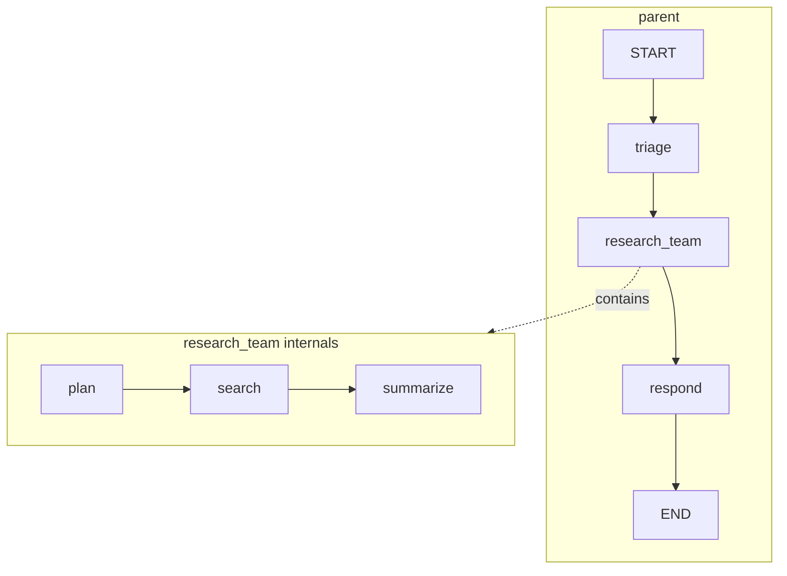

# 9. Subgraphs

A subgraph is a compiled graph used inside another graph — a node whose implementation happens to be an entire `StateGraph` of its own. Subgraphs are how you build systems out of systems: multi-agent teams with private conversations, reusable pipelines shared across products, and components owned by different teams that only agree on an interface. This chapter covers the two integration patterns, how state and persistence flow across the boundary, and how streaming and interrupts behave when graphs nest.

## What a subgraph is

Any compiled graph (`builder.compile()`) is a `Runnable`, and any `Runnable` can be a node. When the parent reaches that node, it invokes the child graph to completion (or to an interrupt) and treats the child's output as the node's state update:



The parent never sees the child's internal nodes in its own edge list — the whole child is one step from the parent's perspective.

## Two integration patterns

How you attach a subgraph depends on whether parent and child share state keys.

### Pattern 1: shared state keys — add the compiled graph directly

If the subgraph's schema overlaps with the parent's (e.g. both use `messages`), add the compiled subgraph as a node. LangGraph passes the overlapping keys in and merges the subgraph's output back using the parent's reducers:

```python
from typing import Annotated, TypedDict
from langgraph.graph import StateGraph, START, END
from langgraph.graph.message import add_messages

class ParentState(TypedDict):
    messages: Annotated[list, add_messages]
    customer_id: str          # parent-only key: invisible to the subgraph

class TeamState(TypedDict):
    messages: Annotated[list, add_messages]   # shared key
    scratch: str                              # subgraph-private key

def team_step(state: TeamState):
    return {"messages": [("ai", "team result")], "scratch": "internal notes"}

team_builder = StateGraph(TeamState)
team_builder.add_node("team_step", team_step)
team_builder.add_edge(START, "team_step")
subgraph = team_builder.compile()

builder = StateGraph(ParentState)
builder.add_node("team", subgraph)            # compiled graph as a node
builder.add_edge(START, "team")
graph = builder.compile()
```

Only `messages` crosses the boundary. `scratch` lives and dies inside the subgraph; `customer_id` never enters it.

### Pattern 2: different schemas — wrap in a transforming function

If the schemas share nothing (or you want explicit control), wrap the subgraph in a plain node function that transforms parent state → subgraph input, invokes it, and transforms subgraph output → parent update:

```python
class ParentState(TypedDict):
    query: str
    answer: str

class ChildState(TypedDict):
    task: str
    findings: list[str]

child = child_builder.compile()

def call_child(state: ParentState):
    child_out = child.invoke({"task": state["query"], "findings": []})  # parent -> child
    return {"answer": "; ".join(child_out["findings"])}                 # child -> parent

builder = StateGraph(ParentState)
builder.add_node("research", call_child)
```

**You cannot combine both patterns for the same subgraph.** Either the subgraph is the node (pattern 1, requires shared keys) or a function is the node and calls the subgraph (pattern 2). If you invoke a subgraph inside a wrapper function, the automatic key mapping of pattern 1 does not apply — *you* are the mapping. Trying to add a subgraph with zero shared keys directly as a node fails, because there is nothing to pass in or merge out.

## State isolation and communication rules

- Communication happens **only through shared keys** (pattern 1) or your explicit transforms (pattern 2).
- Subgraph-private keys are invisible to the parent; parent-private keys are invisible to the subgraph.
- Reducers apply on each side independently: the child's `add_messages` accumulates during the child run; the child's final value is then merged into the parent through the *parent's* reducer.
- A subgraph node can also be jumped *out of* — a node inside the subgraph can return `Command(goto="some_parent_node", graph=Command.PARENT)` to route in the parent graph, which is how multi-agent handoffs escape a worker's internal loop (see [Multi-agent systems](08-multi-agent-systems.md)).

## Checkpointing with subgraphs

You normally configure persistence **once, at the parent**:

```python
from langgraph.checkpoint.memory import InMemorySaver

graph = builder.compile(checkpointer=InMemorySaver())
```

The checkpointer propagates automatically to all subgraphs; child checkpoints are stored under namespaced sub-thread IDs of the parent thread, so a resumed parent resumes its children too. Do not pass a separate checkpointer instance when compiling a subgraph that will be embedded.

Two compile-time switches on the *subgraph* adjust this:

| Subgraph `compile(...)` | Behavior |
|---|---|
| (nothing) | Inherit the parent's checkpointer (default, usually what you want) |
| `checkpointer=True` | Subgraph keeps its **own independent memory** across invocations within the parent thread — e.g. a worker agent that remembers prior handoffs |
| `checkpointer=None` / `False` | Opt out: subgraph state is not checkpointed; each invocation starts fresh and interrupts inside it cannot resume |

```python
worker = worker_builder.compile(checkpointer=True)    # private persistent memory
stateless = tool_pipeline.compile(checkpointer=False) # never persisted
```

## Viewing subgraph state

`get_state` on the parent returns parent-level state; pass `subgraphs=True` to also materialize the state of any currently active subgraphs (most useful while a subgraph is paused at an interrupt):

```python
config = {"configurable": {"thread_id": "t1"}}
state = graph.get_state(config, subgraphs=True)

task = state.tasks[0]                # the paused subgraph node
print(task.state.values)             # the child's own state values
```

`get_state_history` similarly walks parent checkpoints; a child's history is accessible via the namespaced config found on the task.

## Streaming from subgraphs

By default, `stream()` emits only parent-level updates — a subgraph node appears as a single update when it finishes. Pass `subgraphs=True` to receive events from every level, each tagged with a **namespace** tuple identifying where it came from:

```python
for namespace, chunk in graph.stream(inputs, stream_mode="updates", subgraphs=True):
    # namespace == () for the parent,
    # ("team:<task-id>",) for the subgraph, deeper tuples for nested subgraphs
    print(namespace, chunk)
```

This works with every stream mode, including `messages` — so you can stream tokens from an LLM buried three subgraphs deep and know exactly which agent produced them.

## Interrupts inside subgraphs

`interrupt()` called inside a subgraph **bubbles up to the parent**: the whole run pauses, the interrupt payload surfaces in the parent's `__interrupt__` result, and you resume at the parent with `Command(resume=...)` on the same thread. The resume value is routed back down to the interrupted node inside the subgraph. You do not need to know how deep the interrupt occurred — the namespaced checkpoints handle addressing:

```python
result = graph.invoke(inputs, config)                     # pauses inside the subgraph
print(result["__interrupt__"])                            # payload from the child
graph.invoke(Command(resume="approved"), config)          # resumes the child in place
```

This requires a checkpointer on the parent (and not opted out on the child).

## Nesting depth and recursion

Subgraphs nest arbitrarily — a parent can contain a team subgraph that contains agent subgraphs. Practical limits:

- Each subgraph invocation counts against the **parent's step budget**; deep nesting plus loops can hit `recursion_limit` (default 25). Raise it per-run: `graph.invoke(inputs, {"recursion_limit": 100, ...})` — note the child's internal steps consume the *child's own* limit, which you can set the same way when invoking it in pattern 2.
- Keep namespaces comprehensible: two or three levels is plenty for almost any system.
- A graph must not contain itself (no direct recursion); model recursive workflows as loops with edges instead.

## Use cases

| Use case | Why subgraphs fit |
|---|---|
| Multi-agent teams | Each agent keeps a private message history; only results cross the boundary |
| Reusable pipelines | One compiled RAG/validation/ETL graph embedded in many products |
| Per-team persistence | `checkpointer=True` gives a component its own durable memory |
| Organizational boundaries | Teams agree on shared keys, iterate independently behind them |
| Human-in-the-loop components | Interrupts bubble up, so an approval step works no matter how deep it lives |

## Worked example: research subgraph inside a support graph

A research team with a fully private state (pattern 2 — no shared keys), embedded in a customer-support parent:

```python
from typing import Annotated, TypedDict
from langchain_anthropic import ChatAnthropic
from langgraph.graph import StateGraph, START, END
from langgraph.graph.message import add_messages
from langgraph.checkpoint.memory import InMemorySaver

llm = ChatAnthropic(model="claude-opus-4-8")

# --- child: research pipeline with private state ----------------------------
class ResearchState(TypedDict):
    question: str
    notes: Annotated[list[str], lambda a, b: a + b]
    report: str

def gather(state: ResearchState):
    resp = llm.invoke(f"List 3 key facts about: {state['question']}")
    return {"notes": [resp.content]}

def write_report(state: ResearchState):
    resp = llm.invoke("Write a 3-sentence summary from these notes:\n"
                      + "\n".join(state["notes"]))
    return {"report": resp.content}

rb = StateGraph(ResearchState)
rb.add_node("gather", gather)
rb.add_node("write_report", write_report)
rb.add_edge(START, "gather")
rb.add_edge("gather", "write_report")
rb.add_edge("write_report", END)
research = rb.compile()          # inherits the parent's checkpointer when embedded

# --- parent: support conversation -------------------------------------------
class SupportState(TypedDict):
    messages: Annotated[list, add_messages]

def call_research(state: SupportState):
    question = state["messages"][-1].content
    out = research.invoke({"question": question, "notes": [], "report": ""})
    return {"messages": [("ai", out["report"])]}     # only the report crosses over

def respond(state: SupportState):
    resp = llm.invoke([("system", "Answer the customer using the research above.")]
                      + state["messages"])
    return {"messages": [resp]}

pb = StateGraph(SupportState)
pb.add_node("research", call_research)
pb.add_node("respond", respond)
pb.add_edge(START, "research")
pb.add_edge("research", "respond")
pb.add_edge("respond", END)
graph = pb.compile(checkpointer=InMemorySaver())

config = {"configurable": {"thread_id": "case-001"}}
for ns, chunk in graph.stream(
    {"messages": [("user", "Why is my solar inverter showing error E42?")]},
    config, stream_mode="updates", subgraphs=True,
):
    print(ns, list(chunk.keys()))
```

The child's `notes` never appear in `SupportState`; the parent receives only the finished report. Streaming with `subgraphs=True` shows `gather` and `write_report` firing under the `research` namespace before the parent's `respond` runs.

> **Version note:** in early v0.x you sometimes passed `interrupt_before` through wrappers to pause inside children; in v1 use `interrupt()` inside subgraph nodes — it bubbles to the parent automatically (see [Multi-agent systems](08-multi-agent-systems.md) for handoff-based alternatives).

## Key takeaways

- A subgraph is a compiled graph used as a node; the parent sees it as a single step.
- Shared keys → add the compiled graph directly; disjoint schemas → wrap in a function that maps state both ways. You cannot mix the two for one subgraph.
- State crosses the boundary only through shared keys or your explicit transforms; everything else is private to its side.
- The parent's checkpointer propagates to children; `checkpointer=True` on a subgraph gives it independent memory, `False`/`None` opts out.
- Inspect paused children with `get_state(subgraphs=True)`; stream all levels with `stream(..., subgraphs=True)` and read the namespace tuples.
- Interrupts inside subgraphs bubble to the parent and resume transparently with `Command(resume=...)`.

## Next

Continue to [10. Functional API](10-functional-api.md).
