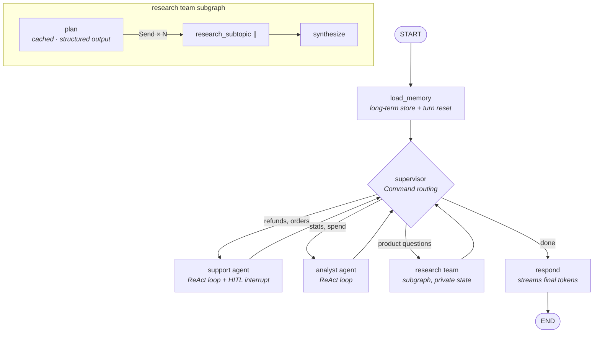

# Atlas — Multi-Agent Customer Support & Research Platform

A complex, real-world LangGraph project that exercises **every major LangGraph
concept** covered in the companion docs at [`docs/langgraph/`](../../docs/langgraph/README.md):
a streaming, human-supervised, multi-agent customer-experience system for a
fictional hardware company, powered by Anthropic Claude.

## What it does

A customer talks to **Atlas**. A supervisor LLM routes each turn to specialist
agents, who use tools, pause for human approval on risky actions, remember the
customer across sessions, and stream everything (tokens, agent activity,
progress) live to the client over SSE.



## Concept → code map

| LangGraph concept | Where in this project |
|---|---|
| Custom state + reducers (`add_messages`, `operator.add`, custom merge) | `atlas/state.py` |
| Supervisor multi-agent architecture, `Command(goto=...)` routing | `atlas/agents/supervisor.py` |
| ReAct agents from scratch (`bind_tools`, `ToolNode`, `tools_condition`) | `atlas/agents/workers.py` |
| Subgraph, shared schema (workers added directly as nodes) | `atlas/agents/workers.py`, `atlas/graph.py` |
| Subgraph, **different/private** schema (wrapped in a node) | `atlas/agents/researcher.py` |
| `Send` map-reduce fan-out (parallel subtopic research) | `atlas/agents/researcher.py` |
| Structured output for routing & planning | `supervisor.py`, `researcher.py` |
| Human-in-the-loop `interrupt()` inside a tool + `Command(resume=...)` | `atlas/tools/support_tools.py`, `server.py /resume`, `cli.py` |
| Streaming: `updates` + `messages` (tokens) + `custom`, `subgraphs=True` | `atlas/server.py`, `atlas/cli.py` |
| Custom stream events via `get_stream_writer()` | `researcher.py`, `support_tools.py` |
| Short-term memory: checkpointers (SQLite async / in-memory), threads | `atlas/server.py`, `cli.py` |
| Long-term memory: `Store`, cross-thread customer preferences | `atlas/memory.py`, `support_tools.py` (`remember_preference`) |
| Runtime context (`context_schema` + `Runtime[AtlasContext]`) | `atlas/config.py`, `atlas/graph.py` |
| `RetryPolicy` on nodes/tasks | `workers.py`, `researcher.py`, `functional_pipeline.py` |
| `CachePolicy` + node caching | `researcher.py` (plan node) |
| Durability modes (`durability="async"`) | `atlas/server.py` |
| Time travel: `get_state_history`, `update_state`, forking | `scripts/time_travel_demo.py`, `GET /history` |
| Functional API (`@entrypoint`, `@task`, `entrypoint.final`, `previous`) | `atlas/functional_pipeline.py` |
| Testing graphs offline (stubs, wiring assertions) | `tests/test_graph.py` |

## Setup

```bash
cd project/atlas
python -m venv .venv && source .venv/bin/activate
pip install -r requirements.txt
cp .env.example .env       # add your ANTHROPIC_API_KEY
export $(grep -v '^#' .env | xargs)
```

## Run it

**1. Terminal chat (simplest):**

```bash
python -m atlas.cli
```

Try these, in order, in one session:

- `What's the warranty on your products?` → supervisor → **research team**: watch
  the plan fan out into parallel `Send` branches with progress events, then the
  synthesized answer streams token-by-token.
- `I want a refund for order ord_1001, the battery drains too fast.` →
  **support agent** checks eligibility, calls `issue_refund`, and the run
  **pauses** — you approve/reject in the terminal, and the run resumes exactly
  where it stopped.
- `How much have I spent with you overall?` → **analyst agent**.
- `Please remember that I prefer replacements over refunds.` → saved to the
  **long-term store**; start a new session and Atlas still knows it.

**2. HTTP streaming server:**

```bash
uvicorn atlas.server:app --reload
```

```bash
# start a streaming chat (SSE events: token / update / progress / interrupt / done)
curl -N localhost:8000/chat -X POST -H 'content-type: application/json' \
  -d '{"thread_id": "t1", "message": "Refund ord_1001 please — battery issues", "customer_id": "cus_001"}'

# the stream ends with an `interrupt` event → approve it:
curl -N localhost:8000/resume -X POST -H 'content-type: application/json' \
  -d '{"thread_id": "t1", "approved": true, "note": "verified with customer"}'

# inspect thread state & checkpoint history (time travel raw material)
curl localhost:8000/state/t1
curl localhost:8000/history/t1
```

**3. Time travel demo:**

```bash
python scripts/time_travel_demo.py
```

**4. Functional API pipeline:**

```bash
python -m atlas.functional_pipeline
```

**5. Offline tests (no API key / network needed):**

```bash
pytest tests/ -v
```

## Design notes

- **Why a supervisor?** Workers stay small and specialized; the supervisor owns
  control flow via `Command(goto=...)` so routing is dynamic, inspectable
  (streamed as `update` events), and guarded against loops (`visited`).
- **Why is the refund interrupt inside the tool?** Pausing at the exact
  side-effect boundary means *approval gates the action itself*, not the
  agent's intention. Note the side effect sits **after** `interrupt()` — on
  resume the tool re-runs from the top, so everything before the interrupt
  must be safe to repeat.
- **Why three stream modes at once?** One connection powers three UI surfaces:
  the chat transcript (`messages`), an agent-activity timeline (`updates`),
  and progress toasts (`custom`). `subgraphs=True` gives events namespaced by
  the emitting (sub)graph.
- **SQLite checkpointer in the server, in-memory in the CLI** — swap either
  for Postgres in production; nothing else changes.
