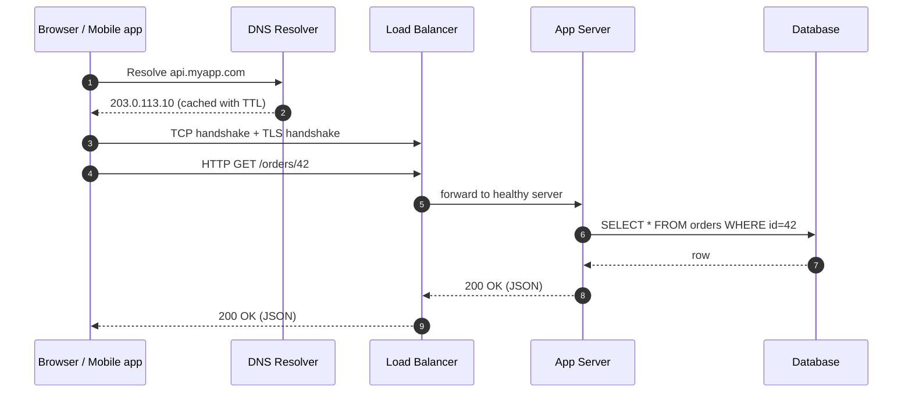
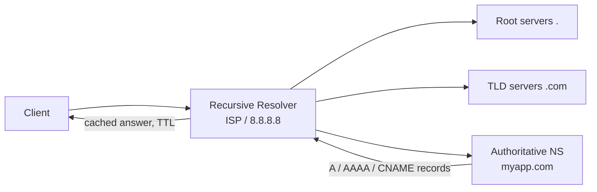
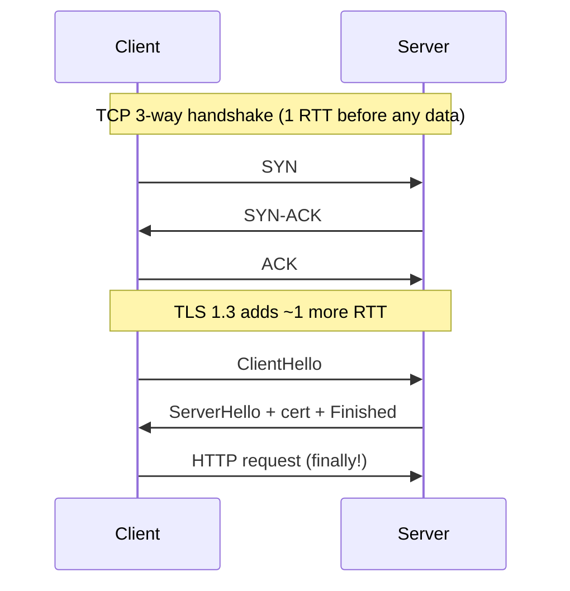
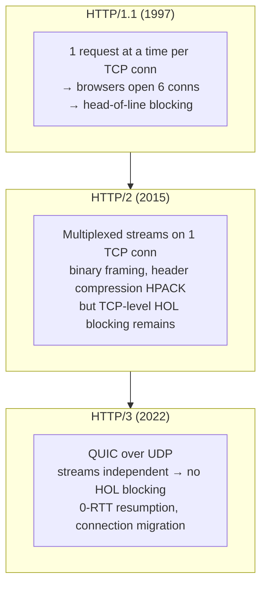
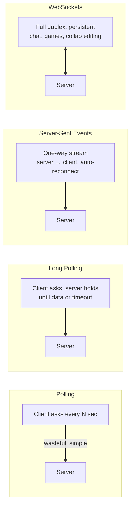
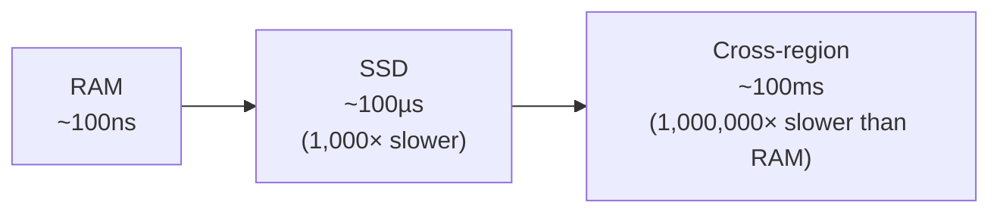
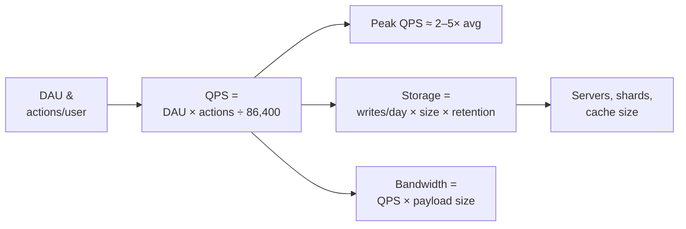

# 01 · Fundamentals — What Happens Before Your Code Runs

Everything in system design sits on top of networking. If you understand what happens between a
user typing a URL and your handler executing, half of HLD becomes intuitive.

---

## 1. Anatomy of a request

Key insight: **every arrow above is a place to optimize, cache, secure, or fail.** System design
is deciding what happens at each arrow.

## 2. DNS — the phonebook of the internet

Design-relevant facts:
- **TTL is a trade-off**: long TTL = fewer lookups, but slow failover; short TTL = fast failover, more load.
- **DNS is a load-balancing tool**: round-robin DNS, GeoDNS (route users to the nearest region), weighted records for canary rollouts.
- **Anycast**: the same IP announced from many locations; the network routes to the nearest one (how CDNs & public DNS work).

## 3. TCP vs UDP

| | TCP | UDP |
|---|---|---|
| Connection | Handshake (SYN, SYN-ACK, ACK) | None |
| Delivery | Ordered, reliable, retransmits | Fire-and-forget |
| Overhead | Higher (state, ACKs, head-of-line blocking) | Minimal |
| Use for | APIs, web, DB connections | Video, gaming, DNS, QUIC/HTTP-3 |

> **Why you care:** connection setup costs RTTs. This is why we use **connection pooling** (DB
> clients, HTTP keep-alive) and why HTTP/3 moved to QUIC (UDP) — 0/1-RTT setup, no head-of-line blocking.

## 4. HTTP evolution

### Realtime options — how the server talks *back*

| Choose | When |
|---|---|
| Short polling | Freshness in minutes is fine (dashboard refresh) |
| Long polling | Simple near-realtime, WS infra unavailable |
| SSE | Server→client only: feeds, notifications, LLM token streaming |
| WebSockets | Bidirectional: chat, multiplayer, live cursors |
| gRPC streaming | Service-to-service realtime |

## 5. Latency numbers every engineer should know (2020s edition)

| Operation | Time | Intuition |
|---|---|---|
| L1 cache reference | ~1 ns | |
| Main memory reference | ~100 ns | RAM is 100× L1 |
| Read 1 MB sequentially from RAM | ~10 µs | |
| SSD random read | ~100 µs | RAM is 1000× faster than SSD |
| Read 1 MB sequentially from SSD | ~1 ms | |
| Round trip within same datacenter | ~0.5 ms | |
| Round trip cross-continent (US↔EU) | ~80–150 ms | **physics — you can't cache your way out, you must replicate** |
| HDD seek | ~10 ms | this is why databases avoid random disk I/O |

**The whole discipline in one sentence:** *keep hot data as far left on this line as possible, and
cross the right side of it as rarely as possible.*

## 6. Back-of-envelope estimation

You will do this in every design discussion. The method:

### Cheat sheet

- `86,400 sec/day ≈ 10⁵` — so **1M requests/day ≈ 12 QPS**. Memorize this.
- 1 char = 1 B · UUID = 16 B · a tweet ≈ 300 B · an image ≈ 300 KB · a minute of video ≈ 30 MB
- `2³⁰ ≈ 10⁹` (1 GB), `2⁴⁰ ≈ 10¹²` (1 TB)
- A modern server: ~16–64 cores, 64–512 GB RAM, handles **~10k–50k simple QPS**; a Postgres box comfortably does **~5k–20k QPS** mixed read/write; Redis does **~100k+ QPS**.

### Worked micro-example — a photo app

> 10 M DAU, each uploads 2 photos/day (300 KB) and views 20.

- Write QPS: `10M × 2 / 10⁵ = 200 QPS` (peak ~500) — trivial for app servers, meaningful for storage.
- Read QPS: `10M × 20 / 10⁵ = 2,000 QPS` (peak ~5k) — **10× reads vs writes → read-optimized design: CDN + cache**.
- Storage: `20M × 300KB = 6 TB/day ≈ 2.2 PB/year` → object storage (S3), not a database.

---

## Advanced corner 🔬

- **Head-of-line (HOL) blocking**: one slow/lost packet stalls everything behind it. Appears at TCP level (fixed by QUIC), in message queues (one poison message stalls a partition), and in connection pools.
- **Nagle's algorithm & delayed ACKs**: TCP batching that can add 40 ms to small writes — why latency-sensitive services set `TCP_NODELAY`.
- **Bandwidth-delay product**: throughput of one connection is capped by `window_size / RTT`. Cross-continent transfers need parallelism or bigger windows.
- **TLS termination point**: at the LB (common, lets LB read HTTP for routing) vs end-to-end mTLS (zero-trust; see service mesh in [Ch 07](07-architecture-patterns.md)).
- **MTU & fragmentation**: payloads > ~1500 bytes split into multiple packets; keeping tokens/headers small matters at scale.

---

### ✅ You should now be able to answer
1. Why does a request from India to a US-only deployment take 250 ms+ no matter how fast the server is?
2. When would you pick SSE over WebSockets?
3. Your app has 50 M requests/day. What's the average and peak QPS? (≈580 avg / ~1.5–3k peak)

**Next:** [02 · Scaling & Load Balancing →](02-scaling-and-load-balancing.md)
