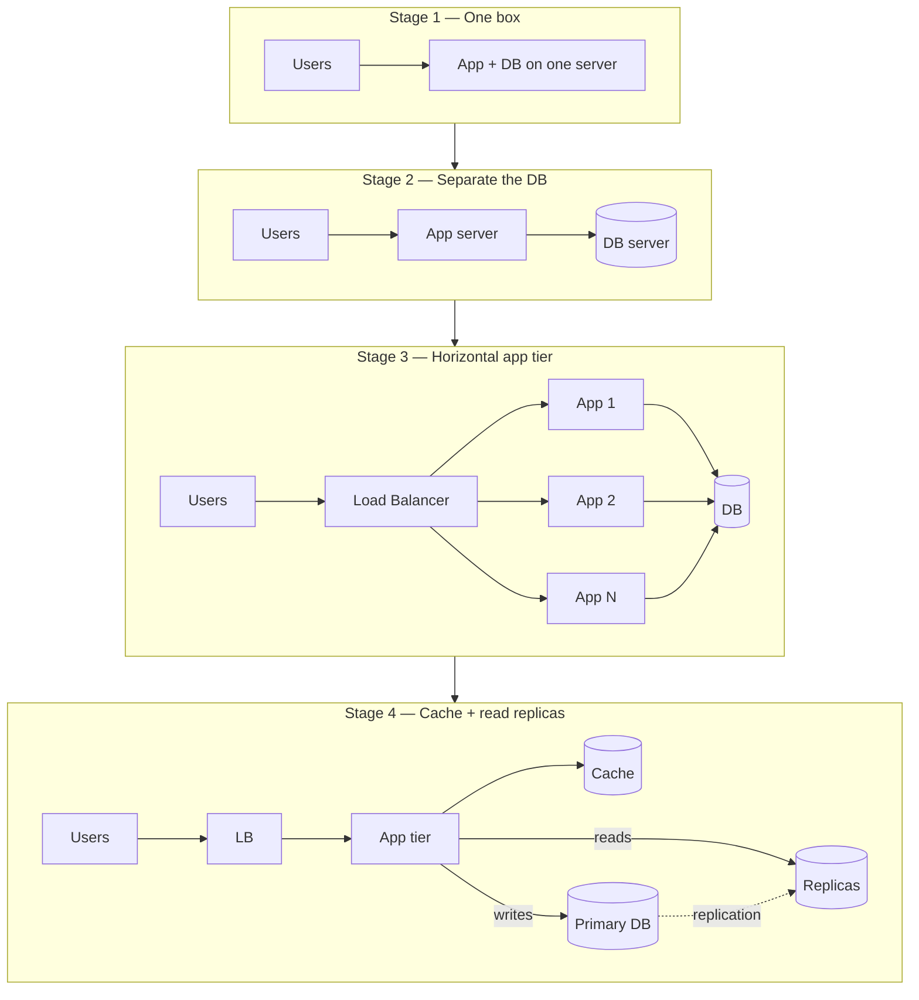
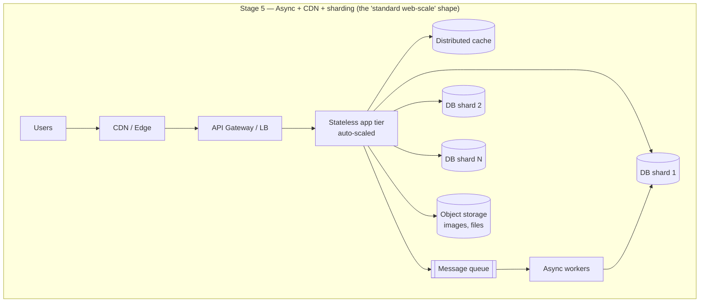
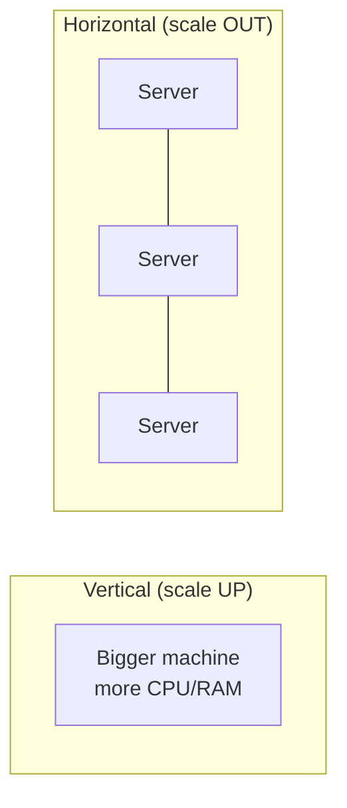
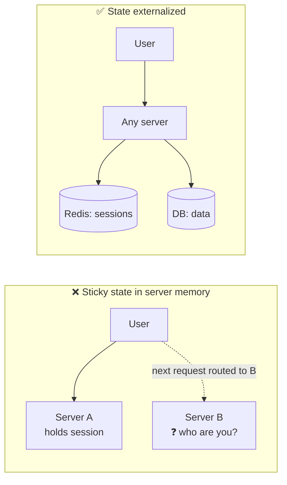
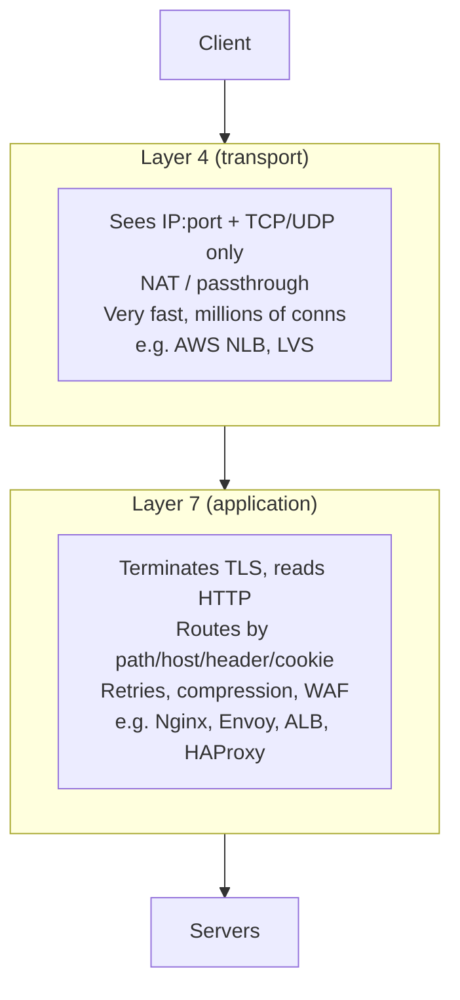
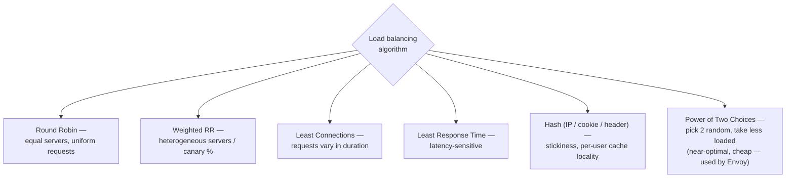
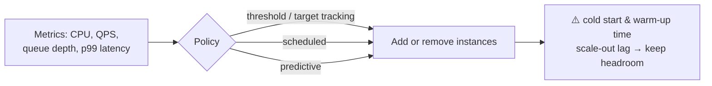
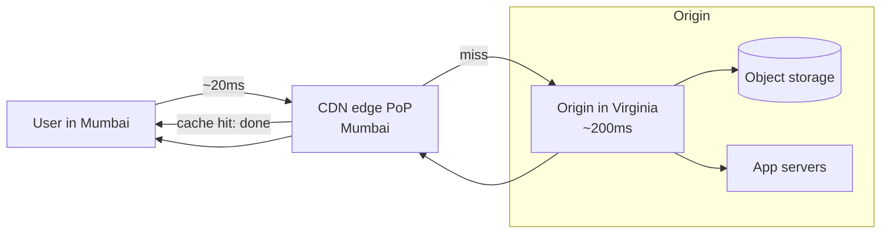
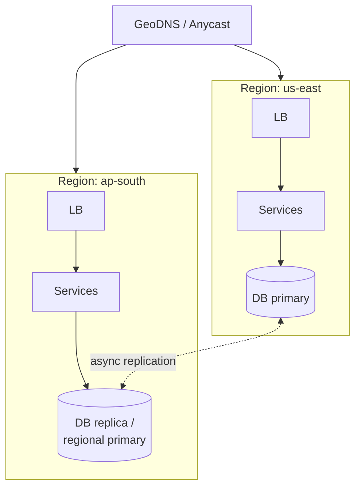

# 02 · Scaling & Load Balancing — From 1 Server to Planet Scale

This chapter is the canonical "evolution of an architecture" story. Every real system walked
roughly this path; interviews expect you to narrate it with reasons.

---

## 1. The evolution, step by step

**Why each step happened:**
| Bottleneck felt | Fix | Chapter |
|---|---|---|
| CPU/RAM contention between app & DB | Split tiers | here |
| One app server maxed out | Horizontal scale + LB | here |
| DB reads maxed out | Cache + read replicas | 03, 04 |
| Slow requests doing heavy work inline | Queue + workers | 05 |
| DB writes/storage maxed out | Sharding | 03 |
| Global users, static assets slow | CDN | here |

## 2. Vertical vs horizontal scaling

| | Vertical | Horizontal |
|---|---|---|
| Ceiling | Hard hardware limit, cost grows super-linearly | Near unlimited |
| Availability | Still a single point of failure | Survives node loss |
| Complexity | None | State, coordination, LB, deployment |
| When | Databases early on, quick wins | Stateless services, everything at scale |

### The prerequisite: statelessness

Rules: sessions → Redis/JWT; files → object storage; locks/counters → shared store. A server you
can kill at any moment with zero data loss is a server you can auto-scale.

## 3. Load balancers

### L4 vs L7

Typical production stack: **DNS/GeoDNS → L4 LB → L7 LB / gateway → services.**

### Algorithms

- **Consistent hashing** at the LB (hash on user/session key) keeps a user on the same backend even as servers join/leave — details in [Ch 03](03-databases.md#consistent-hashing).
- **Health checks**: active (LB probes `/healthz`) + passive (eject a backend after N failures). Distinguish **liveness** (process up) from **readiness** (able to serve — dependencies warm).
- **The LB itself must not be a SPOF**: pairs with VRRP/keepalived and a floating IP, or cloud LBs which are themselves distributed.

### Sticky sessions — know it, avoid it

Stickiness (cookie/IP-based) pins a user to one server. It fights auto-scaling and failover.
Prefer external session stores; accept stickiness only for legacy apps or WebSocket connection
affinity (and even then, store *state* externally).

## 4. Auto-scaling

Advanced notes:
- Scale on the **customer-facing symptom** (latency, queue lag), not just CPU.
- **Scale out fast, scale in slow** (avoid flapping).
- Provisioned headroom ≈ expected peak while new capacity boots.

## 5. CDN & the edge

- **Pull CDN** (lazy: edge fetches on first miss — default) vs **Push CDN** (you upload proactively — for large, predictable assets like video releases).
- Cache key = URL (+ selected headers). Control with `Cache-Control: max-age`, `s-maxage`, `ETag`/`If-None-Match`, and **cache busting** via versioned URLs (`app.v2.js`).
- CDNs can cache **API responses** too (public, read-heavy GETs) and run **edge compute** (auth token validation, A/B routing, personalization at the edge).
- Also your first line of **DDoS absorption** and TLS termination near the user.

## 6. Multi-region 🌍 (advanced)

Three postures, increasing cost & complexity:
1. **Active–passive**: one live region, warm standby; failover via DNS. Simple; minutes of RTO; replication lag = potential data loss (RPO > 0).
2. **Active–active, read-local/write-global**: all regions serve reads locally; writes routed to a single home region (per tenant/user — "home-region" partitioning).
3. **Active–active, write-anywhere**: multi-master with conflict resolution (CRDTs, last-write-wins) — hardest; needed for global low-latency writes (see [Ch 06](06-distributed-systems-theory.md)).

> Interview gold: mention **data residency laws** (e.g., data of EU users stays in EU) as a
> *non-technical* driver of multi-region design.

---

## Advanced corner 🔬

- **Thundering herd on scale events**: all clients reconnect to a fresh node at once → jittered reconnect/backoff.
- **Connection draining**: on deploy/scale-in, LB stops sending new requests and lets in-flight ones finish before killing the node.
- **Direct Server Return (DSR)**: L4 trick where responses bypass the LB — for very high egress (video).
- **Global Server Load Balancing (GSLB)**: health-aware DNS steering across regions.
- **Little's Law**: `concurrency = throughput × latency`. A service at 1,000 QPS with 200 ms latency holds 200 in-flight requests — sizes your thread pools and connection pools.

---

### ✅ You should now be able to answer
1. Walk from 1 server to a sharded, cached, multi-region system, naming the bottleneck that forces each step.
2. Why is "least connections" better than round robin for a mixed workload?
3. Why must services be stateless before horizontal scaling, and where does the state go?

**Next:** [03 · Databases →](03-databases.md)
