# 03 · Databases — Storage Engines, Replication & Sharding

The database is where most systems actually bottleneck, and where the deepest interview follow-ups
live. This chapter goes from "SQL vs NoSQL" down to B-Trees vs LSM-Trees and up to consistent hashing.

---

## 1. The database landscape

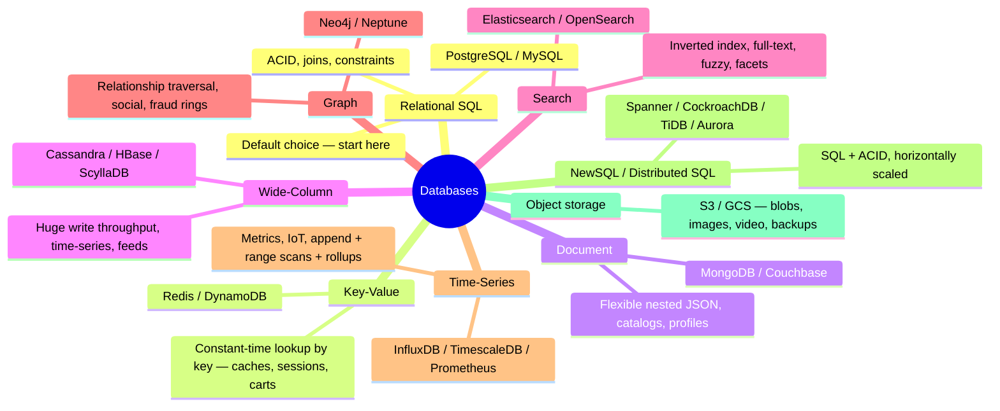

### Choosing — the honest decision tree

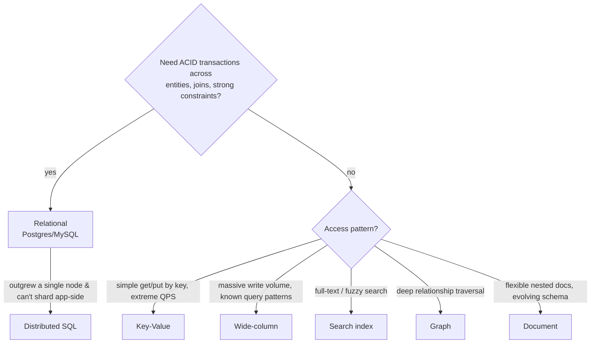

> **Rule for 2 YoE:** default to Postgres until you can name the *specific* limitation forcing you
> off it. "NoSQL because scale" is not a reason; "1 M writes/sec of append-only events with
> partition-key lookups" is.
>
> **Polyglot persistence** is normal: one system commonly uses Postgres (source of truth) + Redis
> (cache) + Elasticsearch (search) + S3 (blobs), kept in sync via CDC (see Ch 05).

## 2. Storage engines — why databases are fast (or not)

### B-Tree (Postgres, MySQL/InnoDB) — read-optimized

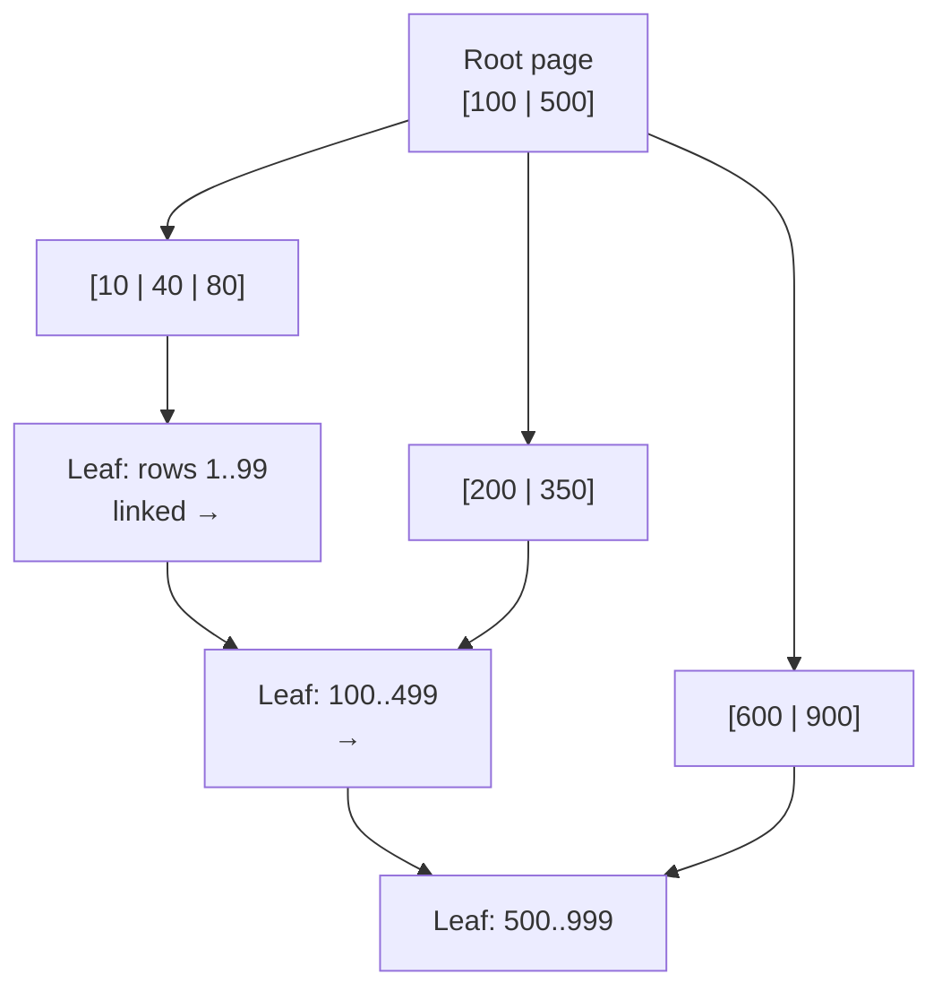

- Balanced tree of fixed-size pages; lookup = `O(log n)` page reads (3–4 hops for billions of rows).
- Updates in place → great point reads/range scans; random writes cause page splits & write amplification.

### LSM-Tree (Cassandra, RocksDB, LevelDB) — write-optimized

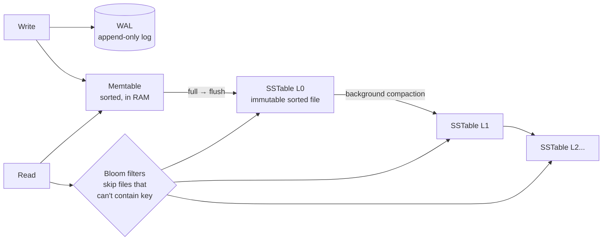

- Writes are **sequential appends** → enormous write throughput.
- Reads may check several files → mitigated by **Bloom filters** (probabilistic "definitely not here") and compaction.
- Trade-off: read amplification + compaction I/O, in exchange for write speed.

| | B-Tree | LSM-Tree |
|---|---|---|
| Writes | In-place, slower under heavy load | Sequential, very fast |
| Reads | Fast, predictable | Slower/variable (multi-file) |
| Space | Fragmentation | Compaction overhead |
| Used by | Postgres, MySQL | Cassandra, RocksDB, ScyllaDB |

## 3. Indexing

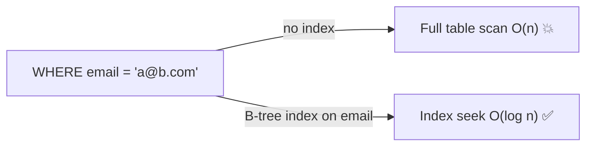

- **Primary/clustered index**: table rows physically ordered by it (InnoDB). Secondary indexes point to the PK.
- **Composite index** `(a, b, c)` — the **leftmost-prefix rule**: serves `a`, `a,b`, `a,b,c` — not `b` alone. Order columns: equality filters first, then range, then sort.
- **Covering index**: index contains every column the query needs → no table lookup ("index-only scan").
- **Partial index**: `WHERE status='active'` — small + fast for hot subsets.
- Specialized: **GIN/inverted** (full-text, JSONB), **geospatial** (R-tree/PostGIS), **hash** (equality only).
- **Cost**: every index slows writes (each INSERT/UPDATE maintains all of them) and eats RAM. Index for your top queries, not for every column.
- Debug with `EXPLAIN ANALYZE`; watch for `Seq Scan` on large tables and non-**sargable** predicates (`WHERE lower(email)=...` skips a plain index — use an expression index).

## 4. Transactions, ACID & isolation levels

**ACID** — Atomicity (all-or-nothing), Consistency (constraints hold), Isolation (concurrent txns
don't corrupt each other), Durability (commit survives crash — via WAL/fsync).

### Isolation levels & anomalies

| Level | Prevents | Anomaly still possible |
|---|---|---|
| Read Uncommitted | — | Dirty reads |
| Read Committed *(Postgres default)* | Dirty reads | Non-repeatable reads |
| Repeatable Read *(MySQL default)* | + non-repeatable reads | Phantom reads¹ |
| Serializable | Everything | — (but retries + lower throughput) |

¹ Postgres RR (snapshot isolation) also blocks phantoms but allows **write skew**.

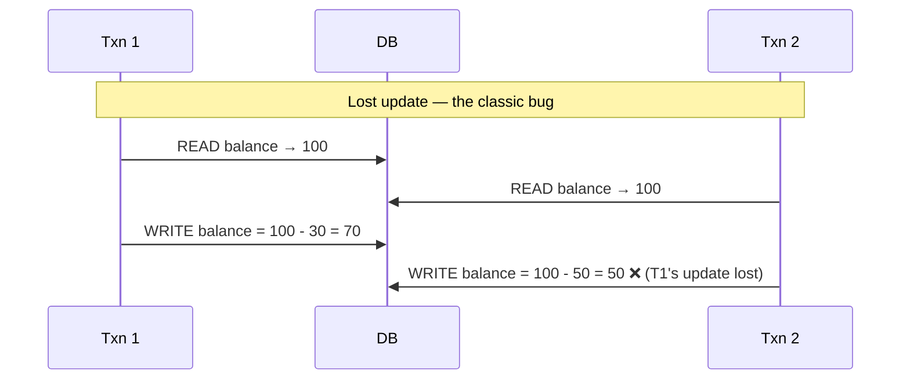

Fixes for lost updates:
- **Atomic ops**: `UPDATE acct SET bal = bal - 30 WHERE id=1 AND bal >= 30`
- **Pessimistic lock**: `SELECT ... FOR UPDATE` (lock row up front; use when conflicts are common)
- **Optimistic concurrency (OCC)**: version column — `UPDATE ... WHERE id=1 AND version=7`; retry on 0 rows (use when conflicts are rare; this is also how you do it across HTTP requests)

**MVCC** (Postgres/MySQL/Oracle): writers create new row versions instead of overwriting; readers
see a snapshot → **readers never block writers**. Cost: old versions must be vacuumed/purged.

## 5. Replication

### Leader–follower (primary–replica)

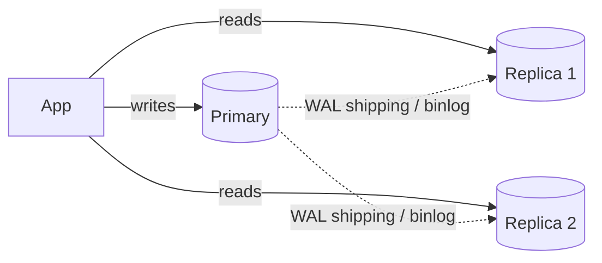

- **Async replication** (default): fast writes; replicas lag → **replication lag** problems; on failover you may lose the tail (RPO > 0).
- **Sync replication**: primary waits for a replica ack → no loss, higher latency, availability coupled to the replica.
- **Semi-sync / quorum**: wait for k of n replicas — the practical middle ground.

### The read-your-own-writes problem ⚠️

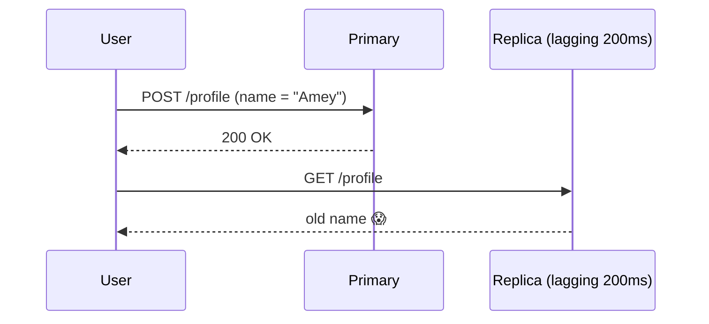

Fixes: pin the writing user's reads to the primary for N seconds · session stickiness ·
compare-replica-LSN ("read from a replica at least as fresh as my write") · causal tokens.

### Multi-leader & leaderless

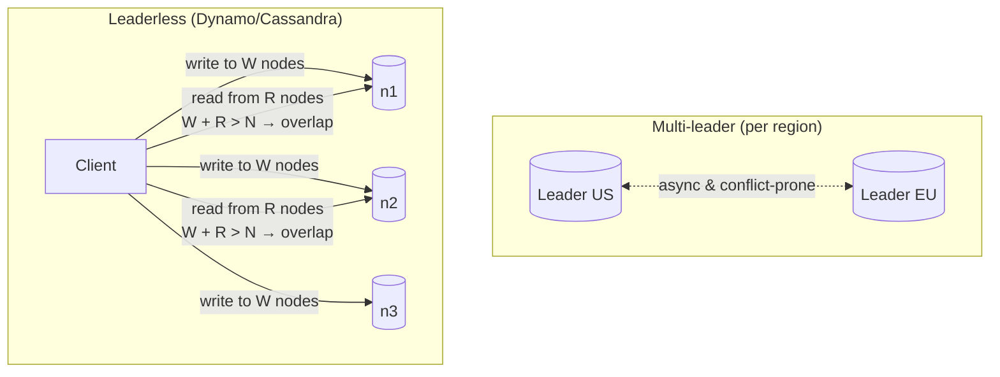

- **Multi-leader**: write locally in each region; must resolve conflicts — Last-Write-Wins (data loss risk), app-level merge, or **CRDTs** (data types that merge automatically — counters, sets; used by Riak, Redis CRDB, collaborative editors).
- **Leaderless quorum**: `W + R > N` gives read-your-write overlap (e.g., N=3, W=2, R=2). Repair via **read repair** and **anti-entropy with Merkle trees**. **Hinted handoff** stores writes for a down node. (More in [Ch 06](06-distributed-systems-theory.md).)

## 6. Partitioning (sharding)

When one node can't hold the data or the write load, split by key.

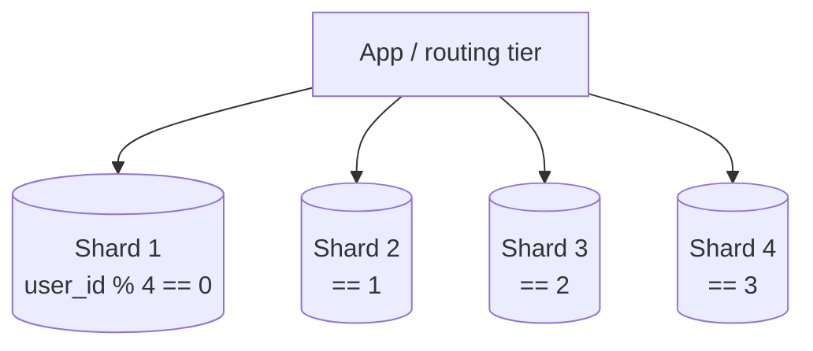

### Strategies

| Strategy | How | Pro | Con |
|---|---|---|---|
| **Range** | key ranges A–M, N–Z | Efficient range scans | Hotspots (new IDs all hit last shard) |
| **Hash** | `hash(key) mod N` | Uniform spread | Range scans die; `mod N` reshuffles everything on resize → use consistent hashing |
| **Directory** | lookup service: key → shard | Flexible, per-tenant placement | The directory is a dependency to keep HA |
| **Geo** | by user region | Data residency, latency | Cross-region queries |

### Consistent hashing 

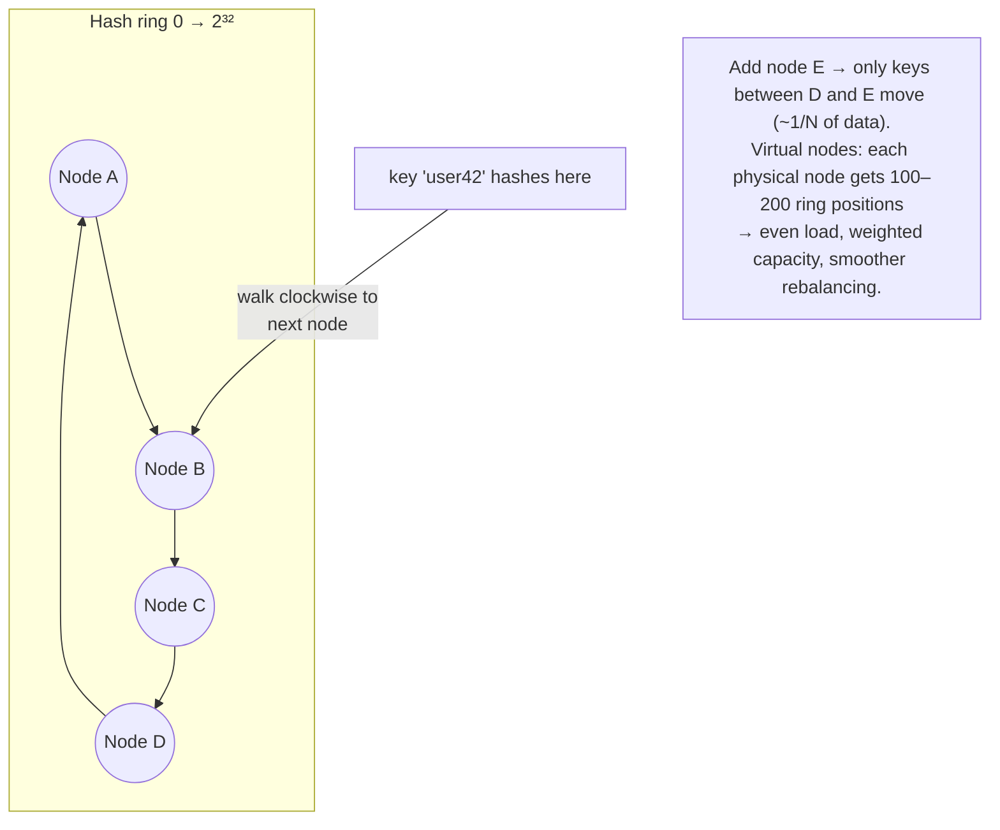

Used by: Cassandra/Dynamo (data placement), Redis-cluster-style caches, LBs, CDNs.

### The hard parts of sharding ⚠️

- **Pick the shard key by your dominant query.** Everything not keyed by it becomes **scatter-gather** (query all shards, merge) — slow and fragile.
- **Cross-shard joins**: gone. Denormalize, duplicate reference data to all shards, or join in the app.
- **Cross-shard transactions**: gone. You now need sagas or 2PC ([Ch 06](06-distributed-systems-theory.md)).
- **Hot partitions / celebrity problem**: one key (Bieber's timeline, one huge tenant) overloads its shard → split the key (`user_id + random suffix`), dedicated cache, or isolate the tenant.
- **Resharding**: plan for it day one (consistent hashing, or logical shards: 4096 virtual shards mapped onto N physical nodes — moving a vshard is easy).
- **Auto-increment IDs break** → globally unique IDs: **Snowflake ID** (`timestamp | machine-id | sequence` — 64-bit, time-sortable), UUIDv7, or a ticket server.

## 7. Other essential patterns

- **Connection pooling** (PgBouncer): DBs die from too many connections before too many queries.
- **N+1 queries**: fetch list, then 1 query per item — the most common ORM performance bug. Fix with joins/batching (`WHERE id IN (...)`) or dataloaders.
- **Soft deletes** (`deleted_at`) vs hard deletes; **audit tables**; **schema migrations** must be backward-compatible (expand → migrate → contract) for zero-downtime deploys.
- **CDC (Change Data Capture)**: tail the WAL/binlog (Debezium) to stream every change into Kafka → feed caches, search indexes, warehouses without dual-writing. ([Ch 05](05-async-and-messaging.md))
- **OLTP vs OLAP**: transactional row stores vs analytical **column stores** (Snowflake, BigQuery, ClickHouse). Ship data to the warehouse via CDC/ETL; don't run analytics on your OLTP primary.
- **Data modeling for NoSQL is query-first**: in Cassandra/Dynamo you design tables per access pattern (denormalized), the opposite of relational normalization.

---

## Advanced corner 🔬

- **Write amplification**: one logical write → many physical writes (B-tree page splits, LSM compaction, index maintenance, replication) — why "just add an index" isn't free.
- **Fan-out on write vs fan-out on read** (the Twitter-feed problem): precompute each follower's feed at post time (fast reads, celebrity write storms) vs compute at read time (cheap writes, slow reads). Real answer: **hybrid** — fan-out on write for normal users, on read for celebrities.
- **Bloom filters** beyond LSM: "have I seen this URL/ID?" at massive scale with tiny memory, allowing false positives, never false negatives. Cousin: **Count-Min Sketch** (approximate counts), **HyperLogLog** (approximate distinct count — Redis `PFCOUNT`).
- **Geo-indexing**: **geohash** / S2 cells turn 2-D proximity into 1-D prefix queries — the core of "find nearby drivers" designs.
- **Inverted index** (Elasticsearch): term → list of doc IDs; why search engines are fast and why they're near-real-time (refresh interval), not transactional.
- **Time-series specifics**: downsampling/rollups, retention tiers (hot SSD → warm → cold object storage), delta+gorilla compression.

---

### ✅ You should now be able to answer
1. Why does Cassandra ingest writes faster than Postgres, and what does it pay for that?
2. Design the shard key for a multi-tenant SaaS where 1 tenant is 100× larger than the rest.
3. A user updates their name and doesn't see it on refresh. Diagnose and give two fixes.
4. When do you choose optimistic vs pessimistic locking?

**Next:** [04 · Caching →](04-caching.md)
