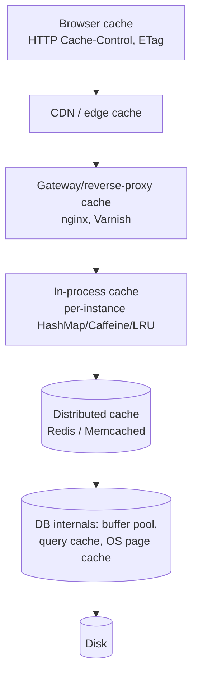
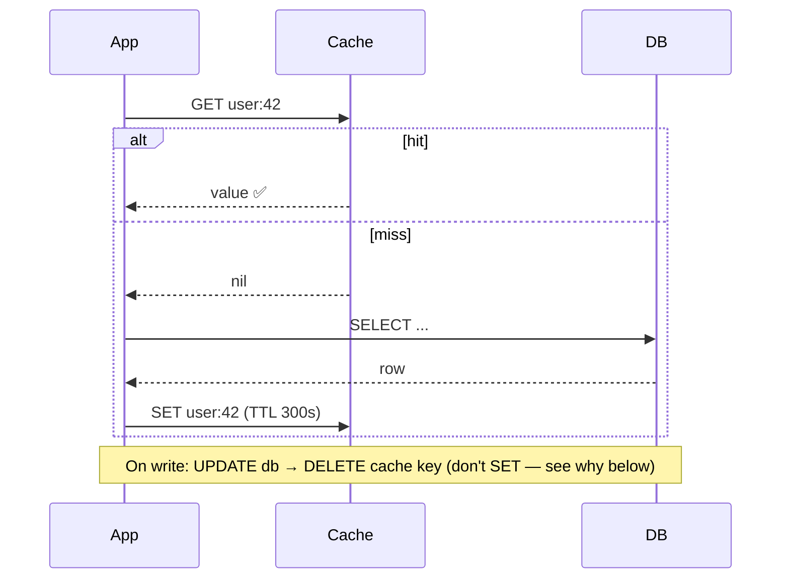
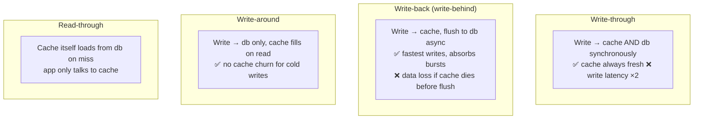
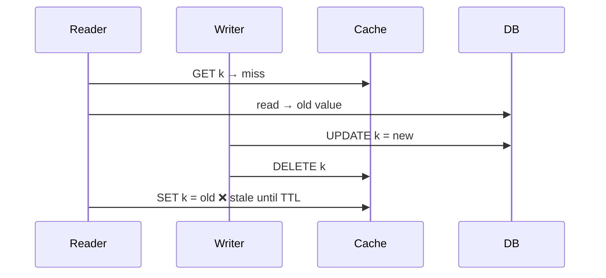
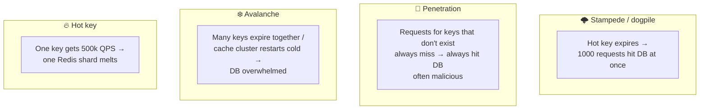
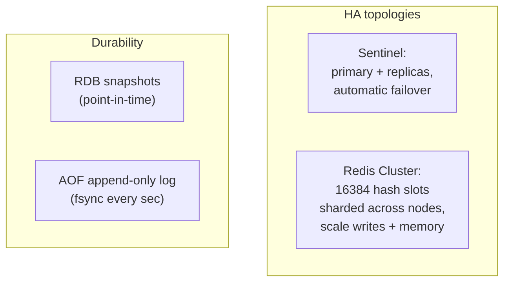

# 04 · Caching — The Highest-Leverage Tool You Have

A cache trades **freshness and memory** for **latency and load reduction**. Most "scale problems"
at read-heavy companies are solved 90% by caching done well — and caused by caching done badly.

---

## 1. Where caches live (the full hierarchy)

Each layer: smaller latency, but harder invalidation as you go up (a CDN entry is cached in 300
cities). **Design question #1 is always: which layer, and how stale is acceptable?**

| Layer | Latency | Scope | Gotcha |
|---|---|---|---|
| In-process | ~100 ns | per instance | N instances = N inconsistent copies |
| Redis/Memcached | ~0.5–1 ms | shared | network hop, needs HA |
| CDN | ~10–30 ms | global | invalidation is slow/expensive |

## 2. Caching strategies (read & write paths)

### Cache-aside (lazy loading) — the default

### Write strategies

| Strategy | Use when |
|---|---|
| Cache-aside + delete-on-write | Default for almost everything |
| Write-through | Read-heavy, can't tolerate stale reads after writes |
| Write-back | Extreme write bursts (counters, likes) & small loss acceptable |
| Write-around | Write-heavy data that's rarely re-read (logs) |

> **Why DELETE instead of SET on write?** Two concurrent writes can SET the cache in the wrong
> order, leaving stale data forever. Delete forces the next reader to fetch fresh. Still imperfect
> (see race below) but much safer.

## 3. Invalidation — "one of the two hard problems"

Options, weakest to strongest:
1. **TTL only** — bounded staleness, zero bookkeeping. Ask "is 60 s of staleness OK?" — usually yes.
2. **Delete-on-write (cache-aside)** — plus TTL as a safety net. **Always keep the TTL.**
3. **Event-driven invalidation** — publish `user.updated` events (or **CDC from the DB binlog**) → consumers delete/refresh keys everywhere, including per-instance caches. Most robust, most machinery.
4. **Versioned keys** — key = `user:42:v{version}`; bump version on write, old entries age out. Sidesteps invalidation races at the cost of storage.

### The subtle cache-aside race ⚠️

Rare (the reader must straddle a write) but real. Mitigations: short TTLs, versioned keys, or
CAS/lease-based sets (memcached "leases", Redis Lua compare-and-set).

## 4. Eviction policies

Cache full → something must go.

| Policy | Idea | Notes |
|---|---|---|
| **LRU** | Evict least-recently-used | Default; you implement it in LLD interviews (HashMap + doubly-linked list, O(1)) |
| **LFU** | Evict least-frequently-used | Better for stable hot sets; Redis has approximated LFU |
| **FIFO / Random** | Cheap, dumb | Memcached-ish behaviors, fine at huge scale |
| **TTL-based** | Expire by age | Combine with the above |
| **W-TinyLFU** | Frequency sketch + LRU window | State of the art (Caffeine) — resists scan pollution |

Redis `maxmemory-policy`: `allkeys-lru`, `volatile-lru`, `allkeys-lfu`, `noeviction` (errors on write — for when the cache is really a store).

## 5. Failure modes & their defenses (interview favorites)

| Problem | Defenses |
|---|---|
| **Stampede** | Per-key **mutex/lease** (one loader, others wait or serve stale) · **stale-while-revalidate** (serve old value, refresh in background) · **probabilistic early refresh** (XFetch) |
| **Penetration** | Cache **negative results** (`NOT_FOUND`, short TTL) · **Bloom filter** of existing keys in front of the cache · input validation |
| **Avalanche** | **Jittered TTLs** (`ttl + rand(0..10%)`) · cache warm-up before taking traffic · circuit breaker + load shed at the DB · Redis HA so the cache never fully vanishes |
| **Hot key** | Replicate the key (`key#1..key#N`, read a random copy) · add a tiny **in-process L1 cache** for the top-100 keys · request coalescing |

## 6. Redis in practice

- **Data structures are the superpower**: Strings (counters, `INCR`), Hashes (objects), Sorted Sets (**leaderboards, rate limiters, delayed queues**), Lists (queues), Sets, Streams (lightweight Kafka), HyperLogLog (unique counts), Bitmaps, Geo (nearby search), Pub/Sub.
- Single-threaded command execution → commands are atomic; multi-step atomicity via **Lua scripts** or `MULTI/EXEC`.
- **Redis as a lock** (`SET k v NX PX 30000`) works for efficiency, not correctness — see fencing tokens in [Ch 06](06-distributed-systems-theory.md).
- Memcached vs Redis: memcached = simpler, multi-threaded, pure LRU byte-cache; Redis = data structures, persistence, replication. Default to Redis unless you need memcached's simplicity at extreme scale.

## 7. Sizing & metrics

- **Hit ratio** is the metric. 90% hits → DB sees 10% of traffic; dropping to 80% **doubles** DB load. Alert on hit-ratio drops.
- Estimate: cache the hot set, not everything — typically top ~20% of objects serve ~80%+ of reads (Zipf distribution).
- Watch: evictions/sec (cache too small), p99 latency, memory fragmentation, big keys (>100 KB values block the event loop).

---

## Advanced corner 🔬

- **Consistent hashing for cache clusters** (client-side, e.g. memcached/Ketama) so node loss only remaps 1/N of keys — cold-cache avalanche avoided.
- **Request coalescing / singleflight**: dedupe identical concurrent misses inside each app instance (Go `singleflight`, Caffeine `refreshAfterWrite`).
- **Two-tier caching**: in-process L1 (microsecond, top keys, 1–5 s TTL) + Redis L2 — L1 absorbs hot-key storms; invalidate L1 via pub/sub broadcast.
- **Materialized views** are "caches inside the DB": precomputed query results refreshed periodically or incrementally — same staleness trade-offs.
- **Cache warming**: pre-load predictable hot data (yesterday's top items, upcoming flash-sale SKUs) before traffic arrives.
- **Do NOT cache**: rapidly changing data with strict correctness (account balances for decisions, inventory at checkout), anything where a stale read causes irreversible action — or cache it with explicit validation at the point of action.

---

### ✅ You should now be able to answer
1. Design the cache for a product page at 50k QPS with 1k writes/min — layers, strategy, TTLs, invalidation.
2. A flash sale starts and your DB falls over even though you "have a cache." List three likely causes and fixes.
3. Why delete-on-write rather than set-on-write?

**Next:** [05 · Async & Messaging →](05-async-and-messaging.md)
