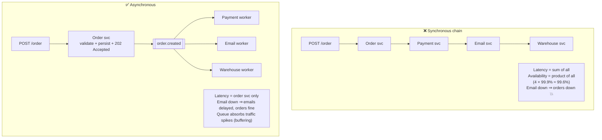
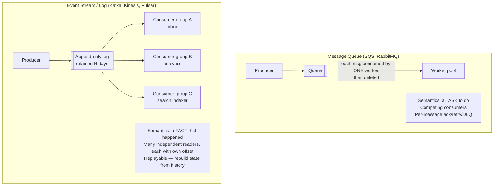
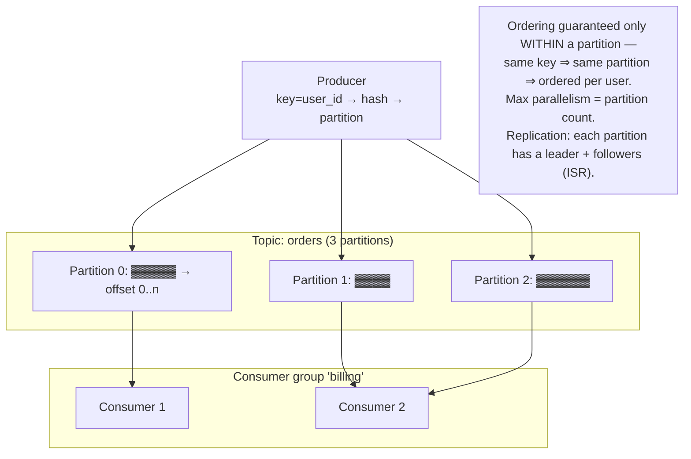
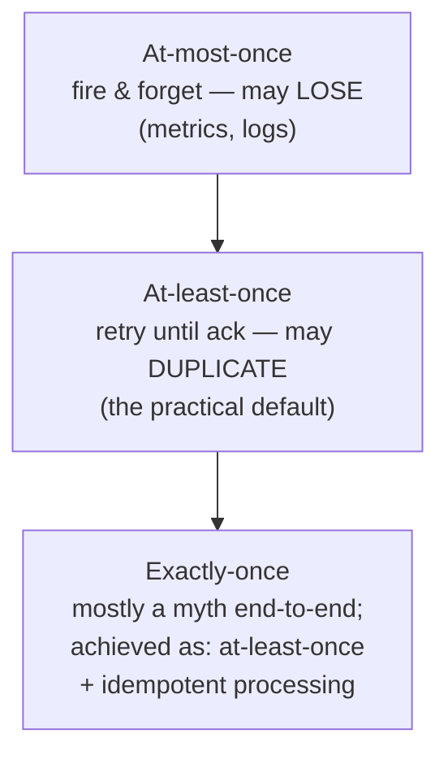
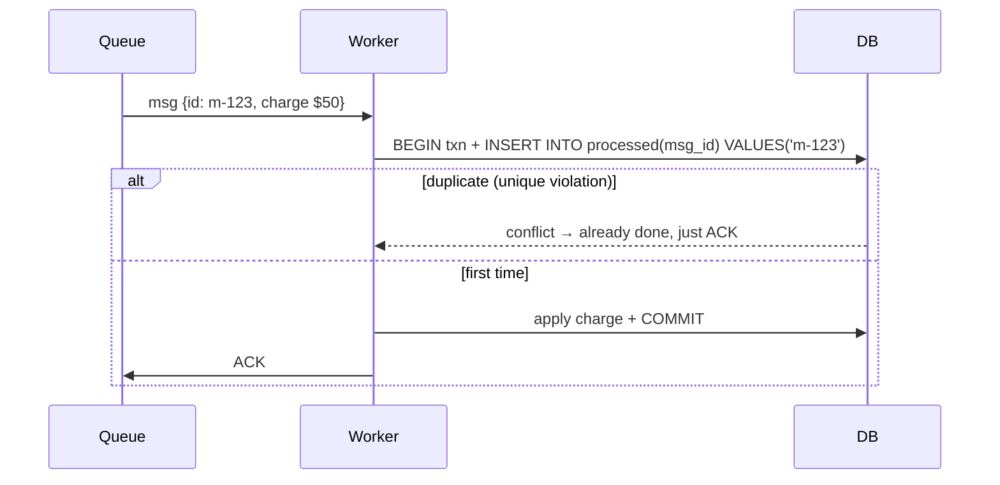
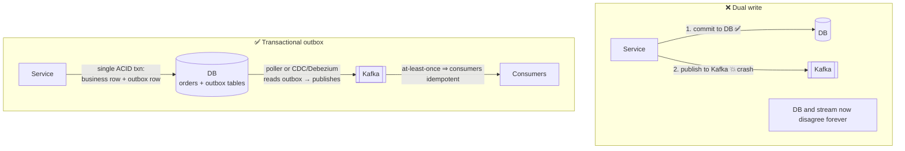
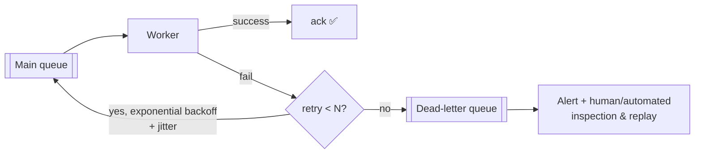
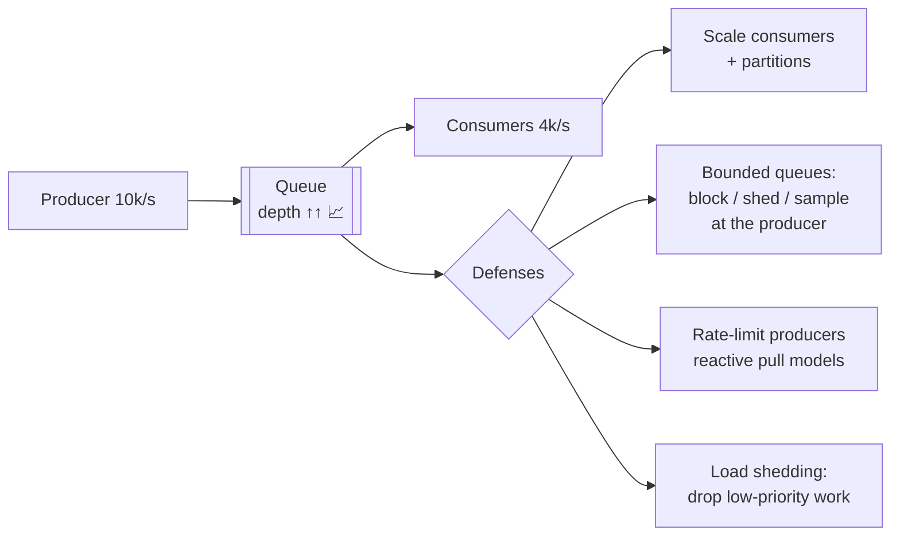
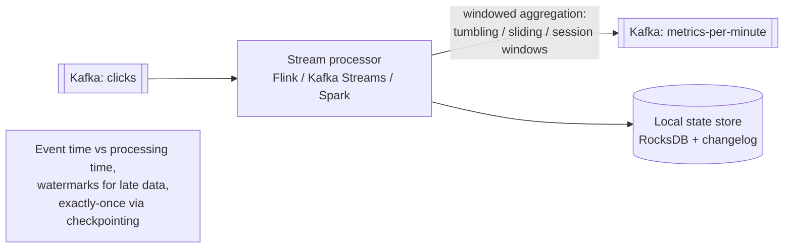

# 05 · Asynchronous Processing & Messaging — Decouple or Die

The moment a request does more than one thing — send email, resize an image, update three other
services — synchronous coupling becomes your availability ceiling. Queues fix that, and introduce
a whole new class of problems this chapter teaches you to handle.

---

## 1. Sync vs async — the core trade

Use async when the caller doesn't need the result *now*: notifications, media processing, syncing
search indexes, analytics, retryable third-party calls, spike smoothing. Keep sync when the user
needs the answer to proceed (auth, "is this seat available?").

**UX for async:** return `202 Accepted` + job id → client polls `/jobs/{id}` or gets a
webhook/WebSocket push when done.

## 2. Message queues vs event streams — know the difference cold

| | Queue | Stream/log |
|---|---|---|
| Message after consumption | Deleted | Retained (time/size based) |
| Consumers | Compete for messages | Each group reads everything |
| Replay | No | Yes (rewind offset) |
| Ordering | Usually best-effort (FIFO variants exist) | Per-partition total order |
| Fit | Background jobs, work distribution | Event-driven architecture, CDC, pipelines, fan-out |

**Pub/Sub** (SNS, Google Pub/Sub, Redis pub/sub) = broadcast to all current subscribers; pair
SNS→SQS to give each subscriber its own durable queue ("fan-out to queues").

## 3. Kafka internals (the follow-up magnet)

Key mechanics:
- **Partition = unit of parallelism and ordering.** Choose the partition key like a shard key (per-user ordering ⇒ key by user_id; beware hot keys).
- **Consumer groups**: partitions are divided among a group's consumers; adding consumers beyond partition count does nothing. **Rebalancing** pauses consumption briefly when membership changes.
- **Offsets** are committed by consumers — commit *after* processing for at-least-once.
- **Producer acks**: `acks=0` (fire & forget), `1` (leader only), `all` (ISR quorum — durable). Idempotent producer + transactions enable exactly-once *within Kafka*.
- **Consumer lag** = produced offset − consumed offset. **The** health metric; alert on growing lag; scale consumers (up to partition count) to fix.
- **Log compaction**: keep only the latest record per key — turns a topic into a changelog/table.

## 4. Delivery semantics & idempotency (the most important section)

Why duplicates are inevitable: worker processes a message, then crashes **before acking** → broker
redelivers → processed twice. You cannot ack and process atomically across two systems.

### Idempotent consumers — the fix

Techniques: unique **idempotency key** per message + dedup table (same transaction as the business
write) · naturally idempotent ops (`SET status='paid'` not `balance += 50`) · optimistic
version checks · upserts.

### Dual-write problem & the Transactional Outbox ⭐

This pattern (or CDC directly off the WAL) is the standard answer to "how do you atomically update
the DB *and* emit an event?" — a near-guaranteed interview follow-up.

## 5. Reliability patterns around queues

- **Visibility timeout** (SQS): message invisible while a worker holds it; crash → it reappears. Set > worst-case processing time, or extend via heartbeat.
- **Poison messages**: a message that always crashes the worker → without max-retries + DLQ it blocks the queue (HOL blocking!) and burns CPU forever.
- **Retries**: always **exponential backoff + jitter**; distinguish retryable (timeout, 5xx) from non-retryable (validation, 4xx) errors.
- **Delayed / scheduled jobs**: SQS delay, RabbitMQ TTL+DLX, or Redis sorted-set by timestamp (poll `ZRANGEBYSCORE now`).
- **Priority**: separate queues per priority with weighted workers (true priority queues are rare in distributed brokers).

## 6. Backpressure — when producers outrun consumers

An unbounded queue just moves the outage later and makes it bigger (hours of lag). **Bound your
queues and decide explicitly what happens when full** — that decision *is* the design.

Watch: queue depth, consumer lag, message age at consumption, DLQ rate.

## 7. Stream processing (a taste)

Know the vocabulary: **event time vs processing time**, **watermarks** (how long to wait for late
events), **windowing**, and that stateful stream processors checkpoint state for fault tolerance.
Used in: real-time analytics, fraud detection, trending topics, metrics pipelines.

---

## Advanced corner 🔬

- **Ordering + retries conflict**: retrying message 5 while 6 already processed breaks order. Per-key partitioning + single in-flight message per key preserves order at a throughput cost.
- **Exactly-once, precisely**: Kafka transactions give EO for *Kafka-in → process → Kafka-out*. The moment a side effect leaves Kafka (DB write, email), you're back to at-least-once + idempotency.
- **Saga orchestration via queues** — covered in [Ch 07](07-architecture-patterns.md); the outbox pattern is its transport backbone.
- **Event schema evolution**: use a schema registry (Avro/Protobuf), additive-only changes, versioned events — the API-versioning problem, but for events.
- **Workflow engines** (Temporal, Step Functions): durable execution — code that survives process crashes, sleeps for days, retries steps with full history. The modern answer for long-running business processes (order fulfillment, onboarding).
- **Redis Streams** as a lightweight Kafka (consumer groups, `XACK`) when you don't want Kafka ops overhead.

---

### ✅ You should now be able to answer
1. Payment events must be processed in order per user, at 100k events/s. Design the topic/partition/consumer layout.
2. Your worker charges a customer, then crashes before acking. What happens, and what must the code have done?
3. Why is "write to DB, then publish to Kafka" broken, and what replaces it?

**Next:** [06 · Distributed Systems Theory →](06-distributed-systems-theory.md)
