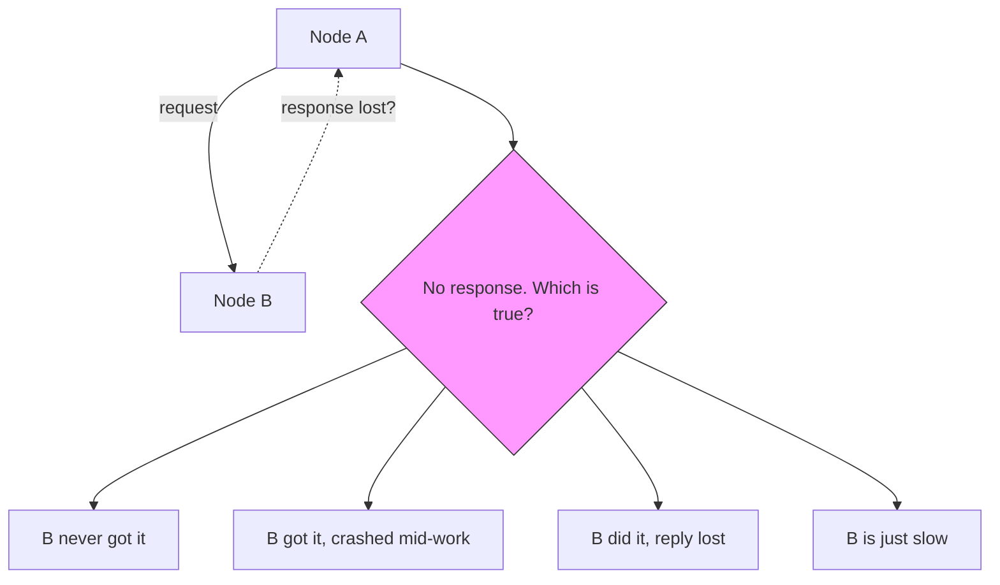
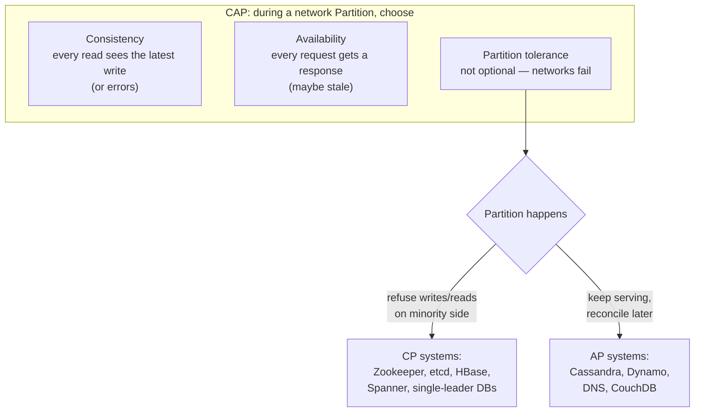
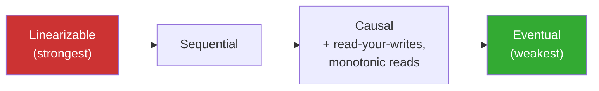
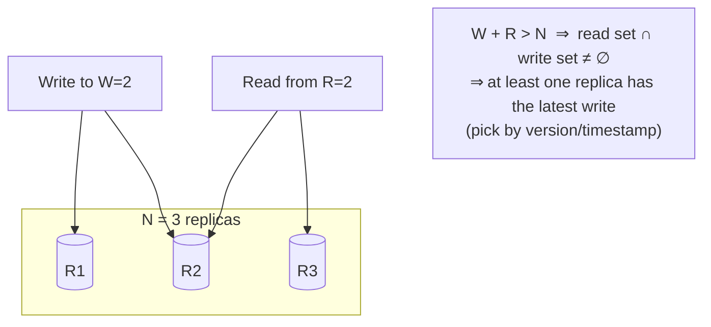
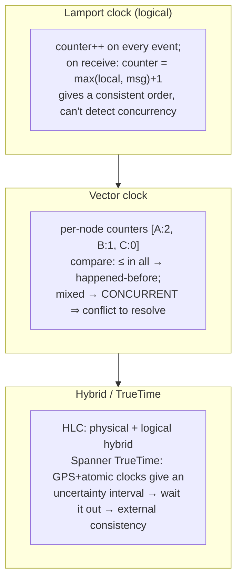
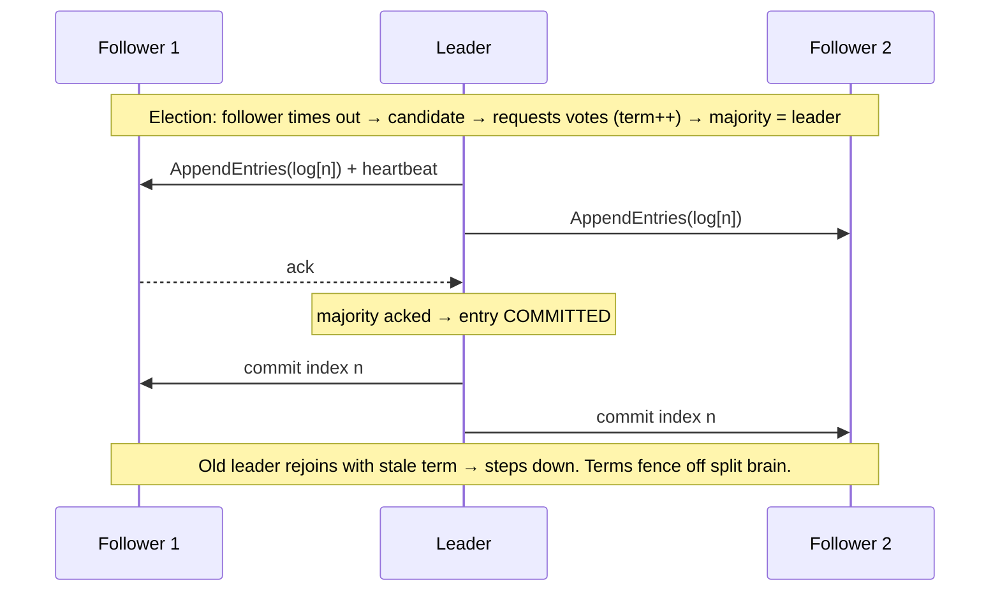
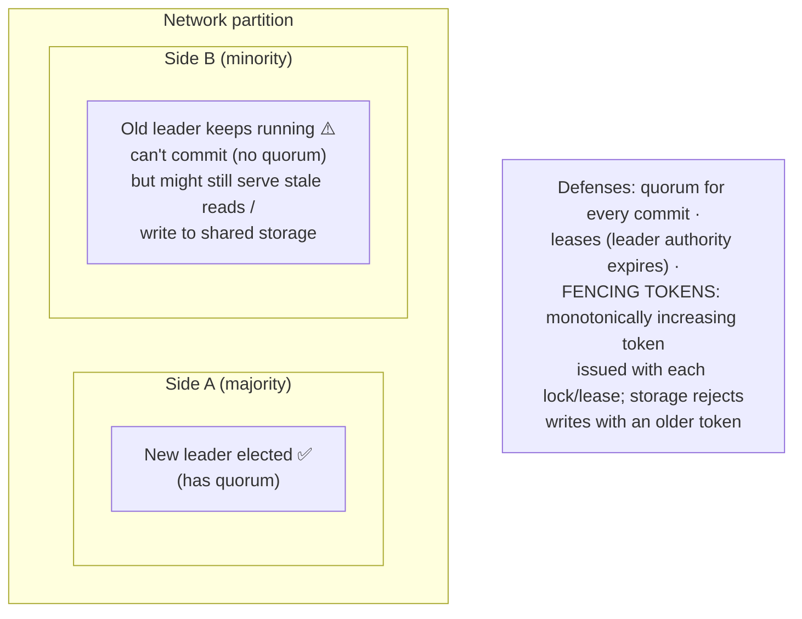
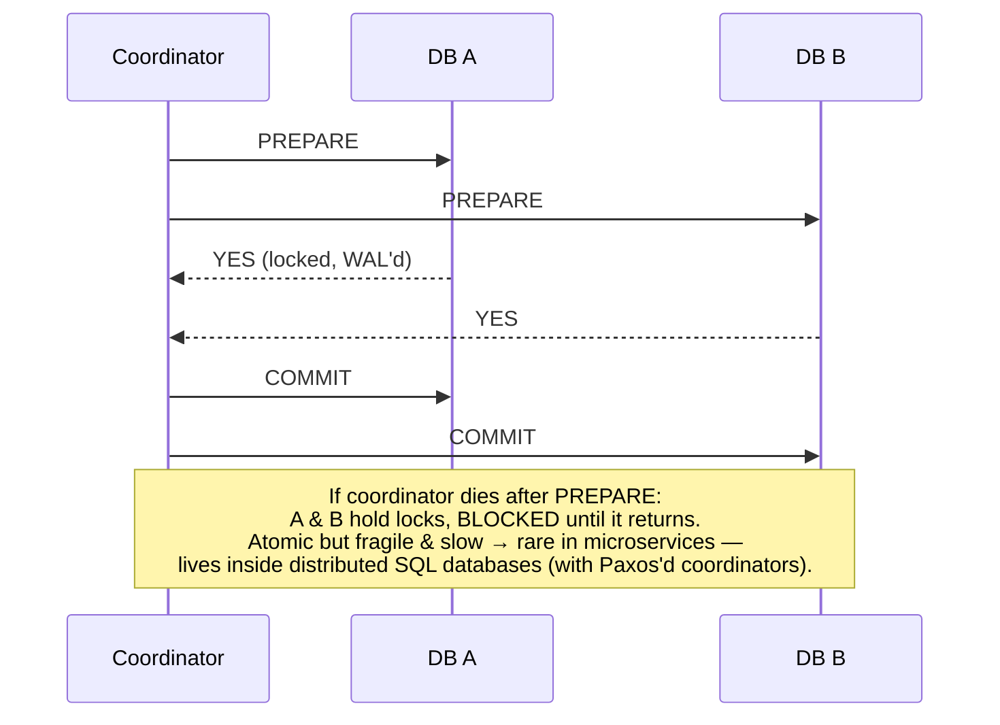
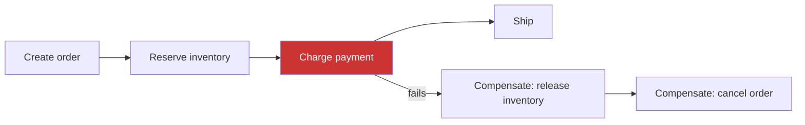

# 06 · Distributed Systems Theory — The Rules of the Game

Everything before this chapter told you *what* to build. This chapter is *why* distributed systems
are hard: the impossibility results, the consistency spectrum, and the algorithms that make
clusters agree. This is where senior-level interviews are won.

---

## 1. The fallacies & the failure model

The 8 fallacies of distributed computing: the network is reliable · latency is zero · bandwidth is
infinite · the network is secure · topology doesn't change · there is one administrator ·
transport cost is zero · the network is homogeneous.

**You cannot distinguish these cases.** Every distributed pattern — timeouts, retries,
idempotency, consensus — exists because of this diagram. There is no reliable failure detector in
an asynchronous network (FLP impossibility); we approximate with timeouts + heartbeats.

## 2. CAP & PACELC

- CAP is about behavior **during a partition** only, and it's per-operation, not per-database (Cassandra with `QUORUM` behaves CP-ish; with `ONE` it's AP).
- **PACELC** completes it: *if Partition → A vs C; Else (normal operation) → Latency vs Consistency.* Even with no partition, strong consistency costs latency (cross-node coordination). Dynamo = PA/EL, Spanner = PC/EC, MySQL async replication = PA/EC-ish.

## 3. The consistency spectrum

| Model | Guarantee | Example need |
|---|---|---|
| **Linearizable** | Ops appear instantaneous in one global order; a read after a completed write sees it | Locks, leader election, unique username claim, account balance check |
| **Sequential** | One global order, but not necessarily real-time fresh | |
| **Causal** | If A could have influenced B, everyone sees A before B | Comment replies never appear before the comment |
| **Session guarantees** | Read-your-writes, monotonic reads (never see data go *backwards*) | Profile edit UX |
| **Eventual** | Replicas converge if writes stop | Like counts, view counters, DNS |

**Design skill:** assign a consistency level *per operation*, not per system. Checkout inventory
check = linearizable; product view counter = eventual. Strong everywhere = slow everywhere.

## 4. Quorums

- `W=2, R=2, N=3`: balanced. `W=N, R=1`: fast reads, fragile writes. `W=1, R=1`: fast, may read stale.
- Quorum ≠ linearizability by itself (sloppy quorums, concurrent writes need versioning), but it's the backbone of leaderless stores.
- **Sloppy quorum + hinted handoff** (Dynamo): during failures, accept writes on stand-in nodes, hand them back later — availability over strict overlap.

## 5. Time & ordering (advanced but crucial)

Physical clocks skew (NTP ≈ ms-level error). "Timestamp ordering" across machines is a bug factory
(LWW conflict resolution can drop concurrent writes).

Conflict resolution when concurrency is detected: **last-write-wins** (simple, lossy) · keep
**siblings** and let the app merge (Dynamo shopping cart) · **CRDTs** — data structures whose
merges are mathematically commutative/associative/idempotent (G-Counter, PN-Counter, OR-Set, LWW-Register;
power collaborative editors and offline-first apps).

## 6. Consensus — getting machines to agree

Needed for: leader election, distributed locks, cluster membership/config, atomic broadcast,
replicated state machines. Requires majority (quorum) ⇒ tolerate f failures with **2f+1** nodes.

### Raft in one diagram

- **Raft** (etcd, Consul, CockroachDB, Kafka KRaft) ≈ Paxos but designed to be understandable: leader election + replicated log + safety via terms.
- **ZAB** = Zookeeper's equivalent. **Multi-Paxos** = classic (Chubby, Spanner).
- You will never implement these; you **use** them via etcd/Zookeeper/Consul for: locks, leases, leader election, service discovery, config. In designs say: *"coordination service (etcd/ZooKeeper) using Raft."*

### Split brain & fencing

**Fencing tokens** answer the classic: *"a client takes a lock, GC-pauses for 40 s, lock expires,
another client takes it — now two writers."* The token (incrementing epoch) lets the downstream
resource reject the zombie. This is why `SET NX PX` Redis locks are fine for efficiency
(dedupe work) but not for correctness (guarding invariants).

## 7. Distributed transactions

### Two-Phase Commit (2PC)

### Saga — the microservices answer

- A sequence of **local transactions**; on failure, run **compensating transactions** backwards.
- Trade: no isolation — intermediate states are visible ("order pending"); compensations must be designed (refund, release, cancel) and can themselves fail (retry + alert).
- **Choreography** (each service reacts to events — simple, but flow is implicit) vs **orchestration** (a saga orchestrator/workflow engine commands each step — explicit, easier to reason about; Temporal/Step Functions). Details in [Ch 07](07-architecture-patterns.md).

## 8. Cluster plumbing you should name-drop correctly

- **Service discovery**: registry (Consul/etcd/Eureka, or Kubernetes DNS) + health checks; client-side LB vs server-side.
- **Gossip protocols** (Cassandra, Consul memberlist): epidemic peer-to-peer state spread — scalable membership/failure detection without a central node (SWIM).
- **Leases & heartbeats**: time-bounded authority; everything that "holds" something (leadership, locks, partitions) should hold it with an expiry.
- **Merkle trees**: hash trees to diff replicas cheaply during anti-entropy repair (Cassandra, Dynamo, git, blockchains).
- **Checksums end-to-end**: detect corruption across hops (network, disk).

---

## Advanced corner 🔬

- **Linearizability vs serializability**: linearizability = single-object, real-time recency; serializability = multi-object transactions equivalent to *some* serial order (not necessarily recent). **Strict serializability** = both (Spanner).
- **Byzantine fault tolerance**: nodes that *lie* (not just crash) — needs 3f+1 (PBFT, blockchains). Out of scope inside one company's datacenter; say why: nodes are trusted, only crash/omission faults assumed.
- **Read/write skew & write skew**: two txns each read the other's write-target and both commit (on-call scheduling bug) — snapshot isolation allows it; serializable (SSI) prevents it.
- **Jepsen**: the test suite that famously catches databases violating their claimed consistency — worth reading a report or two.
- **Deterministic databases** (Calvin/FaunaDB): pre-order transactions before execution to avoid 2PC.
- **Exactly-once state machine replication**: consensus log + deterministic apply = replicated state machine — the mental model behind etcd, Kafka controllers, and most "magic" HA systems.

---

### ✅ You should now be able to answer
1. Your two datacenters lose connectivity. Walk through what a CP system and an AP system each do, for reads and writes.
2. Why can't a Redis `SETNX` lock alone protect a critical invariant? What do you add?
3. An order must decrement inventory (service A) and charge a card (service B). No distributed transactions available — design it. (Saga + outbox + idempotency.)
4. Explain why `W+R>N` can still return stale data without versioning.

**Next:** [07 · Architecture Patterns →](07-architecture-patterns.md)
