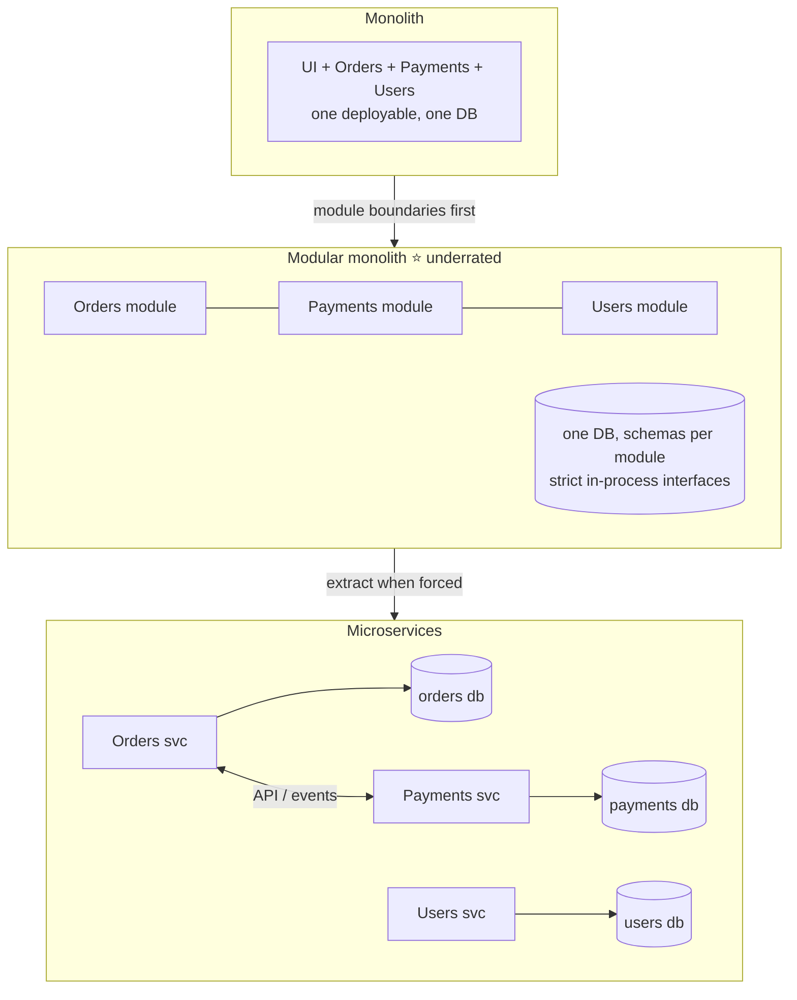
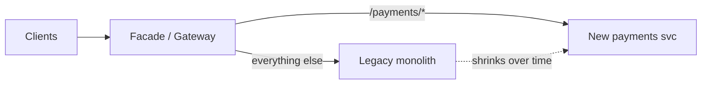
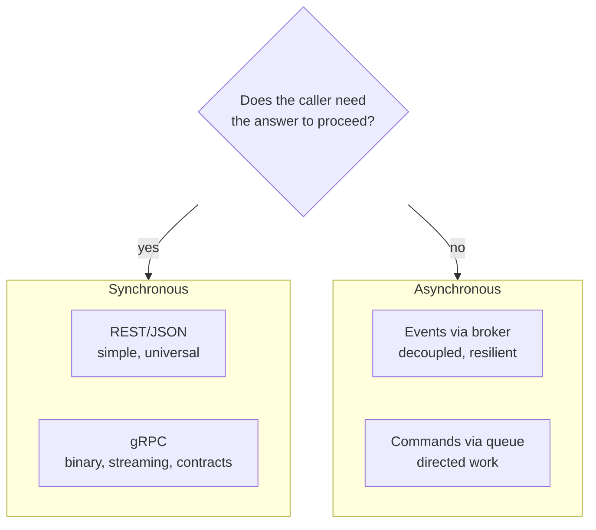
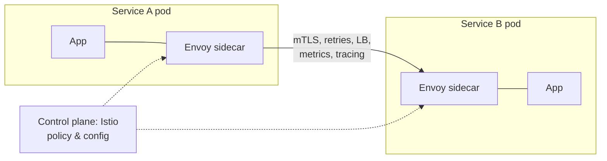
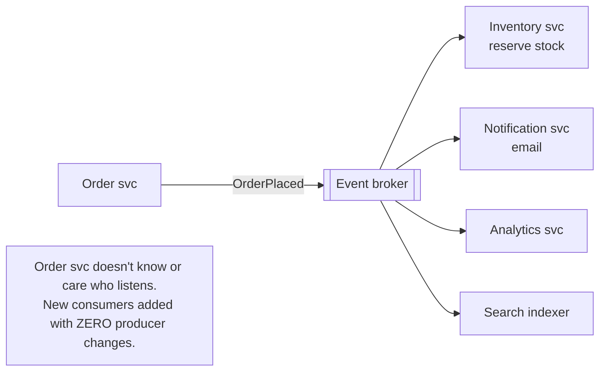
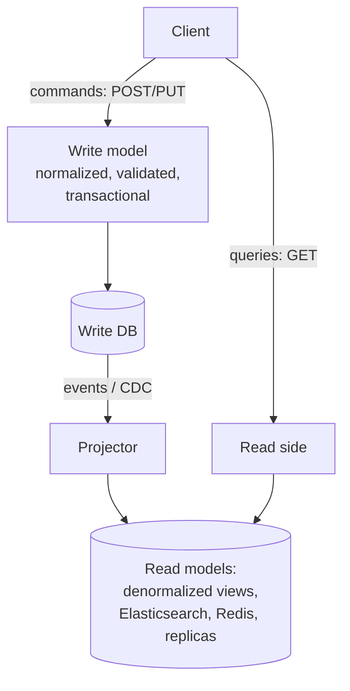
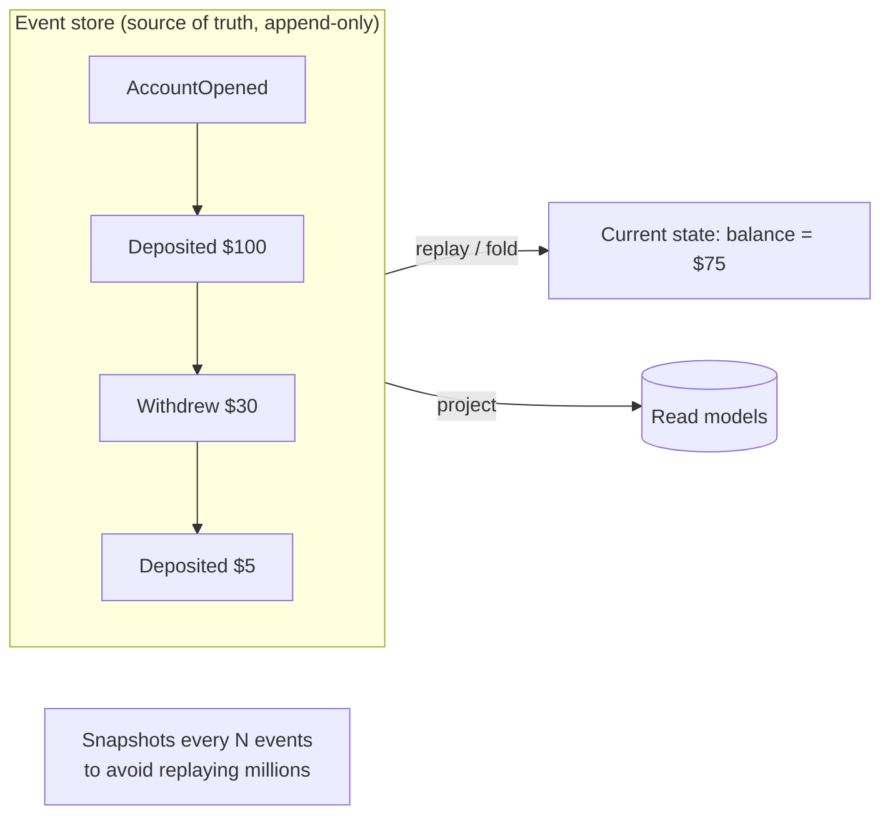
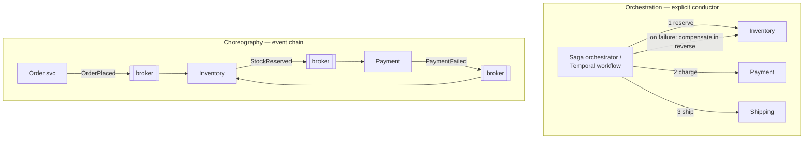
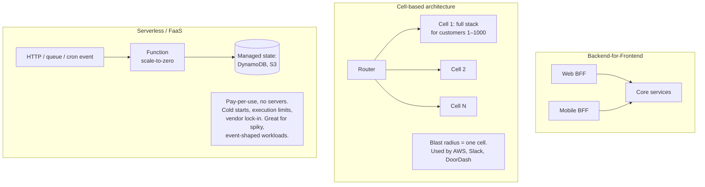
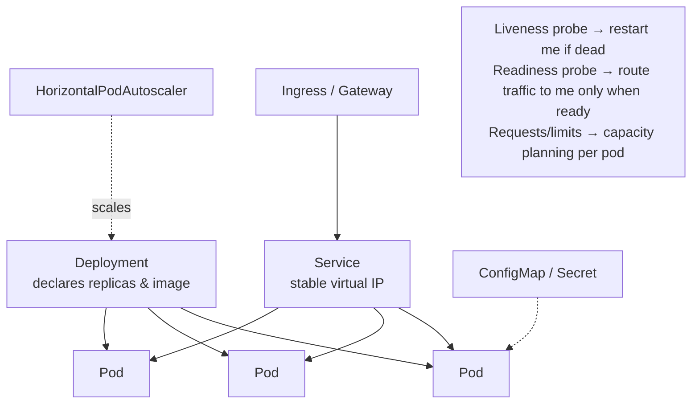

# 07 · Architecture Patterns — Shapes of Systems

How do you organize a whole product's backend? This chapter covers the macro-patterns —
monoliths, microservices, event-driven architecture, CQRS/event sourcing — and the honest costs of
each.

---

## 1. Monolith → modular monolith → microservices

| | Monolith | Microservices |
|---|---|---|
| Deploy | One unit — simple, but everything ships together | Independent deploys per team |
| Scale | Whole thing scales together | Scale hot services only |
| Failure | One bug can take everything down | Isolated (if built right) |
| Data | ACID transactions across features 🎉 | **No cross-service transactions** → sagas |
| Cost | Low ops overhead | Network hops, observability, service sprawl, org overhead |

**Rules that survive contact with reality:**
- Split by **business capability / bounded context** (DDD), never by technical layer ("the DAO service" is an anti-pattern).
- **Database-per-service** is what makes it real — shared databases recreate the monolith's coupling with extra steps ("distributed monolith").
- Extract when you have a *forcing function*: team scaling (Conway's law), divergent scaling needs, isolation requirements — not for fashion. At 2 YoE, defending a modular monolith is a strong senior signal.
- **Strangler fig** migration: put a facade/gateway in front of the legacy system, peel off one capability at a time, shrink the old system gradually — never big-bang rewrite.

## 2. Communication between services

- Chains of sync calls multiply latency and multiply failure probability → keep call depth shallow; prefer events for side effects.
- **Contracts**: OpenAPI / protobuf schemas, consumer-driven contract tests (Pact), backward-compatible evolution.
- **Service mesh** (Istio/Linkerd): sidecar proxies (Envoy) that handle retries, timeouts, mTLS, traffic splitting, and telemetry *outside* app code — platform-level reliability.

## 3. Event-driven architecture (EDA)

- **Event notification** ("something happened, come ask me") vs **event-carried state transfer** (event contains full data → consumers keep local copies, no callback needed) vs **event sourcing** (below). Know all three flavors.
- Costs: eventual consistency everywhere, harder debugging ("what called what?" → distributed tracing), duplicate delivery (idempotency, Ch 05), **event schema governance**.

## 4. CQRS — Command Query Responsibility Segregation

- Separate the write path (correctness, invariants) from read paths (each shaped exactly for a screen/query). Scale and optimize them independently.
- You already do lite-CQRS if you have read replicas or a search index. Full CQRS adds distinct models.
- Cost: **read models lag** the write model (eventual consistency) + projection rebuild machinery. Use for asymmetric read/write loads or wildly different read shapes — not for CRUD apps.

## 5. Event sourcing

- Store **facts (events)**, derive state — instead of storing state and losing history.
- Superpowers: complete audit log, time travel/debugging, rebuild any new read model from history, natural fit with CQRS & EDA.
- Costs: event versioning/migration over years, snapshotting, no ad-hoc queries on the log (need projections), a real learning curve. Use where audit/history is the domain (ledgers, banking, compliance); don't use for a simple catalog.

## 6. Saga in practice (orchestration vs choreography)

| | Orchestration | Choreography |
|---|---|---|
| Flow visibility | Explicit in one place ✅ | Emergent, hard to trace at >3 steps |
| Coupling | Orchestrator knows all steps | Fully decoupled |
| Best for | Complex, long, business-critical flows | Simple 2–3 step reactions |

## 7. Other shapes worth knowing

- **BFF**: one aggregation layer per client type — avoids one-size-fits-none general APIs.
- **Cell-based**: shard *the entire stack* by customer; failures and deploys hit one cell, not everyone. The scaled-up version of "bulkheads" ([Ch 09](09-reliability-and-observability.md)).
- **Serverless**: also know **Lambda-behind-API-Gateway**, DynamoDB streams triggers; and the **12-factor app** principles that make services container/cloud-friendly (config in env, stateless processes, logs to stdout, disposability).
- **Hexagonal / clean architecture** (ports & adapters): domain logic at the center, infrastructure (DB, HTTP, brokers) behind interfaces at the edges — this is the LLD foundation that makes services testable ([Ch 10](10-low-level-design.md)).
- **Multi-tenancy models**: shared-everything (tenant_id column) → shared app, DB-per-tenant → silo-per-tenant. Trade isolation/noisy-neighbor protection against cost & ops.

## 8. Kubernetes-era deployment vocabulary (one diagram)

You don't need to be a k8s expert for design interviews — you need this vocabulary: pod, service,
deployment, autoscaler, probes, and "the platform restarts failed containers and reschedules them."

---

## Advanced corner 🔬

- **Distributed monolith** — the failure mode to name: microservices that must deploy together, share a DB, or chain sync calls. All of the cost, none of the benefit.
- **Sidecar / ambassador / adapter patterns**: attach infrastructure behavior to a service via a companion container.
- **Feature flags** as an architecture tool: decouple deploy from release, canary by cohort, kill switches for risky paths.
- **Data mesh** (buzzword awareness): domain-owned analytical data products vs a central warehouse team.
- **Micro-frontends**: the same decomposition idea applied to UIs — know it exists.
- **Conway's law**: your architecture will mirror your org chart; team boundaries are architectural decisions.

---

### ✅ You should now be able to answer
1. Your startup has 8 engineers and a Django monolith struggling at 5k QPS. Microservices? (Probably not — argue the alternative.)
2. Design order fulfillment across 4 services with money involved. Orchestration or choreography, and why?
3. What breaks first when two services share one database?

**Next:** [08 · API Design & Security →](08-api-design-and-security.md)
