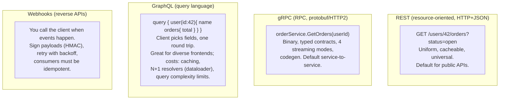
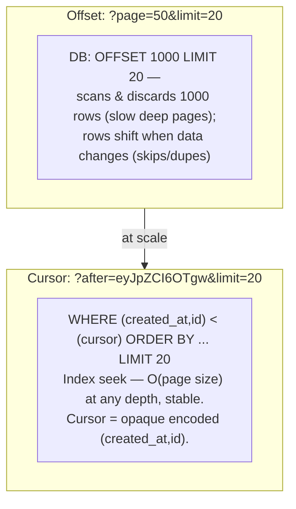
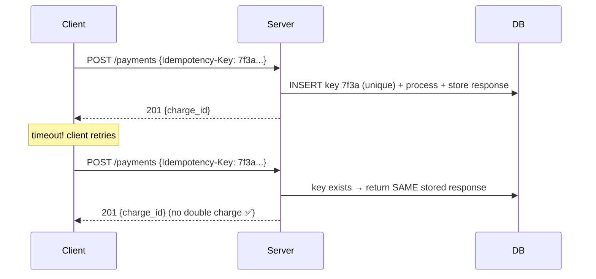
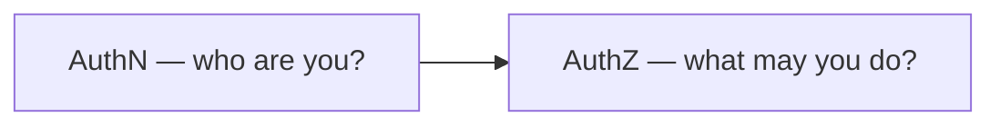
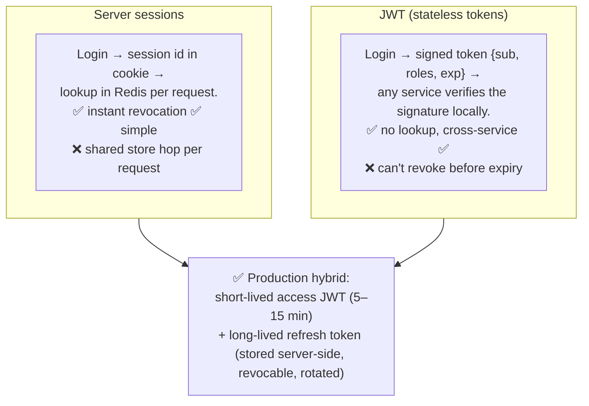
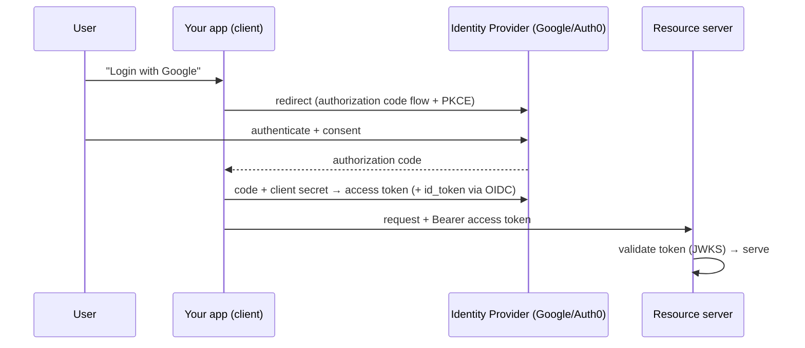
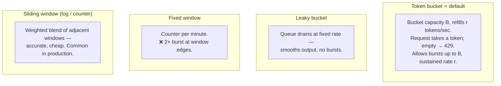
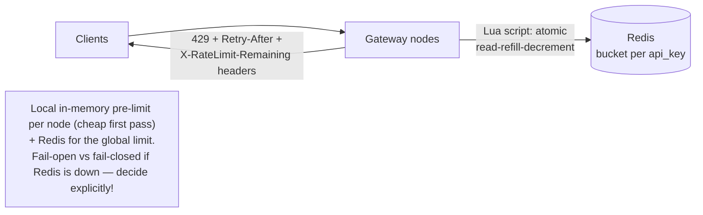
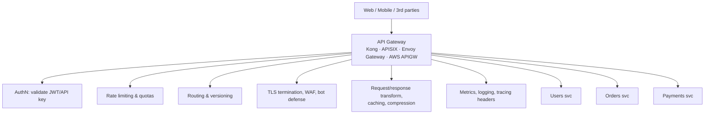
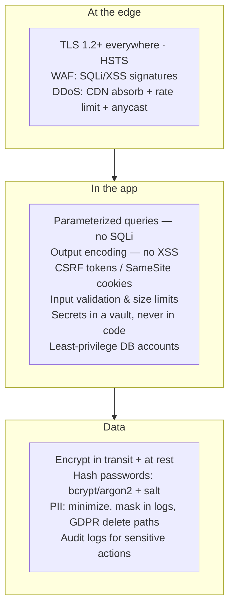

# 08 · API Design, Gateways & Security — The Front Door

APIs are the contract your system makes with the world. This chapter covers designing them well
(REST/gRPC/GraphQL), protecting them (authN/Z, rate limiting), and fronting them (API gateway).

---

## 1. API styles

| Choose | When |
|---|---|
| REST | Public APIs, CRUD-ish domains, maximum compatibility |
| gRPC | Internal microservices, low latency, streaming, strict contracts |
| GraphQL | Many client types with divergent data needs; aggregating many services |
| Webhooks/events | Notifying external consumers |

## 2. REST design that passes review

- **Nouns for resources, verbs from HTTP**: `POST /orders`, not `POST /createOrder`. Nested only one level (`/users/42/orders`); beyond that, filter (`/orders?user_id=42`).
- **Status codes**: 200/201/202/204 · 400 (bad input) 401 (who are you) 403 (not allowed) 404 409 (conflict) 422 429 (slow down) · 500 502 503 504. Use 4xx vs 5xx correctly — clients decide retry behavior on it.
- **Errors**: structured body — `{ "code": "INSUFFICIENT_FUNDS", "message": "...", "trace_id": "..." }` (RFC 7807 Problem Details).
- **Versioning**: URL (`/v2/`) is the pragmatic default; header-based is cleaner but subtler. Real rule: **evolve compatibly** (additive fields, never repurpose), version rarely, sunset with deprecation headers & timelines.

### Pagination — offset vs cursor ⭐

### Idempotency keys ⭐ (payment-grade APIs)

Store the key + response atomically with the business write; expire after ~24 h. This is how
Stripe works, and the standard answer to "what if the client retries a POST?"

Other essentials: request validation at the edge · consistent naming (`snake_case` or `camelCase`, pick one) ·
timeouts on every call · **OpenAPI spec as the source of truth** (codegen clients/servers, contract tests) ·
HATEOAS exists (know the term; rarely used fully).

## 3. Authentication & authorization

### Sessions vs JWT

JWT hygiene: verify signature *and* `exp`/`aud`/`iss` · never put secrets in claims (payload is
only base64) · use `RS256`/asymmetric so services verify with a public key (JWKS endpoint) ·
maintain a small revocation/blocklist for logout-now cases.

### OAuth 2.0 + OIDC in one diagram

Know the vocabulary: authorization code flow (+PKCE for public clients), client credentials flow
(service-to-service), scopes, id_token (OIDC = identity layer on OAuth).

### Authorization models

- **RBAC** — roles → permissions (`admin`, `editor`). Simple, coarse. Default.
- **ABAC** — rules over attributes (`user.dept == doc.dept && time < 6pm`). Flexible, complex.
- **ReBAC** — relationship-based (Google Zanzibar / SpiceDB): `user U is viewer of doc D because member of group G` — for Google-Docs-style sharing.
- Enforce **in the service layer, per resource** ("can THIS user touch THIS order"), not just at the gateway (which does coarse checks). Never trust client-supplied ids — the #1 real-world vuln (IDOR/BOLA).

## 4. Rate limiting ⭐ (a classic interview design on its own)

### Algorithms

### Distributed rate limiter

Dimensions to limit on: per API key / user / IP / endpoint / tenant tier. Related: **quotas**
(daily caps), **concurrency limits** (max in-flight), **spike arrest**.

## 5. API Gateway — one front door

Gateway (north-south: edge concerns, client traffic) vs **service mesh** (east-west:
service-to-service mTLS/retries). They coexist. Don't put business logic in the gateway.

## 6. Security essentials (the checklist)

Also know: **OWASP Top 10** by name · **mTLS** for internal zero-trust · **signed URLs** for
direct-to-S3 upload/download (keeps large files off your app servers) · **HMAC request signing**
for machine-to-machine APIs (AWS SigV4 style) · **replay protection** via timestamp + nonce.

---

## Advanced corner 🔬

- **BOLA/IDOR** (`GET /orders/12345` — someone else's order): the top real-world API vuln; enforce object-level ownership checks in every handler.
- **GraphQL hardening**: depth & complexity limits, persisted queries, disable introspection publicly.
- **gRPC deadline propagation**: caller's deadline flows through the call chain so downstream work is cancelled when the client gave up — pairs with distributed tracing.
- **API keys vs OAuth for B2B**: keys are simple but coarse; OAuth client-credentials gives rotation, scopes, expiry.
- **Backpressure at the edge**: return `429` + `Retry-After` early rather than queueing to death — ties into load shedding ([Ch 09](09-reliability-and-observability.md)).
- **Schema-first dev**: write OpenAPI/proto first, generate stubs, contract-test in CI — prevents drift between docs and reality.

---

### ✅ You should now be able to answer
1. Design Stripe-style safe retries for `POST /payments`.
2. Access token vs refresh token — why both, and where is each stored/validated?
3. Build a per-API-key rate limiter for 100 gateway nodes: algorithm, storage, failure mode.
4. Cursor pagination: why, and what makes a stable cursor?

**Next:** [09 · Reliability & Observability →](09-reliability-and-observability.md)
