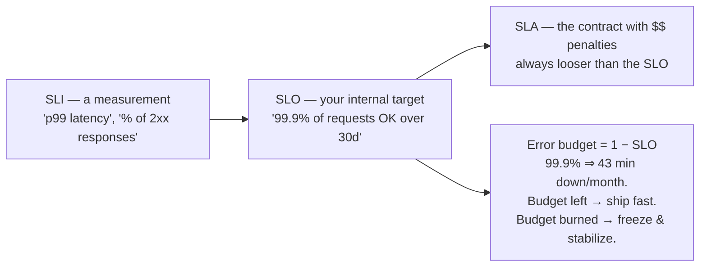
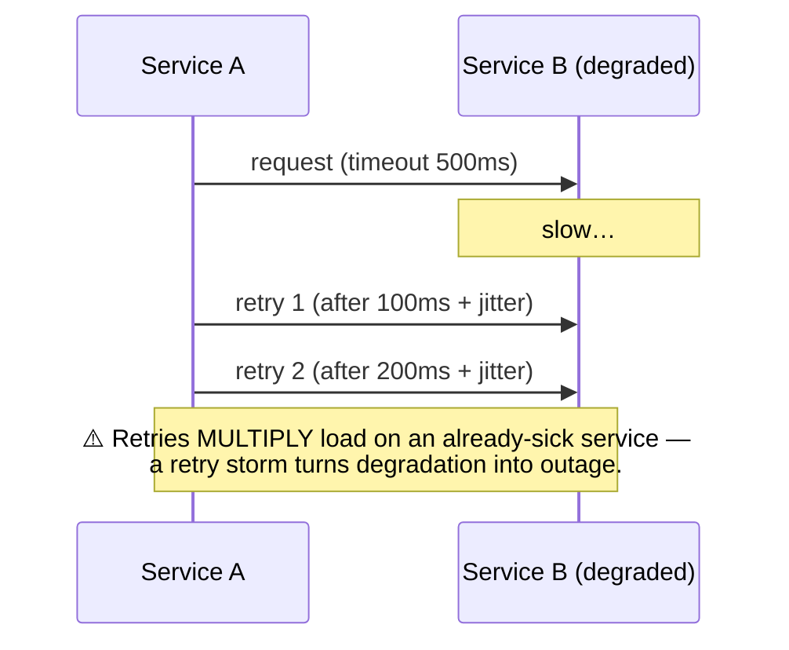
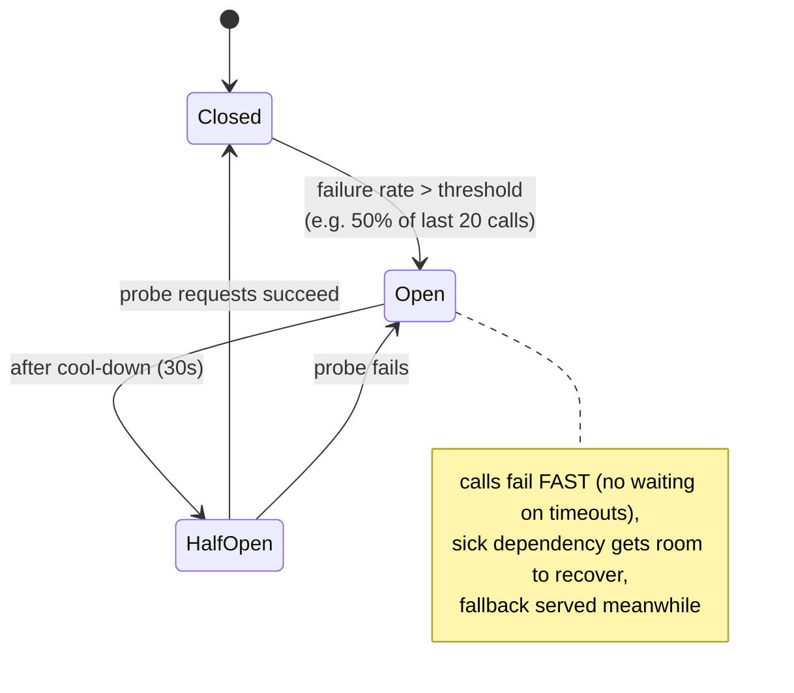
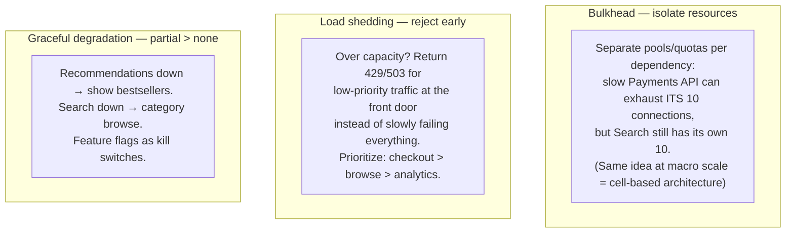
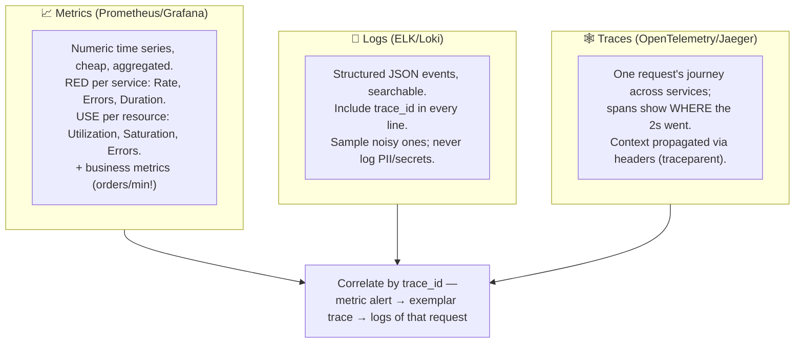
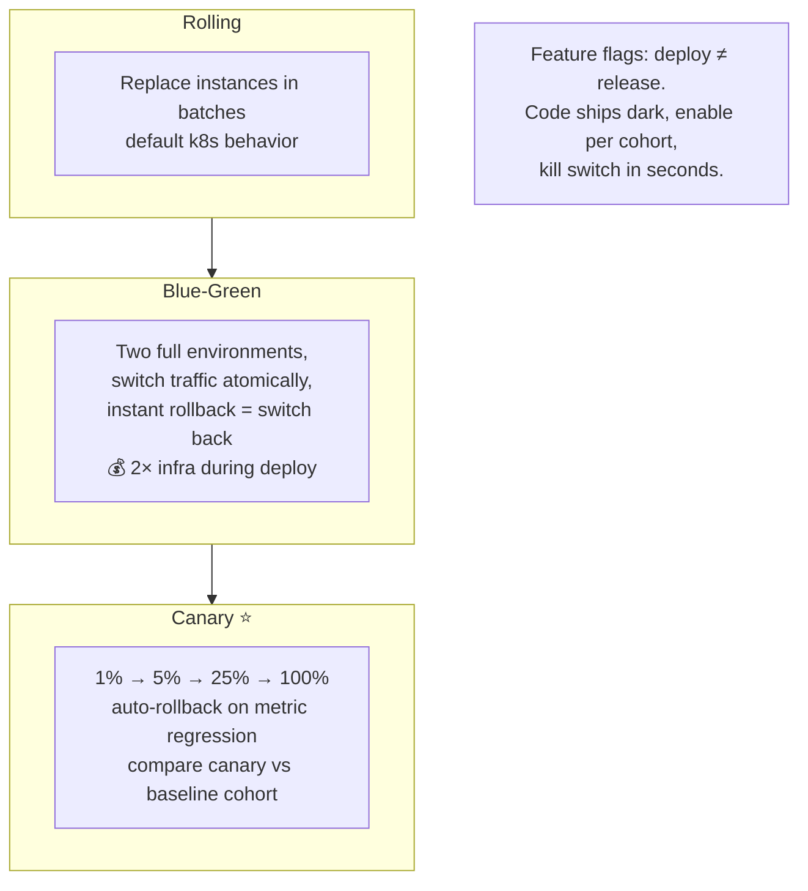
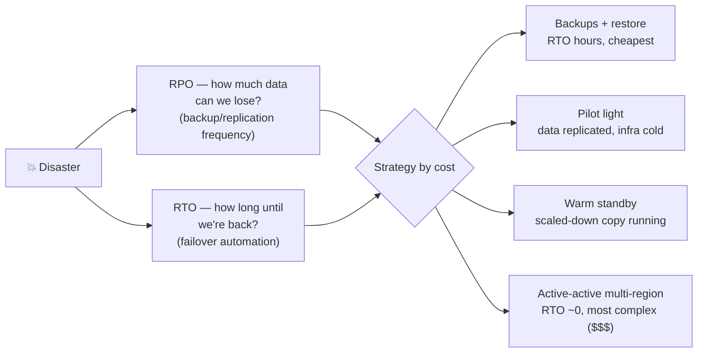

# 09 · Reliability & Observability — Designing for Failure

Everything fails: disks, networks, dependencies, your own deploys. Reliability is not the absence
of failure — it's the containment of failure. This chapter is what separates "it works on the
diagram" from production engineering.

---

## 1. The language of reliability

| Nines | Downtime/year | Reality check |
|---|---|---|
| 99% | 3.65 days | hobby |
| 99.9% | 8.7 h | good SaaS |
| 99.99% | 52 min | serious infra, multi-AZ mandatory |
| 99.999% | 5 min | telecom-grade, enormously expensive |

- Serial dependencies **multiply**: five 99.9% services in a chain ≈ 99.5%. This is the math behind "keep call chains shallow."
- Redundancy math: two independent 99% replicas ≈ 99.99% *if* failures are truly independent (same rack/AZ/deploy = not independent). Hence **multi-AZ** as table stakes and **multi-region** for the highest tiers.
- **MTTR beats MTBF**: you can't prevent all failures; you can detect and recover in minutes. Optimize time-to-detect + time-to-mitigate.
- Percentiles, not averages: **p50/p95/p99** — the p99 is what your heaviest users feel, and **tail latency amplification** means a page fanning out to 100 backends hits somebody's p99 almost every time. (Mitigations: hedged requests, tight timeouts.)

## 2. Resilience patterns (the big six)

### Timeouts, retries, and their dark side

Rules: every network call has a **timeout** (no infinite defaults) · retry only **idempotent** or
idempotency-keyed operations · **exponential backoff + jitter** · **retry budgets** (e.g. retries
≤ 10% of traffic) · cap total attempts across the chain (or only the edge retries).

### Circuit breaker

### Bulkheads, shedding, degradation

### The one everyone forgets: metastable failures & cold starts

A system that's healthy at steady state can be unable to *recover*: cache flushed → DB
overwhelmed → timeouts → retries → more load. Defenses: cache warming, retry budgets, load
shedding at startup, slow-start traffic ramping. Name this in interviews; it's a strong signal.

## 3. Observability — the three pillars (+ one)

### Distributed tracing view

```mermaid
gantt
    title One request, traced (total 900ms — where did it go?)
    dateFormat X
    axisFormat %L ms
    section Gateway
    auth + route          :0, 40
    section Order svc
    handler               :40, 860
    section Payment svc
    charge (external PSP) :120, 700
    section DB
    insert order          :830, 860
```

> The trace instantly shows the external payment call is 65% of latency → cache/parallelize/async it.

### Alerting & health

- Alert on **symptoms users feel** (SLO burn rate, error %, p99), not causes (CPU%) — causes go on dashboards.
- Two burn-rate alerts: fast-burn (page now) + slow-burn (ticket).
- Every alert must be **actionable** with a runbook; alert fatigue is an outage-multiplier.
- `/healthz` liveness vs `/ready` readiness (checks dependencies) — wired into LB/k8s ([Ch 02](02-scaling-and-load-balancing.md), [Ch 07](07-architecture-patterns.md)).
- **Synthetic monitoring**: scripted probes of key flows from outside, catching what internal metrics miss.

## 4. Deployment safety

Zero-downtime requires: backward-compatible schema migrations (**expand → migrate → contract**),
connection draining, versioned APIs/events, and N and N+1 running simultaneously without conflict.

## 5. Disaster recovery

Non-negotiables: **test your restores** (an untested backup is a hope, not a plan) · backups
isolated from prod credentials (ransomware) · run **game days / chaos drills** (Chaos Monkey:
inject failure on purpose, verify the system tolerates it) · practice failover before you need it.

## 6. Operational culture (say these words)

- **Blameless postmortems**: every incident → timeline, contributing causes, action items. Systems fail, processes fix.
- **Runbooks** per alert; **on-call rotations** with escalation.
- **Capacity planning**: forecast + load test (know **p99 under load**, find the knee of the curve) before Black Friday, not during.
- **Graceful shutdown**: catch SIGTERM → stop accepting → drain in-flight → close connections. The difference between "deploy" and "blip of 500s every deploy."

---

## Advanced corner 🔬

- **Hedged requests**: send a duplicate to a second replica if the first hasn't answered by p95 — Google's tail-latency killer; requires idempotent reads.
- **Adaptive concurrency limits** (Netflix): auto-discover a service's capacity from latency gradients instead of fixed limits.
- **Brownout**: deliberately disable expensive features under load (drop personalization, serve static fallbacks).
- **Watchdog vs cascading health checks**: a health check that checks dependencies can turn one dependency's blip into a full-fleet "unready" cascade — keep readiness checks shallow, use circuit breakers for deps.
- **Correlated failure domains**: rack, AZ, deploy pipeline, cert expiry, DNS, config push — the last three cause more global outages than hardware. Stagger config rollouts like code rollouts.
- **Jidoka / automation levels**: auto-rollback, auto-remediation (restart, failover) — with rate limits so automation itself can't run amok.

---

### ✅ You should now be able to answer
1. Your dependency's p99 jumped 10×. Trace the failure through your service (threads/conn pool exhaustion) and list the four patterns that would have contained it.
2. Define an SLO for a checkout API and design its two alerts.
3. Why can retries make an outage worse, and what three mechanisms bound them?
4. Design the deploy pipeline for a payments service (canary + flags + compatible migrations + auto-rollback).

**Next:** [10 · Low-Level Design →](10-low-level-design.md)
