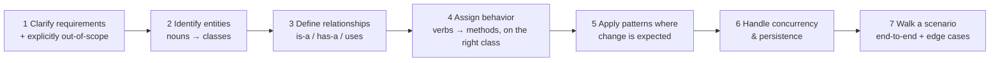
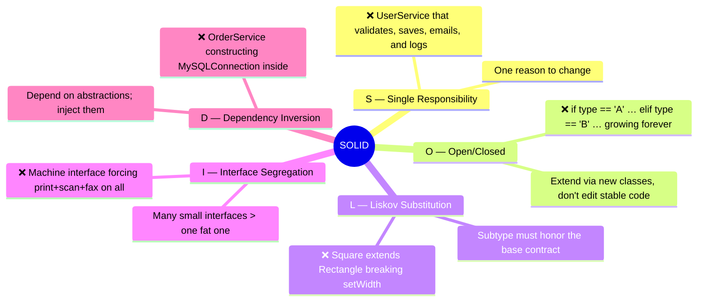
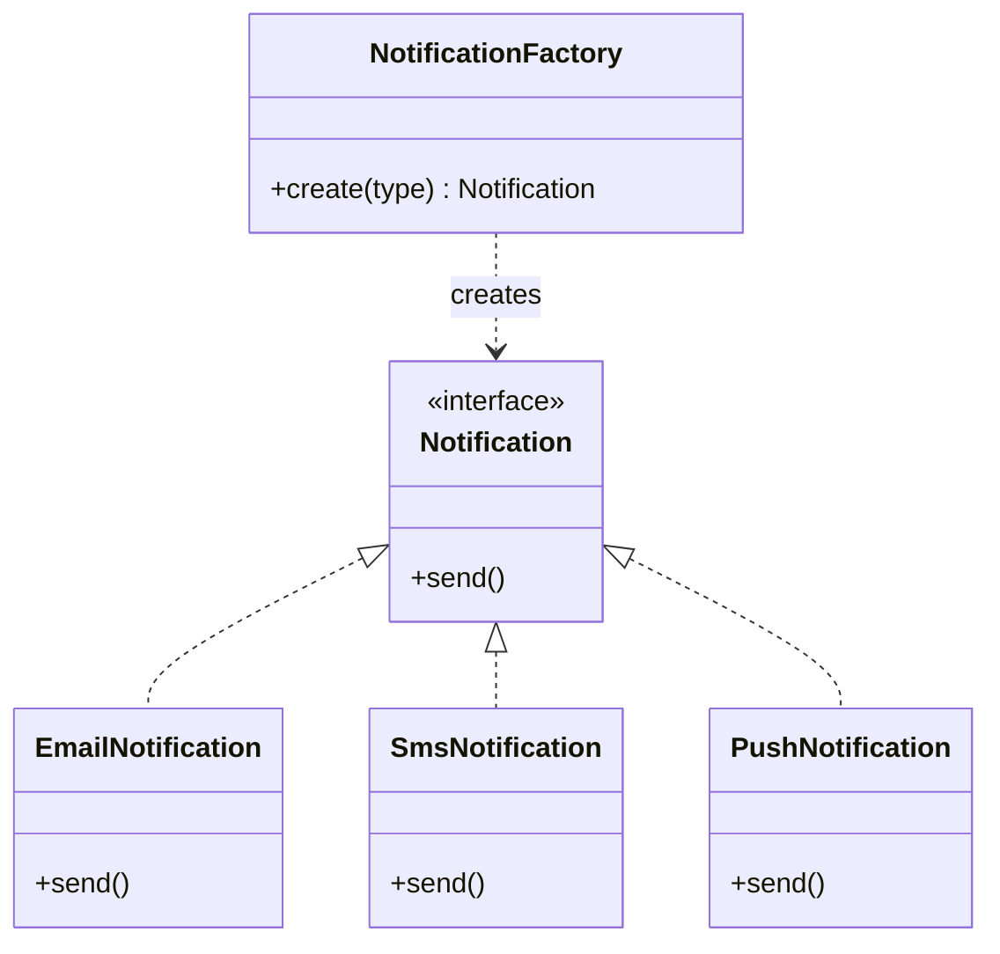
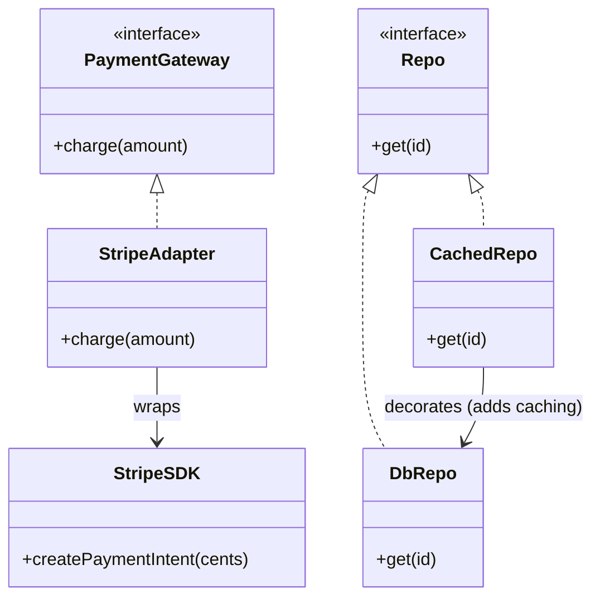
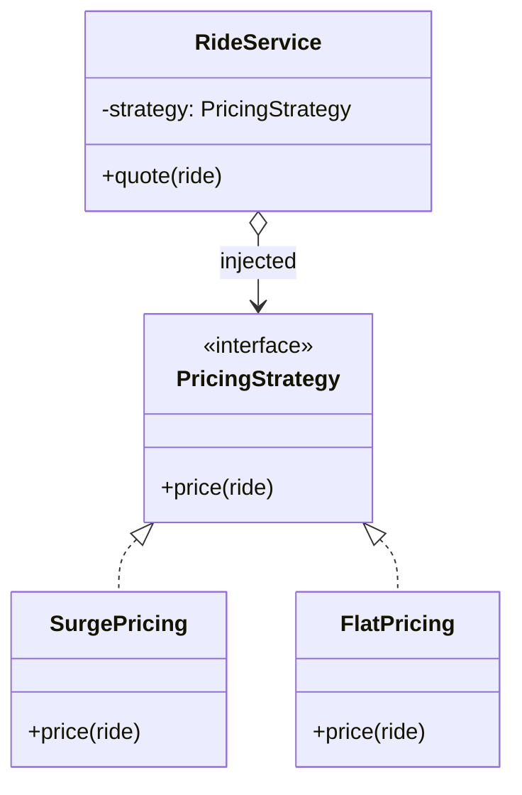
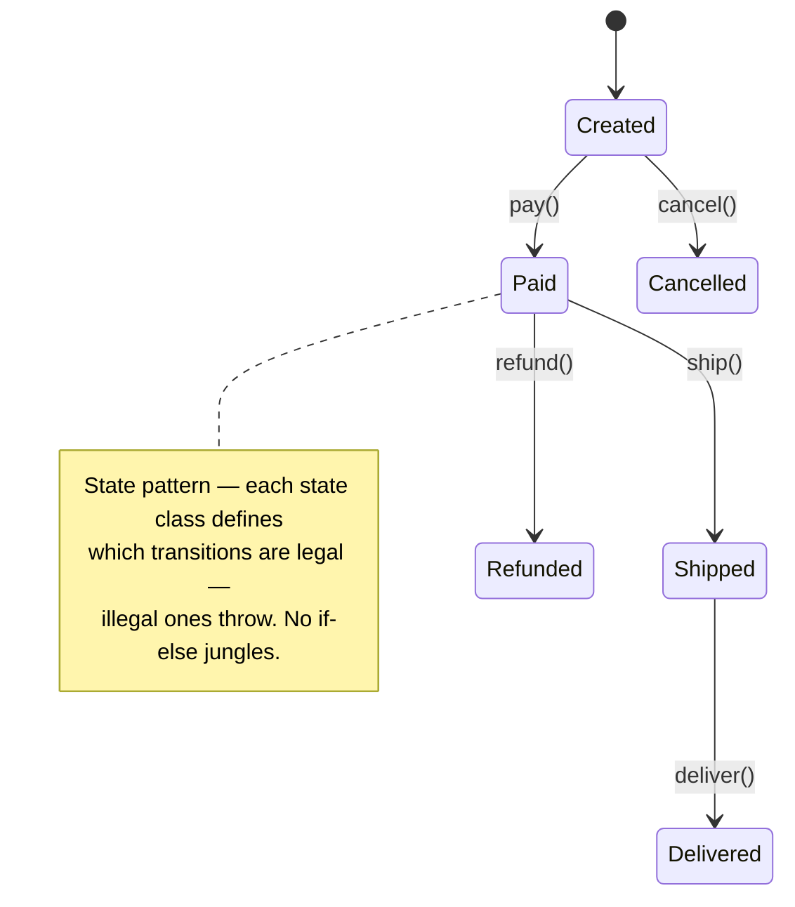
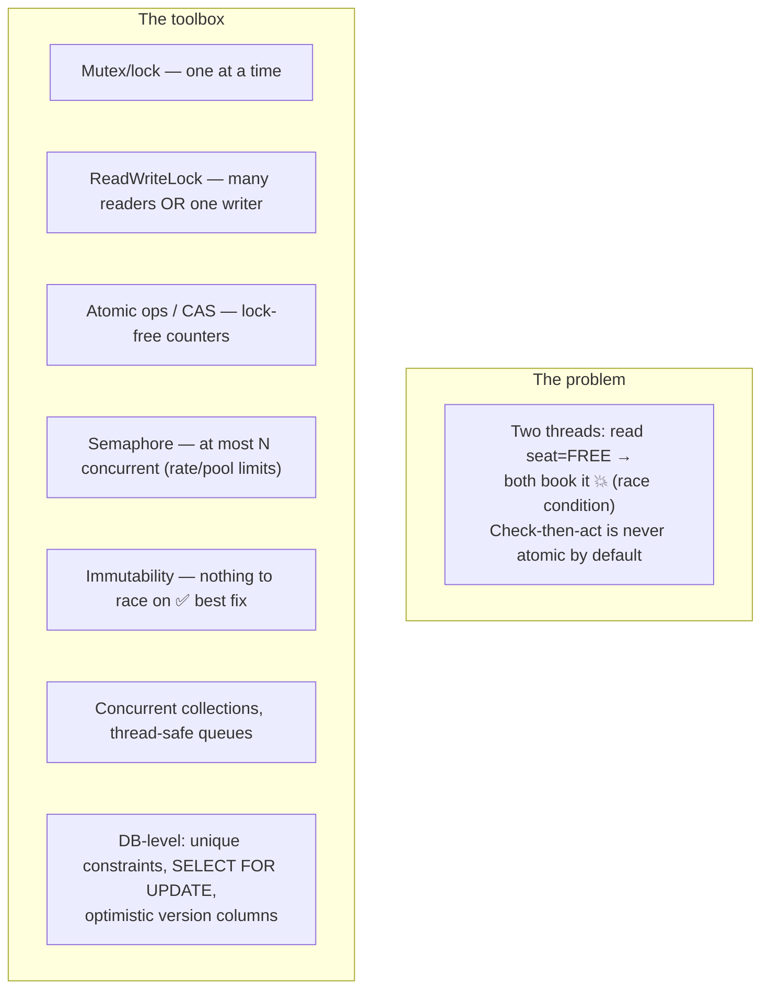
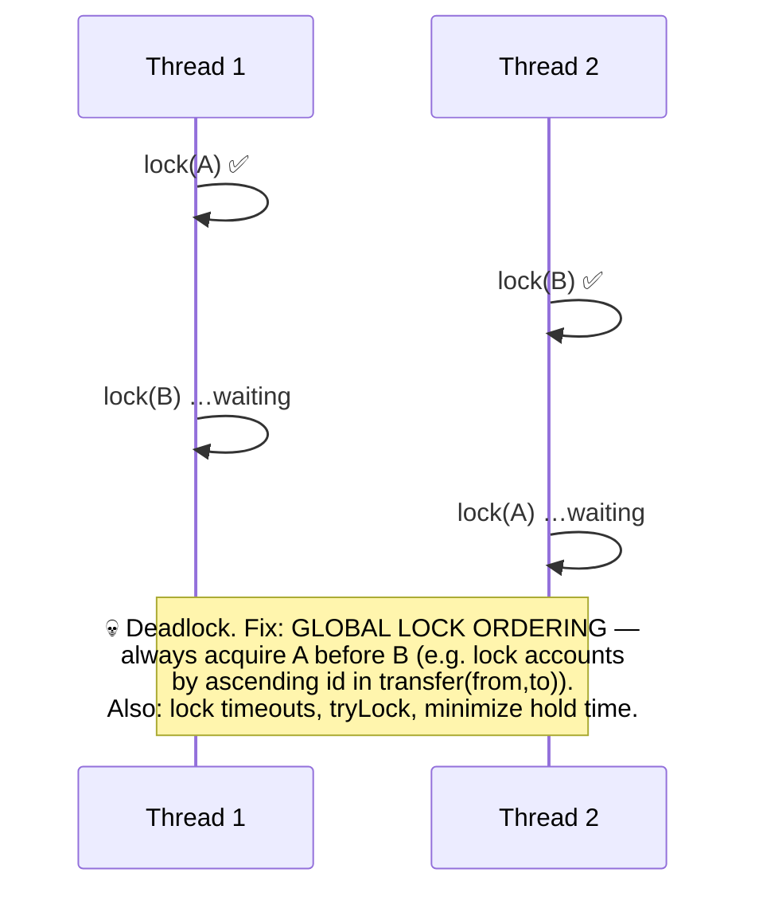
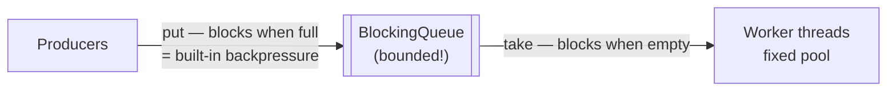
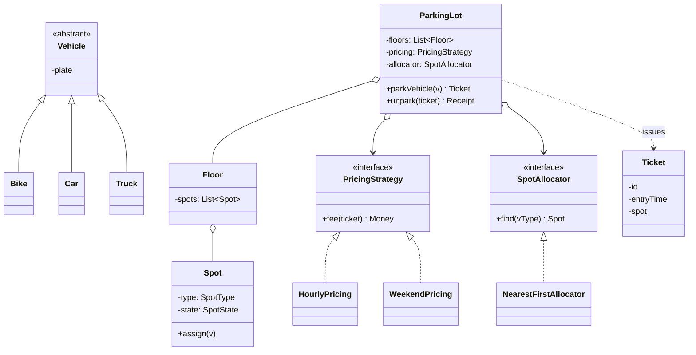

# 10 · Low-Level Design — From Boxes to Classes

HLD decides *what components exist*; LLD decides *what the code inside them looks like*: classes,
interfaces, state, concurrency, and the design patterns that keep it changeable. LLD interviews
give you a problem ("design a parking lot / BookMyShow / Splitwise") and expect clean, extensible
object design — often runnable.

---

## 1. The LLD method (use this every time)

Golden rules:
- **Composition over inheritance** — inherit for true "is-a", compose for capabilities.
- **Program to interfaces** — depend on `PaymentMethod`, not `CreditCard`.
- **Encapsulate what varies** — pricing rules, notification channels, storage backends behind interfaces.
- Small classes, single purpose; **no God objects** (a `Manager` that does everything).

## 2. SOLID — with the violation each one prevents

**Dependency Injection** is D in practice: pass dependencies in via constructor → swappable →
**unit-testable with fakes**. This plus "hexagonal architecture" ([Ch 07](07-architecture-patterns.md))
is why well-designed services are easy to test.

Also know: **DRY** (but don't abstract prematurely — duplication is cheaper than the wrong
abstraction), **KISS**, **YAGNI**, **Law of Demeter** (talk to friends, not friends-of-friends),
**high cohesion / low coupling** (the umbrella goal of all of it).

## 3. Design patterns — the ones that actually appear

### Creational

- **Factory / Abstract Factory**: centralize "which concrete class?" decisions — new types without touching callers.
- **Builder**: construct complex objects step-by-step (`Request.builder().url(...).timeout(...).build()`) — beats 9-arg constructors.
- **Singleton**: one instance (config, connection pool). Use sparingly — hidden global state, test pain; prefer DI-scoped singletons. Know thread-safe init (double-checked locking / language idioms).
- **Prototype**: clone a configured template.
- **Object Pool**: reuse expensive objects — DB connections, threads (this is what connection pooling *is*).

### Structural

- **Adapter**: make a third-party interface fit yours (every payment/notification vendor integration).
- **Decorator**: layer behavior (caching, retry, logging, metrics) around a component without changing it — how middlewares work.
- **Facade**: one simple interface over a messy subsystem (also the strangler-fig front).
- **Proxy**: stand-in controlling access — lazy loading, RPC stubs, access control.
- **Composite**: tree of parts treated uniformly (folders/files, UI, org charts).
- **Flyweight**: share immutable heavy state across many objects (glyphs, map tiles).

### Behavioral

- **Strategy** ⭐: swap algorithms (pricing, routing, eviction, matching) — the most-used pattern in LLD interviews.
- **Observer** ⭐: publish state changes to subscribers — the in-process version of event-driven architecture; UI listeners, domain events.
- **State** ⭐: entity with lifecycle (order, ride, elevator) — legal transitions as first-class design.
- **Command**: reify an action as an object → queues, undo/redo, audit (a queue message *is* a serialized Command).
- **Chain of Responsibility**: pipeline of handlers, each passes along (middleware, approval workflows, support-ticket escalation).
- **Template Method**: skeleton algorithm with overridable steps.
- **Iterator**, **Mediator**, **Memento** (undo snapshots), **Visitor** (operations over object trees): recognize on sight.

> **Anti-pattern awareness** (name these when you avoid them): God object, anemic domain model
> (all logic in "services", entities are dumb structs), spaghetti if-else on type codes
> (→ Strategy/State/polymorphism), premature abstraction, singleton overuse.

## 4. Concurrency — the LLD differentiator

### Deadlock — the 4 conditions & the standard fix

### Producer–consumer & thread pools

- **Thread pool sizing**: CPU-bound ≈ cores; IO-bound ≈ cores × (1 + wait/compute) — or use async IO.
- Know your language's model: Java executors & `synchronized`/`j.u.c`; Python GIL (threads fine for IO, processes for CPU, asyncio for high-concurrency IO); Go goroutines + channels ("share memory by communicating"); Node's single-threaded event loop (never block it).
- In interviews, booking/inventory problems **require** you to volunteer the race condition and fix it (lock, atomic DB op, or unique constraint) before being asked.

## 5. Persistence-aware LLD

- **Repository pattern**: `OrderRepository.save/findById` interface between domain and DB — swap Postgres for in-memory in tests.
- **Entities vs value objects** (DDD-lite): entities have identity (`User#42`); value objects are immutable data (`Money(50, "USD")` — never a float! store cents as integers).
- **Aggregate**: cluster of entities changed as one transactional unit through a root (Order + its lines) — your transaction boundary.
- **Schema design flows from the class model**: 1-N → foreign key; N-M → join table; inheritance → single-table (nullable columns) vs table-per-type. Enforce invariants in the DB too (unique, FK, checks) — the last line of defense.
- **Domain events**: aggregate emits `OrderPaid` in-process → handlers (and the outbox, [Ch 05](05-async-and-messaging.md)) react. This is how LLD connects to HLD event-driven design.

## 6. Worked mini-LLD — Parking Lot (the classic)

Design notes to say out loud:
- Strategy for pricing & allocation (**O** in SOLID: add `EVPricing` without touching `ParkingLot`).
- Spot assignment is a **check-then-act race** → lock per spot / atomic claim (`UPDATE spots SET state='HELD' WHERE id=? AND state='FREE'`).
- `Ticket` is the persistence aggregate; money is a value object in cents.
- Extension probes they'll ask: multiple gates (concurrency), EV spots (new SpotType — enum + allocator handles it), reservations (State pattern on Spot: FREE→RESERVED→OCCUPIED).

## 7. Code-level API & error design

- Validate at the boundary; deeper layers assume valid inputs (parse, don't validate repeatedly).
- Exceptions vs result types: exceptional failures throw; expected outcomes ("insufficient funds") are modeled results.
- Make illegal states unrepresentable: enums/sealed types over strings, non-null by default, constructor-enforced invariants.
- **Composition roots**: wire dependencies at startup (DI container or plain factory functions), not scattered `new` calls.

---

## Advanced corner 🔬

- **Idempotent domain methods**: `order.markPaid()` safe to call twice — LLD's contribution to at-least-once delivery.
- **Optimistic locking in the ORM**: `@Version` column; catch the conflict exception and retry — the code-level view of [Ch 03](03-databases.md) OCC.
- **Event-sourced aggregates**: `apply(event)` + `decide(command) → events` — the LLD inside [Ch 07](07-architecture-patterns.md)'s event sourcing.
- **Lock striping**: N locks by `hash(key) % N` instead of one global lock — ConcurrentHashMap's trick; use it in your LLD rate limiter.
- **Double-checked locking & memory visibility**: locks also publish memory (happens-before); a flag without synchronization may never be *seen* by another thread — say "volatile/atomic" when you share flags.
- **Designing for testability** is designing well: if it's hard to test, the coupling is wrong.

---

### ✅ You should now be able to answer
1. Design BookMyShow seat booking: classes + the exact mechanism preventing double-booking under concurrency.
2. Refactor `if (type=="gold") … else if (type=="platinum") …` pricing — which pattern and why?
3. Implement an in-memory rate limiter (token bucket) that's thread-safe — where's the lock, and how do you avoid one global lock?

**Next:** [11 · Interview Blueprint →](11-interview-blueprint.md)
