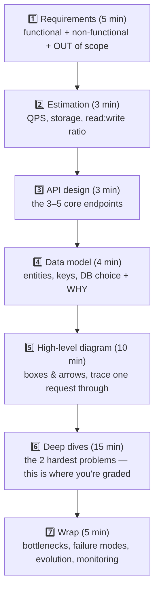
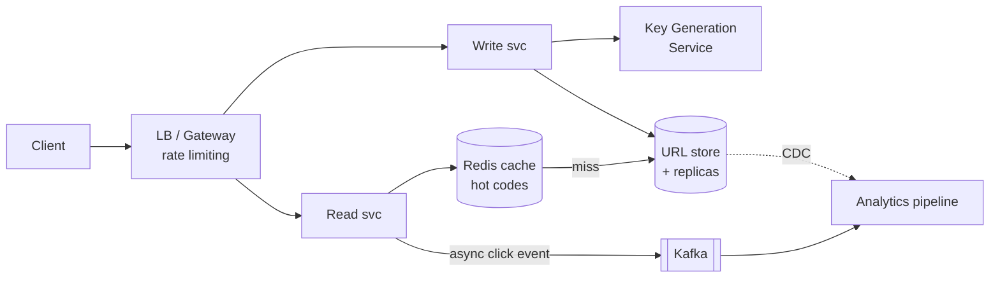
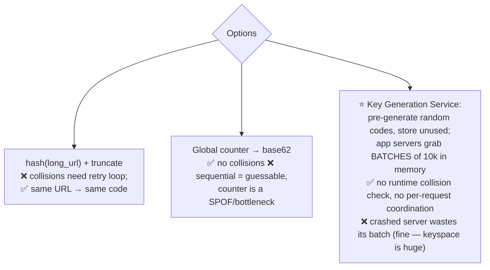

# 11 · The Interview Blueprint — A Repeatable Method + Worked Example

A design interview is 45 minutes to show *structured thinking under ambiguity*. This chapter gives
you the script, then runs it end-to-end on a URL shortener (with the depth follow-ups interviewers
actually ask).

---

## 1. The 7-step framework (≈45 min)



Habits that score:
- **Drive** the interview; announce transitions ("data model's settled — the interesting problem here is the hot-key cache, let me go deep there").
- Every choice framed as a **trade-off** ("cursor pagination because deep offset scans die; the cost is no jump-to-page-N").
- Numbers justify architecture ("500 write QPS — a single Postgres handles it; sharding here would be premature").
- **Non-functional requirements decide the design**: always pin down consistency needs, latency target, availability target, read:write ratio, data size. Two systems with the same features and different NFRs are different designs.

### Deep-dive menu (pick what the problem stresses)
| Problem smells like… | Go deep on |
|---|---|
| Read-heavy | Caching layers, CDN, replicas ([Ch 04](04-caching.md)) |
| Write-heavy | LSM stores, partitioning, batching, queues ([Ch 03](03-databases.md), [05](05-async-and-messaging.md)) |
| Uniqueness/counting | ID generation, idempotency, exactly-once ([Ch 05](05-async-and-messaging.md)) |
| Realtime | WebSockets/SSE, pub-sub fanout, presence ([Ch 01](01-fundamentals.md)) |
| Geo | Geohash, proximity queries, region routing ([Ch 03](03-databases.md)) |
| Money/booking | Transactions, locking, sagas, idempotency keys ([Ch 06](06-distributed-systems-theory.md), [08](08-api-design-and-security.md)) |
| Feeds/social | Fan-out on write vs read, ranking, celebrity problem ([Ch 03](03-databases.md)) |

## 2. Worked example — Design a URL Shortener (bit.ly)

### Step 1 — Requirements
- **Functional**: create short link for a long URL; redirect; optional custom alias & expiry. *Out of scope (say it!): auth, analytics dashboard UI.*
- **Non-functional**: redirect latency < 50 ms p99; availability 99.99% (redirects are the product); **read:write ≈ 100:1**; links live for years. Eventual consistency fine for click counts; created links must be immediately usable (read-your-writes).

### Step 2 — Estimation
- 100 M new URLs/month ≈ `10⁸ / (30×10⁵)` ≈ **40 writes/s** (peak ~100).
- Reads: 100× → **4k reads/s** (peak ~10k) → *screams cache*.
- Storage: 100 M/mo × 500 B ≈ 50 GB/month ≈ **3 TB over 5 years** — one big DB or a small sharded setup; not the hard part.

### Step 3 — API
```
POST /api/v1/urls   {long_url, custom_alias?, expires_at?}  → 201 {short_url}
GET  /{code}                                                → 301/302 redirect
```
- **301 (permanent, browsers cache — fewer hits, no analytics) vs 302 (temporary, every click hits us — analytics)**: choose 302 *because analytics is the business*. This tiny choice is a favorite probe.

### Step 4 — Data model
```
urls(code PK, long_url, created_at, expires_at, user_id)
```
Key-value shaped, no joins, no transactions across rows → Postgres works at this scale;
DynamoDB/Cassandra if we plan for 10×. Say: *"I'll start Postgres + cache; the access pattern is
KV so migrating later is easy."*

### Step 5 — High-level design



Trace a redirect: `GET /abc123` → cache hit (~1 ms) → 302. Miss → DB → fill cache → 302.

### Step 6 — Deep dives (where the marks are)

**(a) Generating the short code.** 7 chars of base62 → 62⁷ ≈ **3.5 trillion** codes.

**(b) Cache & hot keys.** Zipf traffic → cache top codes, TTL hours + delete on update; a viral
link = hot key → per-instance L1 cache in front of Redis; negative-cache unknown codes + Bloom
filter to blunt scanners ([Ch 04](04-caching.md)).

**(c) Availability.** Redirect path touches only cache+DB replicas → keep the write path's
failures away from reads (separate services — bulkhead). Multi-AZ replicas, Redis Sentinel,
DNS-level region failover. Expired links: lazy check on read + nightly cleanup job.

### Step 7 — Wrap
Bottleneck: cache hit ratio (alert on it). Evolution: shard by `hash(code)` when writes 50×;
analytics already decoupled via Kafka. Monitoring: redirect p99, 404 rate (scanner detection), hit
ratio, replication lag.

> **That's the template.** Every problem in [Ch 12](12-practice-problems.md) runs through these
> same 7 steps with different deep dives.

## 3. Estimation cheat card (memorize)

| Fact | Value |
|---|---|
| Seconds/day | ~10⁵ (86,400) |
| 1 M req/day | ~12 QPS (peak ×2–5) |
| Redis / node | ~100k QPS, sub-ms |
| Postgres / node | ~5–20k QPS mixed |
| Kafka / broker | ~100s of MB/s |
| One app server | ~10–50k simple QPS |
| base62⁷ | ~3.5 × 10¹² |
| UUID | 16 B; Snowflake ID: 8 B, time-sortable |
| 1 B rows × 100 B | 100 GB — one machine, don't shard reflexively |

## 4. Red flags interviewers actually mark down

1. Jumping to boxes before requirements/NFRs.
2. Buzzword architecture ("Kafka + Cassandra + k8s") with no numbers forcing it.
3. No failure story — never mentioning what happens when a component dies.
4. Ignoring hints — the interviewer's follow-up *is* the rubric; go where they point.
5. Silent trade-offs — a choice with no stated alternative reads as memorization.
6. One consistency level for everything ("everything strongly consistent" = didn't think).

**Next:** [12 · Practice Problems →](12-practice-problems.md)
