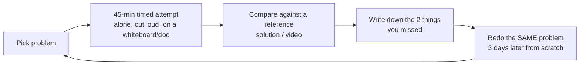

# 12 · Practice Problems — Apply Everything

Work these in order within each track. For every problem: run the [7-step blueprint](11-interview-blueprint.md),
draw the diagram, and *say the trade-offs out loud* (or write them down). The **Concepts** column
tells you which chapters the problem forces you to use — that's the real syllabus.

---

## 🏙️ Track A — HLD problems

### Tier 1 · Foundations (start here)

| # | Problem | Core challenges | Concepts exercised |
|---|---------|-----------------|--------------------|
| 1 | **URL shortener** (worked in Ch 11 — now redo it blind) | ID generation, 100:1 read ratio, hot keys | Ch 01, 03, 04 |
| 2 | **Pastebin** | Blob vs metadata storage, expiry, size limits | Object storage, TTL cleanup |
| 3 | **Rate limiter as a service** | Token bucket, atomic Redis ops, fail-open vs fail-closed | Ch 04, 08 |
| 4 | **Distributed ID generator** | Snowflake layout, clock skew, per-node sequences | Ch 03, 06 |
| 5 | **Image hosting service** (imgur) | Direct-to-S3 signed uploads, CDN, thumbnails via queue | Ch 02, 04, 05 |
| 6 | **Notification service** | Fan-out to email/SMS/push, retries, DLQ, idempotency, user prefs | Ch 05, 08 |
| 7 | **Web crawler** | Politeness (per-domain rate), URL frontier queue, dedup at billions (Bloom), robots.txt | Ch 03, 05 |

### Tier 2 · Core product systems

| # | Problem | Core challenges | Concepts exercised |
|---|---------|-----------------|--------------------|
| 8 | **Instagram / photo feed** | Fan-out on write vs read, celebrity problem, feed ranking, media pipeline | Ch 03, 04, 05 |
| 9 | **Twitter timeline + follow graph** | Same as #8 plus graph storage, trending (heavy hitters / Count-Min) | Ch 03, 05 |
| 10 | **WhatsApp / chat system** | WebSocket connection service, message ordering per conversation, delivery receipts, offline sync, E2E encryption awareness | Ch 01, 05, 06 |
| 11 | **Dropbox / file sync** | Chunking + content-addressed dedup, delta sync, conflict resolution, metadata vs block store | Ch 03, 06 |
| 12 | **YouTube / video platform** | Upload → transcode DAG (queue), adaptive bitrate (HLS), CDN strategy, view counting at scale | Ch 02, 05 |
| 13 | **Ticketmaster / BookMyShow** ⭐ | Seat locking (pessimistic vs reservation-with-TTL), oversell prevention, payment saga, waiting room for on-sale spikes | Ch 03, 06, 08 |
| 14 | **E-commerce checkout (Amazon)** | Cart, inventory reservation, order saga across services, outbox, exactly-once payment | Ch 05, 06, 07 |
| 15 | **Uber / ride matching** | Geohash/S2 driver index, location update firehose, matching, surge pricing, trip state machine | Ch 03, 05, 10 |
| 16 | **Food delivery (DoorDash)** | #15 plus three-sided marketplace, ETA estimation, order tracking realtime | Ch 01, 03, 05 |
| 17 | **Search autocomplete / typeahead** | Trie vs prefix tables, top-k per prefix, precompute pipeline, personalization | Ch 03, 04, 05 |
| 18 | **News feed ranking pipeline** | Candidate generation → scoring → dedup, feature store, freshness vs cost | Ch 05, 07 |

### Tier 3 · Infrastructure & advanced

| # | Problem | Core challenges | Concepts exercised |
|---|---------|-----------------|--------------------|
| 19 | **Distributed cache** (build Redis Cluster) | Consistent hashing, replication, failover, hot shard | Ch 03, 04, 06 |
| 20 | **Distributed message queue** (build Kafka-lite) | Partitioned log, consumer groups, offsets, replication/ISR, delivery semantics | Ch 05, 06 |
| 21 | **Distributed lock service** (Chubby/Zookeeper-lite) | Leases, fencing tokens, consensus, session expiry | Ch 06 |
| 22 | **Metrics/monitoring system** (Datadog-lite) | Time-series ingestion at 10M points/s, downsampling, retention tiers, alert evaluation | Ch 03, 05, 09 |
| 23 | **Log search** (ELK-lite) | Ingestion pipeline, inverted index, hot/warm/cold tiers, query fan-out | Ch 03, 05 |
| 24 | **Google Docs / collaborative editor** | OT vs CRDT, presence, cursor broadcast, offline merge | Ch 01, 06 |
| 25 | **Stock exchange / matching engine** | In-memory order book, determinism, sequencer, event sourcing for audit, HA with state machine replication | Ch 06, 07 |
| 26 | **Payment system / wallet ledger** | Double-entry ledger, idempotency everywhere, reconciliation, exactly-once, auditability | Ch 05, 06, 07, 08 |
| 27 | **Flash sale / limited inventory drop** | 100k QPS on 1 SKU: queue-based admission, inventory decrement without hot-row death, bot defense | Ch 02, 04, 05 |
| 28 | **Leaderboard (global, realtime)** | Redis sorted sets, sharded top-k merge, rank queries at 100M users | Ch 04 |
| 29 | **Ad click aggregator** | Stream aggregation windows, late events/watermarks, exactly-once counts, fraud filtering | Ch 05 |
| 30 | **Multi-region active-active deployment** of #14 | Home-region routing, conflict handling, data residency, failover RPO/RTO | Ch 02, 06, 09 |

---

## 🔬 Track B — LLD problems

Implement these in your language of choice — actually write and run the code; that's where LLD learning happens.

### Tier 1 · Patterns & modeling

| # | Problem | What it forces |
|---|---------|----------------|
| 1 | **Parking lot** (redo Ch 10's blind, then extend: EV charging, reservations) | Strategy, State, composition, concurrency on spot claim |
| 2 | **LRU cache, then LFU, then thread-safe** | HashMap+DLL O(1), lock striping — classic must-do |
| 3 | **Tic-tac-toe → extend to Chess** | Board abstraction, move validation, extensibility test of your design |
| 4 | **Snake & Ladder / Ludo** | Turn management, dice Strategy, game State |
| 5 | **Vending machine** | State pattern (idle→selecting→paying→dispensing), money handling |
| 6 | **Splitwise** | Debt simplification graph, equal/exact/percent splits (Strategy), Money value object |
| 7 | **Library management** | Entities & repositories, reservations, fine calculation |
| 8 | **Elevator system** | Scheduling strategies (SCAN), State machine, concurrent requests |

### Tier 2 · Concurrency & infra components

| # | Problem | What it forces |
|---|---------|----------------|
| 9 | **Token-bucket rate limiter library** (thread-safe, per-key) | Atomics, lock striping, time handling, the LLD twin of HLD #3 |
| 10 | **In-memory message queue** (topics, consumer groups) | BlockingQueue, producer-consumer, offsets, graceful shutdown |
| 11 | **Connection pool** | Object pool pattern, semaphores, leak detection, timeouts |
| 12 | **Job scheduler** (cron-like, retries, priorities) | Priority queue + timer wheel, Command pattern, idempotent execution |
| 13 | **Notification dispatcher** (channels, templates, retries, per-user prefs) | Factory + Strategy + Decorator (retry/logging), DLQ hook |
| 14 | **Key-value store with WAL + TTL** | File I/O, crash recovery replay, compaction — a baby LSM |
| 15 | **In-memory SQL-ish database** (tables, indexes, simple WHERE) | Index structures, iterator model, query planning lite |
| 16 | **Circuit breaker library** | State machine (closed/open/half-open), sliding-window stats, thread safety |

### Tier 3 · Product-grade LLD (interview finals)

| # | Problem | What it forces |
|---|---------|----------------|
| 17 | **BookMyShow booking flow** (code-level) | Seat lock w/ TTL, optimistic vs pessimistic comparison, payment timeout compensation |
| 18 | **Cab booking (Uber) domain model** | Matching Strategy, trip State machine, location index interface |
| 19 | **Food ordering (Swiggy) domain model** | Cart aggregate, restaurant/menu modeling, order saga hooks |
| 20 | **Chess with move history & undo** | Command + Memento, replay = event sourcing in miniature |
| 21 | **Logging framework** (log4j-lite) | Chain of Responsibility (levels), appenders (Observer), async buffer, config |
| 22 | **Feature flag SDK** | Targeting rules (Specification pattern), local cache + background sync, default fallbacks |

---

## 🎯 How to practice (the loop that works)

- **HLD**: 2 problems/week beats 10 skimmed videos. The redo step is where retention happens.
- **LLD**: implement Tier 1–2 for real. Add unit tests; then add a requirement ("now support X") and see if your design bends or breaks — that's the O in SOLID testing itself.
- **Mock with a peer monthly**: being interrupted with follow-ups is a skill of its own.
- After ~15 HLD + ~10 LLD problems you'll notice everything is the same 20 concepts recombined — that's the point of this guide.

---

*Back to the [index](README.md). Good luck — go build something that fails gracefully.* 🚀
