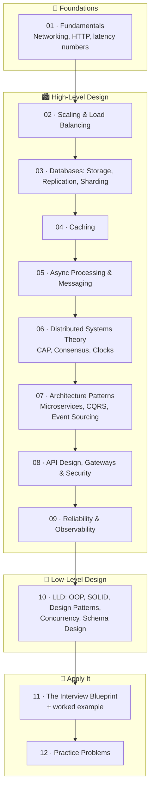
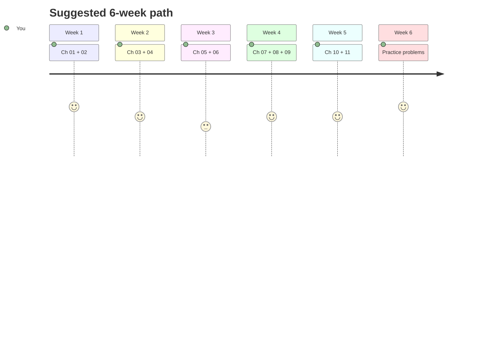

# 🏗️ The Backend System Design Walkthrough

> A pictorial, end-to-end walkthrough of backend system design — from fundamentals to advanced
> distributed systems (HLD) and object-level design (LLD) — written for an engineer with ~2 years
> of experience who wants **one exhaustive resource**.

All diagrams are [Mermaid](https://mermaid.js.org/) and render natively on GitHub — read this repo
in the browser and every chapter is pictorial.

---

## 🗺️ The Map

## 📚 Chapters

| # | Chapter | You will learn |
|---|---------|----------------|
| 01 | [Fundamentals](01-fundamentals.md) | Client-server, DNS, TCP/UDP, HTTP/1.1→3, WebSockets, latency numbers, back-of-envelope math |
| 02 | [Scaling & Load Balancing](02-scaling-and-load-balancing.md) | Vertical vs horizontal scaling, stateless services, L4/L7 load balancers, algorithms, CDNs, edge |
| 03 | [Databases](03-databases.md) | SQL vs NoSQL, B-Trees vs LSM-Trees, indexing, ACID & isolation levels, replication, sharding, consistent hashing |
| 04 | [Caching](04-caching.md) | Cache layers, cache-aside/write-through/write-back, eviction, invalidation, stampede, hot keys, Redis |
| 05 | [Async & Messaging](05-async-and-messaging.md) | Queues vs streams, Kafka internals, delivery semantics, idempotency, outbox pattern, backpressure, DLQs |
| 06 | [Distributed Systems Theory](06-distributed-systems-theory.md) | CAP & PACELC, consistency models, quorums, Raft, 2PC vs Saga, logical clocks, distributed locks, split brain |
| 07 | [Architecture Patterns](07-architecture-patterns.md) | Monolith→microservices, event-driven, CQRS, event sourcing, service mesh, serverless, cell-based, strangler fig |
| 08 | [API Design & Security](08-api-design-and-security.md) | REST/gRPC/GraphQL, versioning, pagination, idempotency keys, AuthN/AuthZ, OAuth2/JWT, rate limiting, API gateway |
| 09 | [Reliability & Observability](09-reliability-and-observability.md) | SLI/SLO/SLA, metrics/logs/traces, retries, circuit breakers, bulkheads, load shedding, deployments, DR |
| 10 | [Low-Level Design](10-low-level-design.md) | SOLID, GoF design patterns (with class diagrams), concurrency primitives, schema design, an LLD method |
| 11 | [Interview Blueprint](11-interview-blueprint.md) | A repeatable 7-step framework + a fully worked URL-shortener design |
| 12 | [Practice Problems](12-practice-problems.md) | 40+ graded HLD & LLD problems mapped to the concepts they exercise |

## 🧭 How to use this (at 2 YoE)

1. **Read a chapter, then close it and redraw its main diagram from memory.** If you can't draw it, you don't own it yet.
2. **After every two chapters, attempt one practice problem** from [Chapter 12](12-practice-problems.md) that uses those concepts.
3. **Say trade-offs out loud.** Every choice in system design is a trade-off; the diagrams here always show *what you give up*, not just what you gain.
